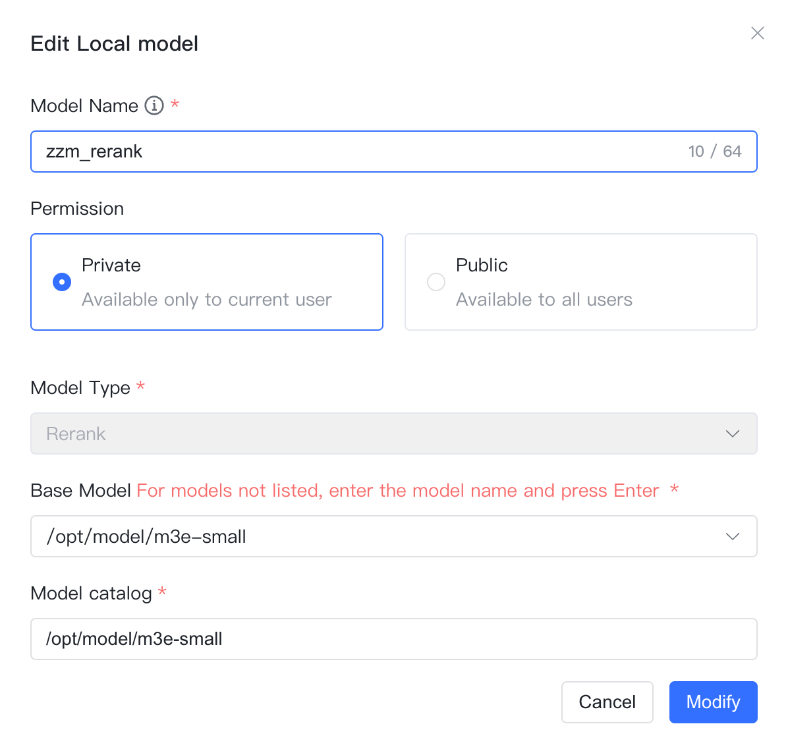

## 1 下载模型

!!! Abstract ""
    **前提条件：** 将模型下载到服务器，并且挂在到 MaxKB 容器中,以向量模型为例详细说明如下。

    （1）将向量模型下载到本地服务器。
    ```
    # 推荐模型下载网址
    https://huggingface.co/models?other=text-embedding
    # 下载后存放在/opt/maxkb/model/local_embedding目录下
    ```
    （2）使用-v 将宿主机模型路径挂载到 MaxKB 容器内部。
    ```
    -v /opt/maxkb/model/local_embedding:/opt/maxkb/model/local_embedding
    # 说明： v 模型所在目录:MaxKB容器内目录
    ```
## 2 添加模型

!!! Abstract ""
    在模型管理中，点击供应商【本地模型】，直接进入下一步填写本地模型的表单。  

    * 模型名称：MaxKB 中自定义的模型名称。    
    * 权限：分为私有和公用两种权限，私有模型仅当前用户可用，公用模型即系统内所有用户均可使用，但其它用户不能编辑和删除。   
    * 模型类型：向量模型/重排模型。   
    * 基础模型：模型在 MaxKB 容器下的绝对路径。     
    * 模型目录：模型的目录（基础模型为名称时，该目录生效，基础模型若有绝对路径，则该参数不生效，建议与基础模型填写一致）。 

## 3 配置样例

!!! Abstract ""
    本地模型-向量模型配置样例图示如下：
{ width="500px" }

!!! Abstract ""
    本地模型-重排模型配置样例图示如下：
{ width="500px" }