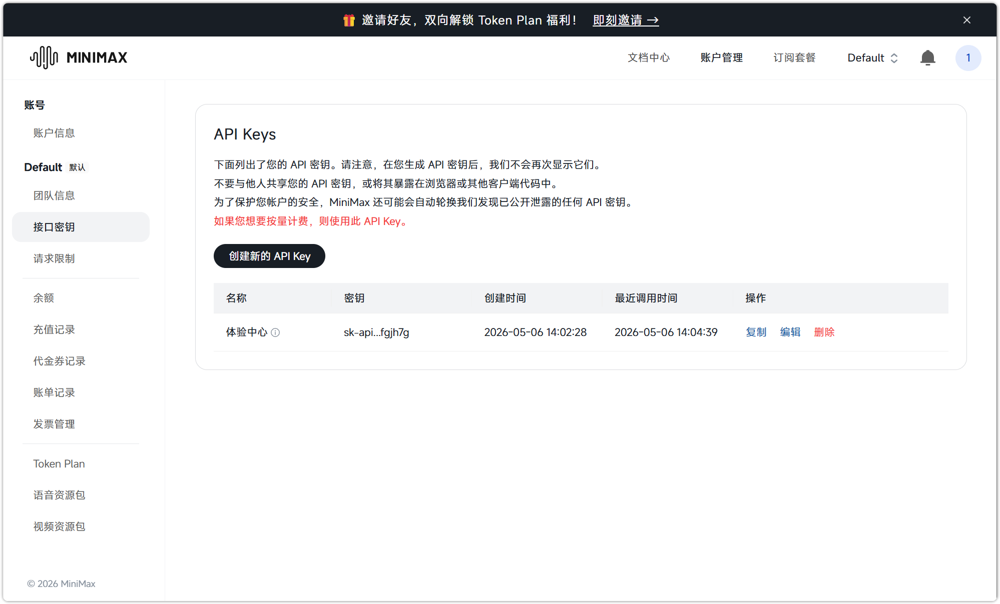
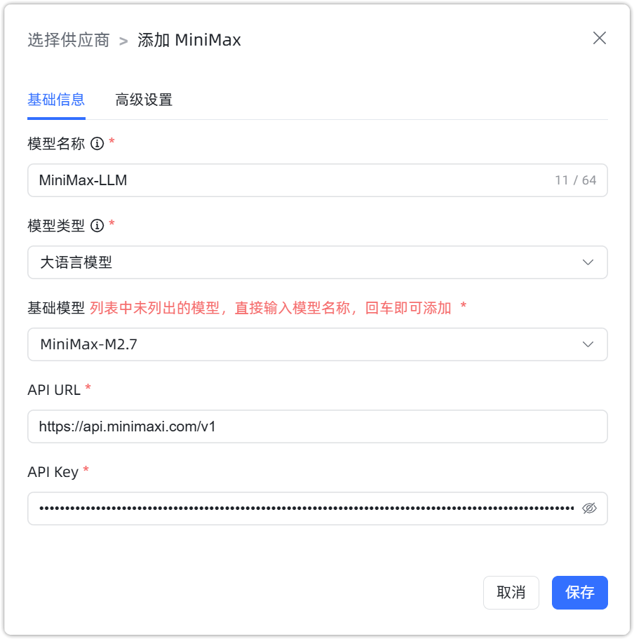
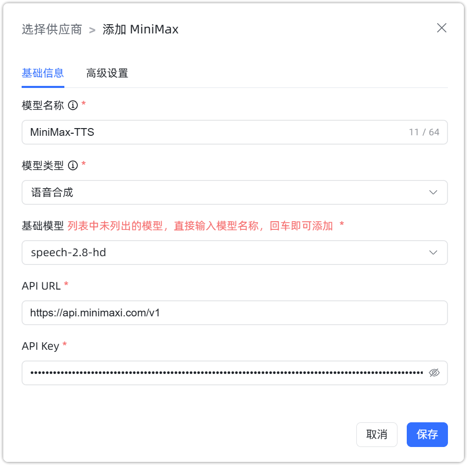

## 1 添加模型

!!! Abstract ""
    选择模型供应商为`MiniMax`，并在模型添加对话框中输入如下必要信息：

    * 模型名称：MaxKB 中自定义的模型名称。
    * 模型类型：大语言模型/语音合成模型。   
    * 基础模型：不同类型模型下的基础模型名称，下拉选项是常用的一些基础模型名称，支持自定义输入。      
    * API 域名：模型服务地址， 如：https://api.minimaxi.com/v1 。 
    * API Key：模型服务 API 服务访问密钥。

## 2 配置样例

!!! Abstract ""
    MiniMax-大语言模型配置样例图示如下：

{ width="500px" }

!!! Abstract ""
    MiniMax-语音合成模型配置样例图示如下：

{ width="500px" }