!!! Abstract ""
    模型管理用于对接供应商的大语言模型，支持对接主流的大模型，包括包括本地私有大模型（Llama 3 / Qwen 2 等）、国内公共大模型（通义千问 / 智谱 AI / 百度千帆 / Kimi / DeepSeek 等）和国外公共大模型（OpenAI / Azure OpenAI / Gemini 等）。


## 1 添加大语言模型

!!! Abstract ""
    登录 MaxKB 系统后，可以先对接一下模型，也可以在创建应用时添加模型。

### 1.1 添加千帆大模型

!!! Abstract ""
    点击【添加模型】，选择供应商【千帆大模型】，直接进入下一步填写千帆大模型表单。
    或者左侧供应商先选择【千帆大模型】，然后点击【添加模型】，则直接进入千帆大模型表单。


!!! Abstract ""
    * 模型名称：MaxKB 中自定义的模型名称。   
    * 权限：私有（仅自己可用）；公用（所有用户可使用，不能编辑和删除）。    
    * 模型类型：大语言模型。    
    * 基础模型：为供应商的 LLM 模型，支持自定义输入官方模型，选项中列了的一些常用的大语言模型。
            注意自定义基础模型名称需保证与供应商平台的模型名称一致才能校验通过。    
    * API Key 和 Secret Key：千帆大模型中应用的API Key 和 Secret Key（需要先创建应用）   


### 1.2 添加 Ollama 模型

!!! Abstract ""
    点击【添加模型】，选择供应商【Ollama】，直接进入下一步填写 Ollama 供应商的大模型表单。
    或者左侧供应商先选择【Ollama】，然后点击【添加模型】，则直接进入 Ollama 表单。 

    * 模型名称：MaxKB 中自定义的模型名称。   
    * 权限：私有（仅自己可用）；公用（所有用户可使用，不能编辑和删除）。    
    * 模型类型：大语言模型。    
    * 基础模型：为供应商的 LLM 模型，支持自定义输入，但需要与供应商的模型名称保持一致，系统会自动下载部署模型。   
    * API 域名：为供应商的连接信息（Ollama 服务地址， 如：http://42.92.198.53:11434 ）。     
    * API Key：若没有 API Key 可以输入任意字母、数字。

    点击【添加】后 校验通过则添加成功，便可以在应用的 AI 模型列表选择该模型。
    


### 1.3 添加 Azure OpenAI 模型

!!! Abstract ""
    在模型管理中，点击供应商【 Azure OpenAI 】，直接进入下一步填写Azure OpenAI 的模型表单。    
    或者左侧供应商先选择【 Azure OpenAI 】，然后点击【添加模型】，则直接进入 Azure OpenAI 的模型表单。    
    * 模型名称：MaxKB 中自定义的模型名称。   
    * 权限：私有（仅自己可用）；公用（所有用户可使用，不能编辑和删除）。    
    * 模型类型：大语言模型。   
    * 基础模型：为供应商的 LLM 模型，支持自定义输入和下拉选项，当前可下拉选择的大语言模型如：gpt-3.5-turbo-0613、gpt-3.5-turbo-0301、gpt-3.5-turbo-16k-0613 等。    


!!! Abstract ""
    API 域名、API Key、部署名称: 是Azure OpenAI 的模型部署中提供的，需要填写一致，参考下图：


### 1.4 添加 OpenAI 大模型

!!! Abstract ""
    在模型管理中，点击供应商【 OpenAI 】，直接进入下一步填写 OpenAI 的模型表单。    
    或者左侧供应商先选择【 OpenAI 】，然后点击【添加模型】，则直接进入 OpenAI 的模型表单。

    * 模型名称： MaxKB 中自定义的模型名称。   
    * 权限：私有（仅自己可用）；公用（所有用户可使用，不能编辑和删除）。     
    * 模型类型： 大语言模型。   
    * 基础模型： 为供应商的 LLM 模型，支持自定义输入，下拉选项是 OpenAI 常用的一些大语言模型如：gpt-3.5-turbo-0613、gpt-3.5-turbo、gpt-4 等。    
    * API 域名（国外）：https://api.openai.com/v1 ，国内服务器反向代理地址/v1。
    * API Key：访问 OpenAI 的 Key。


### 1.5 添加讯飞星火大模型

!!! Abstract ""
    在模型管理中，点击供应商【讯飞星火】，直接进入下一步填写讯飞星火的模型表单。    
    或者左侧供应商先选择【讯飞星火】，然后点击【添加模型】，则直接进入讯飞星火的模型表单。    

    * 模型名称：MaxKB 中自定义的模型名称。 
    * 权限：私有（仅自己可用）；公用（所有用户可使用，不能编辑和删除）。     
    * 模型类型：大语言模型。   
    * 基础模型：支持自定义输入，对应接口文档中domain，下拉选项是讯飞星火常用的一些大语言模型。    
    * API 域名：每个基础模型对应的API域名不同，请根据所选基础模型输入对应的API域名，参考[讯飞星火官方文档](https://www.xfyun.cn/doc/spark/Web.html#_1-%E6%8E%A5%E5%8F%A3%E8%AF%B4%E6%98%8E)。

{width="800px"}
!!! Abstract ""
    APP ID、API Key、Secret Key 需要现在讯飞星火开放平台创建应用，并且应用的剩余tokens>0，才能添加成功。


### 1.6 添加智谱AI大模型

!!! Abstract ""
    在模型管理中，点击供应商【智谱AI】，直接进入下一步填写智谱AI的模型表单。    
    或者左侧供应商先选择【智谱AI】，然后点击【添加模型】，则直接进入智谱AI的模型表单。

    * 模型名称：MaxKB 中自定义的模型名称。   
    * 权限：私有（仅自己可用）；公用（所有用户可使用，不能编辑和删除）。     
    * 模型类型：大语言模型。   
    * 基础模型：为供应商的 LLM 模型，支持自定义输入，下拉选项是常用的一些大语言模型。    
    * API Key：需要现在智谱 AI 开放平台创建。


### 1.7 添加通义千问大模型

!!! Abstract ""
    在模型管理中，点击供应商【通义千问】，直接进入下一步填写通义千问的模型表单。    
    或者左侧供应商先选择【通义千问】，然后点击【添加模型】，则直接进入通义千问的模型表单。 

    * 模型名称：MaxKB 中自定义的模型名称。  
    * 权限：私有（仅自己可用）；公用（所有用户可使用，不能编辑和删除）。    
    * 模型类型：大语言模型。   
    * 基础模型：为供应商的 LLM 模型，支持自定义输入，下拉选项是常用的一些大语言模型。    
    * API Key：需要在阿里云->DashScope灵积模型服务->API Key管理中获取。


### 1.8 添加 Kimi 大模型

!!! Abstract ""
    在模型管理中，点击供应商【Kimi】，直接进入下一步填写Kimi的模型表单。    
    或者左侧供应商先选择【Kimi】，然后点击【添加模型】，则直接进入Kimi的模型表单。

    * 模型名称：MaxKB 中自定义的模型名称。   
    * 权限：私有（仅自己可用）；公用（所有用户可使用，不能编辑和删除）。    
    * 模型类型：大语言模型。   
    * 基础模型：为供应商的 LLM 模型，支持自定义输入，下拉选项是常用的一些大语言模型。  
    * API 域名：https://api.moonshot.cn/v1  
    * API Key：在Kimi 账户中心的 API Key 管理中获取 key。


### 1.9 添加 DeepSeek 大模型

!!! Abstract ""
    在模型管理中，点击供应商【DeepSeek】，直接进入下一步填写 DeepSeek 的模型表单。    
    或者左侧供应商先选择【DeepSeek】，然后点击【添加模型】，则直接进入 DeepSeek 的模型表单。

    * 模型名称： MaxKB 中自定义的模型名称。  
    * 权限：私有（仅自己可用）；公用（所有用户可使用，不能编辑和删除）。      
    * 模型类型： 大语言模型。   
    * 基础模型： 为供应商的 LLM 模型，支持自定义输入，下拉选项是常用的一些大语言模型。  
    * API Key： 在 [DeepSeek官方](https://www.deepseek.com) 获取 API Key。


###  1.10 添加 Gemini 大模型

!!! Abstract ""
    在模型管理中，点击供应商【Gemini】，直接进入下一步填写 Gemini 的模型表单。    
    或者左侧供应商先选择【Gemini】，然后点击【添加模型】，则直接进入 Gemini 的模型表单。 

    * 模型名称：MaxKB 中自定义的模型名称。    
    * 权限：私有（仅自己可用）；公用（所有用户可使用，不能编辑和删除）。     
    * 模型类型：大语言模型。   
    * 基础模型：为供应商的 LLM 模型，支持自定义输入，下拉选项是常用的一些大语言模型。  
    * API Key：获取 API Key。

    注意：使用 Gemini API 需要确保程序所在服务器位于 [Gemini API所支持的地区](https://ai.google.dev/gemini-api/docs/available-regions?hl=zh-cn) ，否则无法调用API，并且无法进入Google AI Studio。


### 1.11 添加 Xorbits Inference 大模型

!!! Abstract ""
    在模型管理中，点击供应商【 Xorbits Inference 】，直接进入下一步填写 Xorbits Inference 的模型表单。    
    或者左侧供应商先选择【 Xorbits Inference 】，然后点击【添加模型】，则直接进入 Xorbits Inference 的模型表单。

    * 模型名称：MaxKB 中自定义的模型名称。    
    * 权限：私有（仅自己可用）；公用（所有用户可使用，不能编辑和删除）。    
    * 模型类型：大语言模型。   
    * 基础模型：为供应商的大语言模型，支持自定义输入。    
    * API 域名：为供应商的连接信息（Xorbits Inference 服务地址， 如：http://42.92.198.53:11434/v1 ）。 
    * API Key：若没有 API Key 可以输入任意字母、数字。     
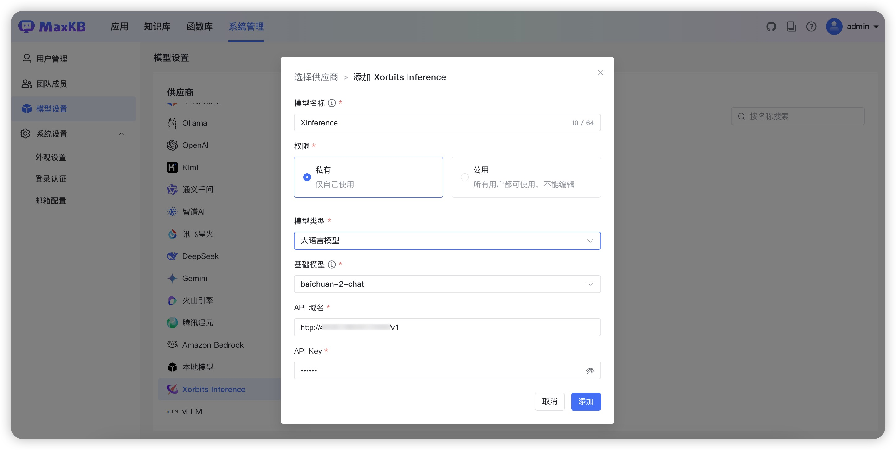

### 1.12 添加 vLLM 大模型

!!! Abstract ""
    在模型管理中，点击供应商【 vLLM 】，直接进入下一步填写 vLLM 的模型表单。    
    或者左侧供应商先选择【 vLLM 】，然后点击【添加模型】，则直接进入 vLLM 的模型表单。

    * 模型名称：MaxKB 中自定义的模型名称。    
    * 权限：私有（仅自己可用）；公用（所有用户可使用，不能编辑和删除）。    
    * 模型类型：大语言模型。   
    * 基础模型：为供应商的大语言模型，支持自定义输入。    
    * API 域名：为供应商的连接信息（vLLM 服务地址， 如：http://42.92.198.53:11434/v1 ）。 
    * API Key：若没有 API Key 可以输入任意字母、数字。     
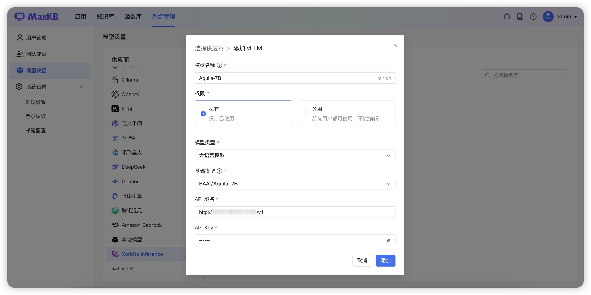

### 1.13 添加 Amazon Bedrock 大模型

!!! Abstract ""
    在模型管理中，点击供应商【 Amazon Bedrock 】，直接进入下一步填写 Amazon Bedrock 的模型表单。    
    或者左侧供应商先选择【 Amazon Bedrock 】，然后点击【添加模型】，则直接进入 Amazon Bedrock的模型表单。

    * 模型名称：MaxKB 中自定义的模型名称。    
    * 权限：私有（仅自己可用）；公用（所有用户可使用，不能编辑和删除）。    
    * 模型类型：大语言模型。   
    * 基础模型：为供应商的大语言模型，支持自定义输入。     
    * Region Name：模型开通的区域。    
    * API 域名：为供应商的连接信息（vLLM 服务地址， 如：http://42.92.198.53:11434/v1 ）。 
    * API Key：若没有 API Key 可以输入任意字母、数字。     
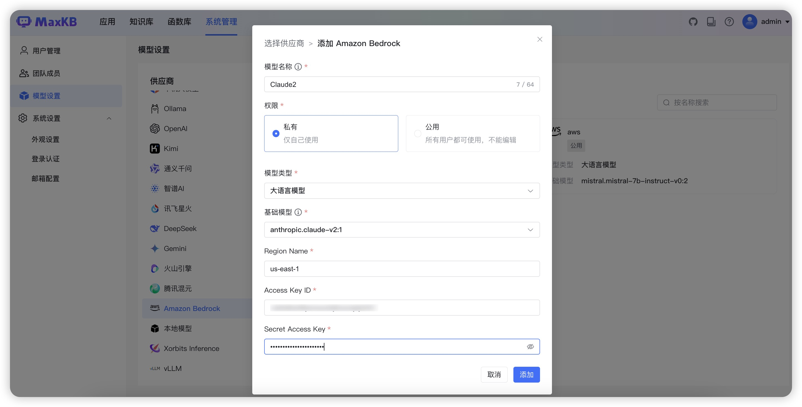

### 1.14 添加腾讯混元大模型

!!! Abstract ""
    在模型管理中，点击供应商【腾讯混元】，直接进入下一步填写腾讯混元的模型表单。    
    或者左侧供应商先选择【腾讯混元】，然后点击【添加模型】，则直接进入腾讯混元的模型表单。

    * 模型名称：MaxKB 中自定义的模型名称。    
    * 权限：私有（仅自己可用）；公用（所有用户可使用，不能编辑和删除）。    
    * 模型类型：大语言模型。   
    * 基础模型：为供应商的大语言模型，支持自定义输入。       
    * APPID：控制台-访问管理-API密钥管理中获取。 
    * SecretId：控制台-访问管理-API密钥管理中获取
    * SecretKey：控制台-访问管理-API密钥管理中新建密钥时下载的SecretKey。     
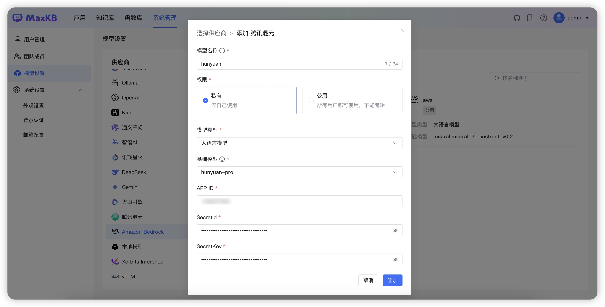

### 1.15 添加豆包大模型

!!! Abstract ""
    在模型管理中，点击供应商【火山引擎】，直接进入下一步填写火山引擎的模型表单。    
    或者左侧供应商先选择【火山引擎】，然后点击【添加模型】，则直接进入火山引擎的模型表单。

    * 模型名称：MaxKB 中自定义的模型名称。    
    * 权限：私有（仅自己可用）；公用（所有用户可使用，不能编辑和删除）。    
    * 模型类型：大语言模型。   
    * 基础模型：在线推理的接入点ID。        
    * API 域名：https://ark.cn-beijing.volces.com/api/v3
    * API Key：接入点-> API调用 -> 通过API Key授权 -> 选择 API Key 并复制 中获取，如下图  
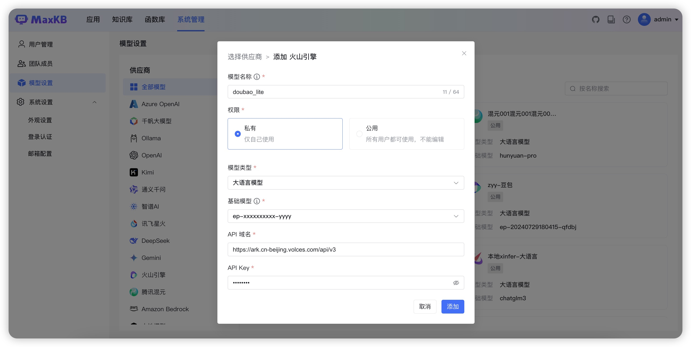

!!! Abstract ""
    基础模型获取方式如下：  
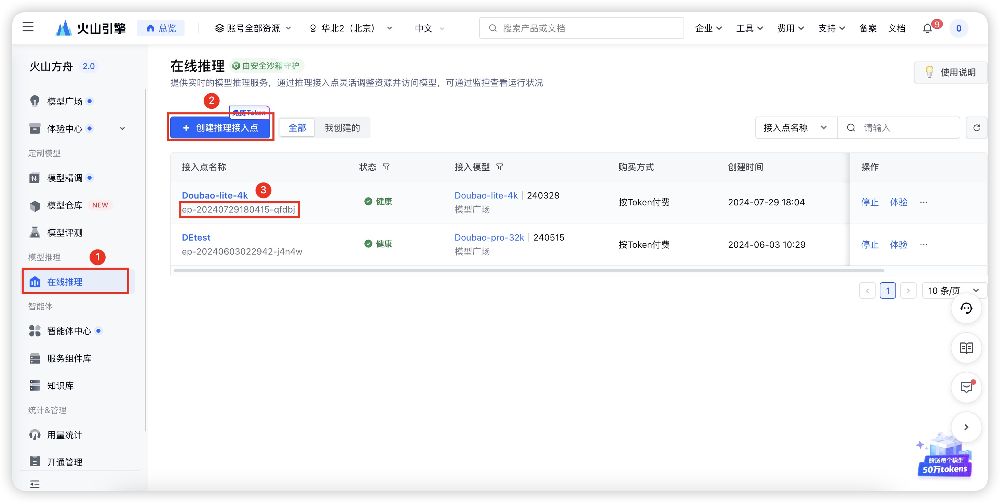
!!! Abstract ""
    API Key获取方式如下图：  
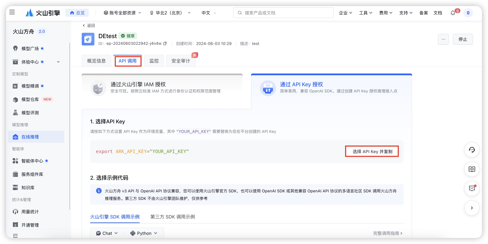

## 2 添加向量模型

### 2.1 添加 OpenAI 向量模型

!!! Abstract ""
    在模型管理中，点击供应商【 OpenAI 】，直接进入下一步填写 OpenAI 的模型表单。    
    或者左侧供应商先选择【 OpenAI 】，然后点击【添加模型】，则直接进入 OpenAI 的模型表单。

    * 模型名称： MaxKB 中自定义的模型名称。    
    * 权限：私有（仅自己可用）；公用（所有用户可使用，不能编辑和删除）。    
    * 模型类型： 向量模型。     
    * 基础模型： 为供应商的向量模型，支持自定义输入。    
    * API 域名：国外服务器域名地址：https://api.openai.com/v1 ，国内服务器反向代理地址/v1。     
    * API Key：访问 OpenAI 的 Key。     
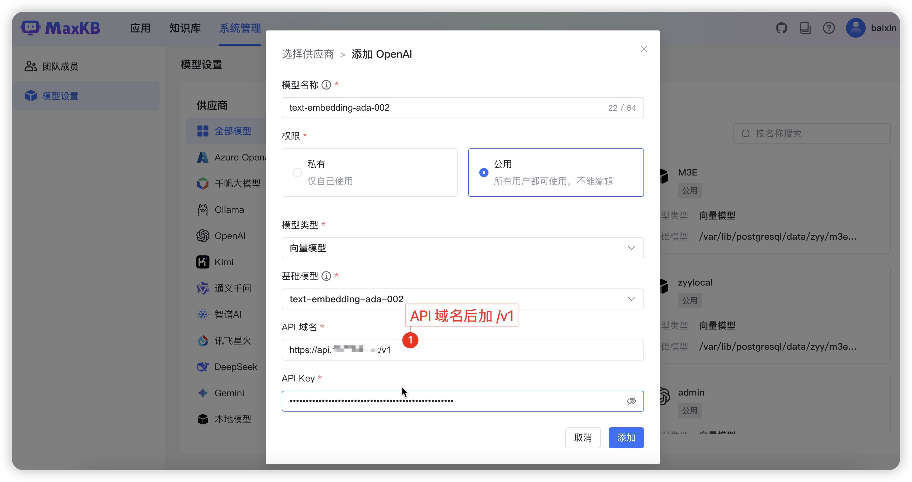

### 2.2 添加 Ollama 向量模型

!!! Abstract ""
    在模型管理中，点击供应商【 Ollama 】，直接进入下一步填写 Ollama 的模型表单。    
    或者左侧供应商先选择【 Ollama 】，然后点击【添加模型】，则直接进入 Ollama 的模型表单。

    * 模型名称：MaxKB 中自定义的模型名称。    
    * 权限：私有（仅自己可用）；公用（所有用户可使用，不能编辑和删除）。    
    * 模型类型：向量模型。   
    * 基础模型：为供应商的向量模型，支持自定义输入。    
    * API 域名：为供应商的连接信息（Ollama 服务地址， 如：http://42.92.198.53:11434 ）。     
    * API Key：若没有 API Key 可以输入任意字母、数字。 
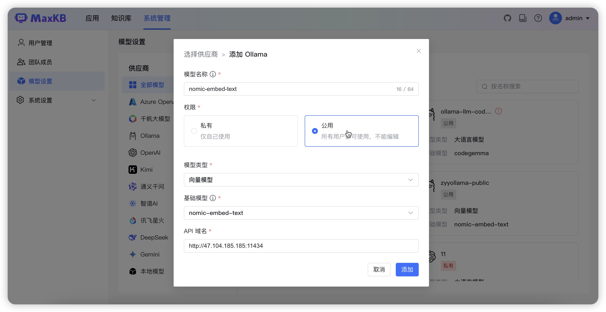

### 2.3 添加本地向量模型

!!! Abstract ""
    **前提条件：将模型下载到服务器，并且挂在到 MaxKB 容器中。**

    1、将向量模型下载到本地服务器。
    ```
    # 推荐模型下载网址
    https://huggingface.co/models?other=text-embedding
    # 下载后存放在/opt/maxkb/model/local_embedding目录下
    ```
    2、使用-v 将宿主机模型路径挂载到 MaxKB 容器内部。
    ```
    -v /opt/maxkb/model/local_embedding:/opt/maxkb/model/local_embedding
    # 说明： v 模型所在目录:MaxKB容器内目录
    ```

!!! Abstract ""
    在模型管理中，点击供应商【本地模型】，直接进入下一步填写本地模型的表单。  

    * 模型名称：MaxKB 中自定义的模型名称。    
    * 权限：私有（仅自己可用）；公用（所有用户可使用，不能编辑和删除）。    
    * 模型类型：向量模型。   
    * 基础模型：模型在MaxKB容器下的绝对路径。     
    * 模型目录：模型的目录（基础模型为名称时，该目录生效，基础模型若有绝对路径，则该参数不生效，建议与基础模型填写一致）。    
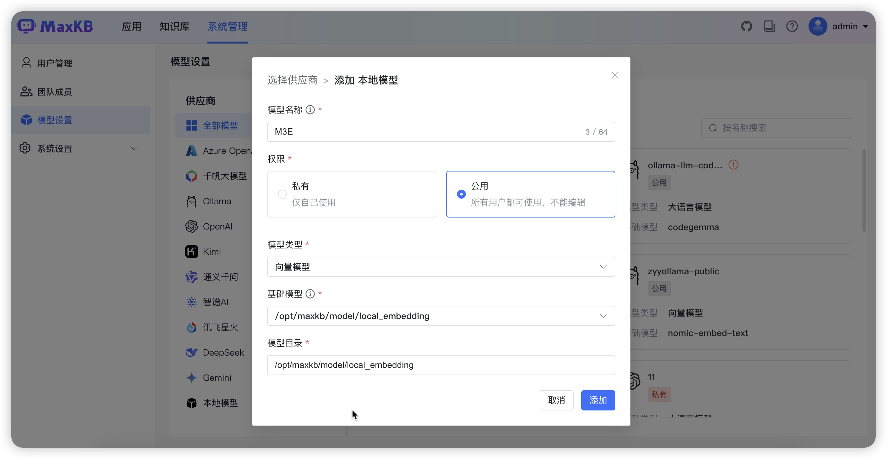

### 2.4 添加 Xorbits Inference 向量模型

!!! Abstract ""
    在模型管理中，点击供应商【 Xorbits Inference 】，直接进入下一步填写 Xorbits Inference 的模型表单。    
    或者左侧供应商先选择【 Xorbits Inference 】，然后点击【添加模型】，则直接进入 Xorbits Inference 的模型表单。

    * 模型名称：MaxKB 中自定义的模型名称。    
    * 权限：私有（仅自己可用）；公用（所有用户可使用，不能编辑和删除）。    
    * 模型类型：向量模型。   
    * 基础模型：为供应商的向量模型，支持自定义输入。    
    * API 域名：为供应商的连接信息（Xorbits Inference 服务地址， 如：http://42.92.198.53:11434 ）。     
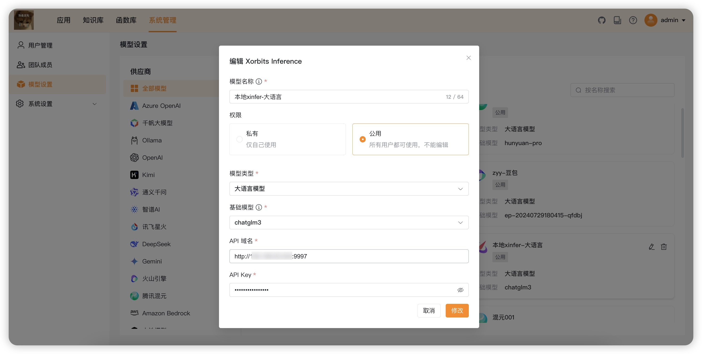

## 3 编辑模型

!!! Abstract ""
    点击模型右上角的编辑icon，打开编辑模型表单，可以对模型的属性进行修改。


## 4 删除模型

!!! Abstract ""
    点击模型右上角的删除icon，这里仅会删除在MaxKB中模型的对接信息，不会物理删除供应商的模型。
