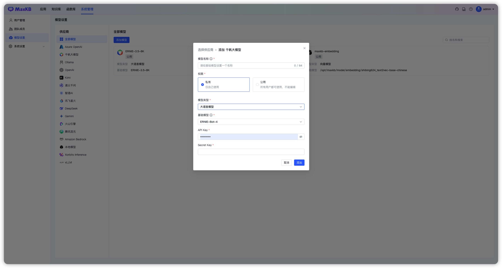
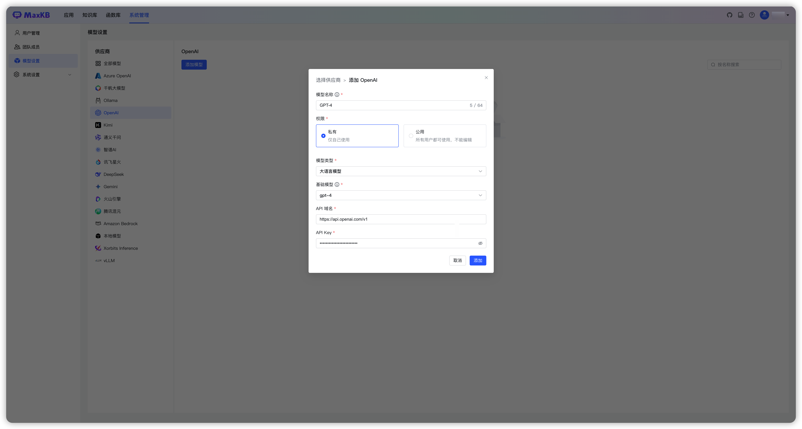
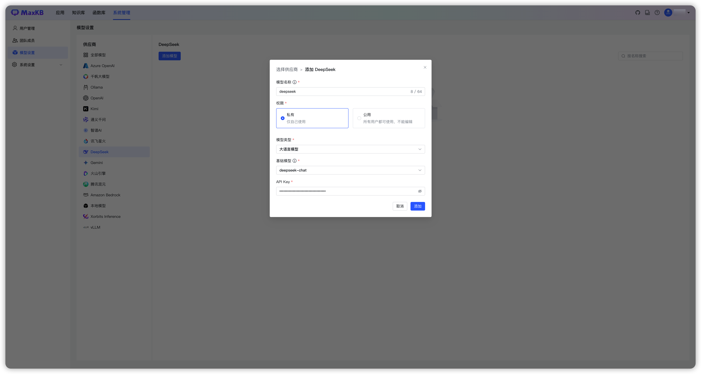

!!! Abstract ""
    模型管理用于对接供应商的大语言模型，支持对接主流的大模型，包括包括本地私有大模型（Llama 3 / Qwen 2 等）、国内公共大模型（通义千问 / 智谱 AI / 百度千帆 / Kimi / DeepSeek 等）和国外公共大模型（OpenAI / Azure OpenAI / Gemini 等）。


## 1 添加大语言模型

!!! Abstract ""
    登录 MaxKB 系统后，可以先对接模型，也可以在创建应用时再添加模型。添加模型时，可先点击【添加模型】，然后选择供应商，也可以左侧先选择供应商，然后点击【添加模型】

### 1.1 添加千帆大模型

!!! Abstract ""
    添加千帆大模型之前，需要先在 [百度智能云千帆大模型平台](https://qianfan.cloud.baidu.com/) 中进行注册，并在【模型服务-应用接入】中创建应用，生成 API Key和Secret Key。


!!! Abstract ""
    选择模型供应商为`千帆大模型`，并在模型添加对话框中输入如下必要信息：

    * 模型名称：MaxKB 中自定义的模型名称。   
    * 权限：分为私有和公用两种权限，私有模型仅当前用户可用，公用模型即系统内所有用户均可使用，但其它用户不能编辑和删除。    
    * 模型类型：大语言模型。    
    * 基础模型：百度千帆支持的 LLM 模型名称，选项中显示了百度千帆支持的部分常用大语言模型名称，支持手动输入，但需要与千帆大平台支持的模型名称保持一致，否则无法通过校验。    
    * API Key 和 Secret Key：千帆大模型中应用的API Key 和 Secret Key。



!!! Abstract ""


### 1.2 添加 Ollama 模型

!!! Abstract "" 
    选择模型供应商为`Ollama`，并在模型添加对话框中输入如下必要信息：

    * 模型名称：MaxKB 中自定义的模型名称。   
    * 权限：分为私有和公用两种权限，私有模型仅当前用户可用，公用模型即系统内所有用户均可使用，但其它用户不能编辑和删除。    
    * 模型类型：大语言模型。    
    * 基础模型：Ollama 支持的 LLM 模型名称，选项中显示了 Ollama 支持的部分常用大语言模型名称，支持手动输入，但需要与 Ollama 支持的模型名称保持一致，否则无法通过校验。如果本地没有此模型，系统将自动下载。   
    * API 域名：为 Ollama 服务地址连接信息，例如：http://42.92.198.53:11434 。     
    * API Key：若没有配置API Key，可以输入任意字符。

    点击【添加】后 校验通过则添加成功，便可以在应用的 AI 模型列表选择该模型。
    


### 1.3 添加 Azure OpenAI 模型

!!! Abstract "" 
    添加 Azure OpenAI 大模型之前，需要先在 Azure OpenAI Studio 中注册，并获取有关API 域名、API Key、部署名称等信息，参考下图：


!!! Abstract "" 
    选择模型供应商为`Azure OpenAI`，并在模型添加对话框中输入如下必要信息：

    * 模型名称：MaxKB 中自定义的模型名称。   
    * 权限：分为私有和公用两种权限，私有模型仅当前用户可用，公用模型即系统内所有用户均可使用，但其它用户不能编辑和删除。    
    * 模型类型：大语言模型。   
    * 基础模型：Azure OpenAI 支持的 LLM 模型名称，选项中显示了 Azure OpenAI 支持的部分常用大语言模型名称，支持手动输入，但需要与 Azure OpenAI 支持的模型名称保持一致，否则无法通过校验。    


### 1.4 添加 OpenAI 大模型

!!! Abstract ""
    选择模型供应商为`OpenAI`，并在模型添加对话框中输入如下必要信息：

    * 模型名称： MaxKB 中自定义的模型名称。   
    * 权限：分为私有和公用两种权限，私有模型仅当前用户可用，公用模型即系统内所有用户均可使用，但其它用户不能编辑和删除。     
    * 模型类型： 大语言模型。   
    * 基础模型： OpenAI 支持的 LLM 模型名称，选项中显示了 OpenAI 支持的部分常用大语言模型名称，支持手动输入，但需要与 OpenAI 支持的模型名称保持一致，否则无法通过校验。    
    * API 域名：国外 Open API的域名是`https://api.openai.com/v1`，国内代理的API域名格式一般是`反向代理地址/v1`。
    * API Key：访问 OpenAI 的 Key。



### 1.5 添加讯飞星火大模型
!!! Abstract "" 
    添加讯飞星火大模型之前，需要先在 [讯飞开放平台](https://www.xfyun.cn/) 中进行注册，并创建应用，生成APPID、APIKey。


!!! Abstract "" 
    选择模型供应商为`讯飞星火`，并在模型添加对话框中输入如下必要信息：

    * 模型名称：MaxKB 中自定义的模型名称。 
    * 权限：分为私有和公用两种权限，私有模型仅当前用户可用，公用模型即系统内所有用户均可使用，但其它用户不能编辑和删除。     
    * 模型类型：大语言模型。   
    * 基础模型：对应接口文档中的 domain，下拉选项是讯飞星火常用的一些大语言模型名称，支持自定义输入。    
    * API 域名：每个基础模型对应的 API 域名不同，请根据所选基础模型输入对应的 API 域名，详情请参考[讯飞星火官方文档](https://www.xfyun.cn/doc/spark/Web.html#_1-%E6%8E%A5%E5%8F%A3%E8%AF%B4%E6%98%8E)。


### 1.6 添加智谱AI大模型
!!! Abstract "" 
    添加讯智谱AI模型之前，需要先在 [智谱AI开放平台](https://www.xfyun.cn/) 中进行注册并创建 API Key。


!!! Abstract ""
    选择模型供应商为`智谱AI`，并在模型添加对话框中输入如下必要信息：

    * 模型名称：MaxKB 中自定义的模型名称。   
    * 权限：分为私有和公用两种权限，私有模型仅当前用户可用，公用模型即系统内所有用户均可使用，但其它用户不能编辑和删除。     
    * 模型类型：大语言模型。   
    * 基础模型：智谱AI支持的 LLM 模型名称，下拉选项是常用的一些大语言模型名称，支持自定义输入。    
    * API Key：在智谱 AI 开放平台创建的 API Key。


### 1.7 添加通义千问大模型

!!! Abstract ""
    添加通义千问模型之前，需要先在阿里云 DashScope 模型服务灵积创建 API-Key。


!!! Abstract ""
    选择模型供应商为`通义千问`，并在模型添加对话框中输入如下必要信息：

    * 模型名称：MaxKB 中自定义的模型名称。  
    * 权限：分为私有和公用两种权限，私有模型仅当前用户可用，公用模型即系统内所有用户均可使用，但其它用户不能编辑和删除。   
    * 模型类型：大语言模型。   
    * 基础模型：通义千问支持的 LLM 模型名称，下拉选项是常用的一些大语言模型名称，支持自定义输入。        
    * API Key：阿里云 DashScope灵积模型服务 API Key管理中创建和查看。


### 1.8 添加 Kimi 大模型

!!! Abstract ""
    添加 kimi 模型之前，需要先在 Moonshot AI 开放平台中创建 API Key。


!!! Abstract ""
    选择模型供应商为`Kimi`，并在模型添加对话框中输入如下必要信息：

    * 模型名称：MaxKB 中自定义的模型名称。   
    * 权限：分为私有和公用两种权限，私有模型仅当前用户可用，公用模型即系统内所有用户均可使用，但其它用户不能编辑和删除。
    * 模型类型：大语言模型。   
    * 基础模型：Kimi 支持的 LLM 模型名称，下拉选项是常用的一些大语言模型名称，支持自定义输入。   
    * API 域名：https://api.moonshot.cn/v1  
    * API Key：在 Kimi 账户中心的 API Key 管理中创建和查看。


### 1.9 添加 DeepSeek 大模型

!!! Abstract ""
    添加 DeepSeek 大模型之前，需要先在[DeepSeek 开放平台](https://platform.deepseek.com/) 创建 API Key。


!!! Abstract ""
    选择模型供应商为`DeepSeek`，并在模型添加对话框中输入如下必要信息：

    * 模型名称：MaxKB 中自定义的模型名称。  
    * 权限：分为私有和公用两种权限，私有模型仅当前用户可用，公用模型即系统内所有用户均可使用，但其它用户不能编辑和删除。      
    * 模型类型：大语言模型。   
    * 基础模型：DeepSeek 支持的 LLM 模型名称，下拉选项是常用的一些大语言模型名称，支持自定义输入。  
    * API Key：在 DeepSeek 开放平台创建并查看。



###  1.10 添加 Gemini 大模型

!!! Abstract ""
    选择模型供应商为`Gemini`，并在模型添加对话框中输入如下必要信息：

    * 模型名称：MaxKB 中自定义的模型名称。    
    * 权限：分为私有和公用两种权限，私有模型仅当前用户可用，公用模型即系统内所有用户均可使用，但其它用户不能编辑和删除。     
    * 模型类型：大语言模型。   
    * 基础模型：Gemini 支持的 LLM 模型名称，下拉选项是常用的一些大语言模型名称，支持自定义输入。
    * API Key：获取 API Key。

    注意：使用 Gemini API 需要确保程序所在服务器位于 [Gemini API所支持的地区](https://ai.google.dev/gemini-api/docs/available-regions?hl=zh-cn) ，否则无法调用API，并且无法进入Google AI Studio。


### 1.11 添加 Xorbits Inference 大模型

!!! Abstract ""
    选择模型供应商为`Xorbits Inference`，并在模型添加对话框中输入如下必要信息：

    * 模型名称：MaxKB 中自定义的模型名称。    
    * 权限：分为私有和公用两种权限，私有模型仅当前用户可用，公用模型即系统内所有用户均可使用，但其它用户不能编辑和删除。    
    * 模型类型：大语言模型。   
    * 基础模型：Xorbits-Inference 支持的 LLM 模型名称，下拉选项是常用的一些大语言模型名称，支持自定义输入。    
    * API 域名：Xorbits Inference 服务地址，例如：http://42.92.198.53:11434/v1 。 
    * API Key：若没有 API Key，输入任意字符即可。     


### 1.12 添加 vLLM 大模型

!!! Abstract ""
    选择模型供应商为`vLLM`，并在模型添加对话框中输入如下必要信息：

    * 模型名称：MaxKB 中自定义的模型名称。    
    * 权限：分为私有和公用两种权限，私有模型仅当前用户可用，公用模型即系统内所有用户均可使用，但其它用户不能编辑和删除。
    * 模型类型：大语言模型。   
    * 基础模型：vLLM 支持的 LLM 模型名称，下拉选项是常用的一些大语言模型名称，支持自定义输入。      
    * API 域名：vLLM 服务地址， 如：http://42.92.198.53:11434/v1 。 
    * API Key：若没有 API Key，输入任意字符即可。     


### 1.13 添加 Amazon Bedrock 大模型

!!! Abstract ""
    选择模型供应商为`Amazon Bedrock`，并在模型添加对话框中输入如下必要信息：

    * 模型名称：MaxKB 中自定义的模型名称。    
    * 权限：分为私有和公用两种权限，私有模型仅当前用户可用，公用模型即系统内所有用户均可使用，但其它用户不能编辑和删除。
    * 模型类型：大语言模型。   
    * 基础模型：Amazon Bedrock 支持的 LLM 模型名称，下拉选项是常用的一些大语言模型名称，支持自定义输入。     
    * Region Name：模型开通的区域。    
    * Access Key ID:。 
    * Secret Access Key：。     


### 1.14 添加腾讯混元大模型

!!! Abstract ""
    选择模型供应商为`腾讯混元`，并在模型添加对话框中输入如下必要信息：

    * 模型名称：MaxKB 中自定义的模型名称。    
    * 权限：分为私有和公用两种权限，私有模型仅当前用户可用，公用模型即系统内所有用户均可使用，但其它用户不能编辑和删除。    
    * 模型类型：大语言模型。   
    * 基础模型：腾讯混元支持的 LLM 模型名称，下拉选项是常用的一些大语言模型名称，支持自定义输入。         
    * APPID：控制台-访问管理-API密钥管理中获取。 
    * SecretId：控制台-访问管理-API密钥管理中获取
    * SecretKey：控制台-访问管理-API密钥管理中新建密钥时下载的SecretKey。 


### 1.15 添加豆包大模型

!!! Abstract ""
    选择模型供应商为`火山引擎`，并在模型添加对话框中输入如下必要信息：

    * 模型名称：MaxKB 中自定义的模型名称。    
    * 权限：分为私有和公用两种权限，私有模型仅当前用户可用，公用模型即系统内所有用户均可使用，但其它用户不能编辑和删除。   
    * 模型类型：大语言模型。   
    * 基础模型：在线推理的接入点ID。        
    * API 域名：https://ark.cn-beijing.volces.com/api/v3
    * API Key：接入点-> API调用 -> 通过API Key授权 -> 选择 API Key 并复制 中获取，如下图  


!!! Abstract ""
    基础模型获取方式如下：  

!!! Abstract ""
    API Key获取方式如下图：  


## 2 添加向量模型

### 2.1 添加 OpenAI 向量模型

!!! Abstract ""
    选择模型供应商为`OpenAI`，并在模型添加对话框中输入如下必要信息：

    * 模型名称： MaxKB 中自定义的模型名称。    
    * 权限：分为私有和公用两种权限，私有模型仅当前用户可用，公用模型即系统内所有用户均可使用，但其它用户不能编辑和删除。    
    * 模型类型： 向量模型。     
    * 基础模型： 为供应商的向量模型，支持自定义输入。    
    * API 域名：国外服务器域名地址：https://api.openai.com/v1 ，国内服务器反向代理地址/v1。     
    * API Key：访问 OpenAI 的 Key。     


### 2.2 添加 Ollama 向量模型

!!! Abstract ""
    选择模型供应商为`Ollama`，并在模型添加对话框中输入如下必要信息：

    * 模型名称：MaxKB 中自定义的模型名称。    
    * 权限：分为私有和公用两种权限，私有模型仅当前用户可用，公用模型即系统内所有用户均可使用，但其它用户不能编辑和删除。   
    * 模型类型：向量模型。   
    * 基础模型：Ollama 支持的向量模型名称，支持自定义输入。    
    * API 域名：Ollama 服务地址，例如：http://42.92.198.53:11434。     
    * API Key：若没有 API Key，可以输入任意字符。 


### 2.3 添加 Xorbits Inference 向量模型

!!! Abstract ""
    在模型管理中，点击供应商【Xorbits Inference】，并在模型添加对话框中输入如下必要信息。  

    * 模型名称：MaxKB 中自定义的模型名称。    
    * 权限：私有（仅自己可用）；公用（所有用户可使用，不能编辑和删除）。    
    * 模型类型：向量模型。   
    * 基础模型：为供应商的向量模型，支持自定义输入。    
    * API 域名：为供应商的连接信息（Xorbits Inference 服务地址， 如：http://42.92.198.53:11434 ）。     


### 2.4 添加本地向量模型

!!! Abstract ""
    **前提条件：将模型下载到服务器，并且挂在到 MaxKB 容器中。**

    1、将向量模型下载到本地服务器。
    ```
    # 推荐模型下载网址
    https://huggingface.co/models?other=text-embedding
    # 下载后存放在/opt/maxkb/model/local_embedding目录下
    ```
    2、使用-v 将宿主机模型路径挂载到 MaxKB 容器内部。
    ```
    -v /opt/maxkb/model/local_embedding:/opt/maxkb/model/local_embedding
    # 说明： v 模型所在目录:MaxKB容器内目录
    ```

!!! Abstract ""
    在模型管理中，点击供应商【本地模型】，直接进入下一步填写本地模型的表单。  

    * 模型名称：MaxKB 中自定义的模型名称。    
    * 权限：分为私有和公用两种权限，私有模型仅当前用户可用，公用模型即系统内所有用户均可使用，但其它用户不能编辑和删除。   
    * 模型类型：向量模型。   
    * 基础模型：模型在 MaxKB 容器下的绝对路径。     
    * 模型目录：模型的目录（基础模型为名称时，该目录生效，基础模型若有绝对路径，则该参数不生效，建议与基础模型填写一致）。    


## 3 编辑模型

!!! Abstract ""
    点击模型右上角的编辑icon，打开编辑模型表单，可以对模型的属性进行修改。


## 4 删除模型

!!! Abstract ""
    点击模型右上角的删除icon，即删除 MaxKB 与该模型的对接信息，但不会物理删除此模型。
