!!! Abstract ""
    模型管理用于对接供应商的大语言模型，支持对接主流的大模型，包括本地私有大模型（如 Llama 2）、Azure OpenAI 和百度千帆大模型等；           
    支持对接各种大语言模型，包括本地私有大模型（Llama 3 / Qwen 2 等）、国内公共大模型（通义千问 / 智谱 AI / 百度千帆 / Kimi / DeepSeek 等）和国外公共大模型（OpenAI / Azure OpenAI / Gemini 等）。
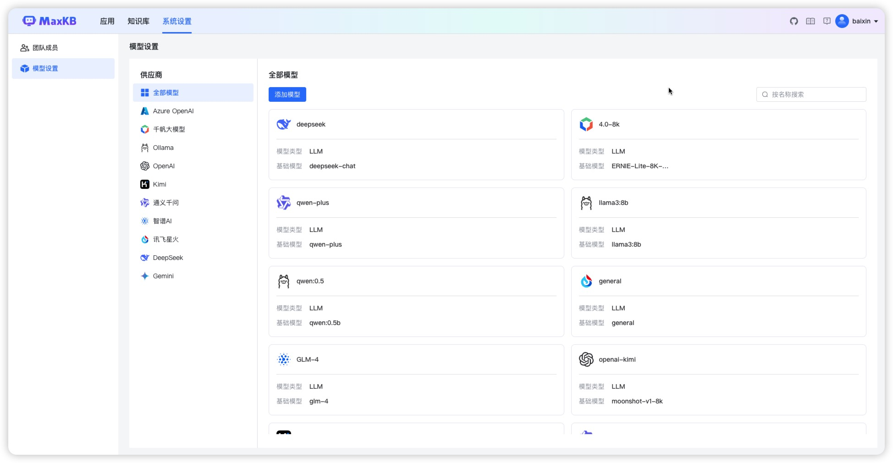

## 1 添加模型

!!! Abstract ""
    登录 MaxKB 系统后，可以先对接一下模型，也可以在创建应用时添加模型。

### 1.1 添加千帆大模型

!!! Abstract ""
    点击【添加模型】，选择供应商【千帆大模型】，直接进入下一步填写千帆大模型表单。
    或者左侧供应商先选择【千帆大模型】，然后点击【添加模型】，则直接进入千帆大模型表单。

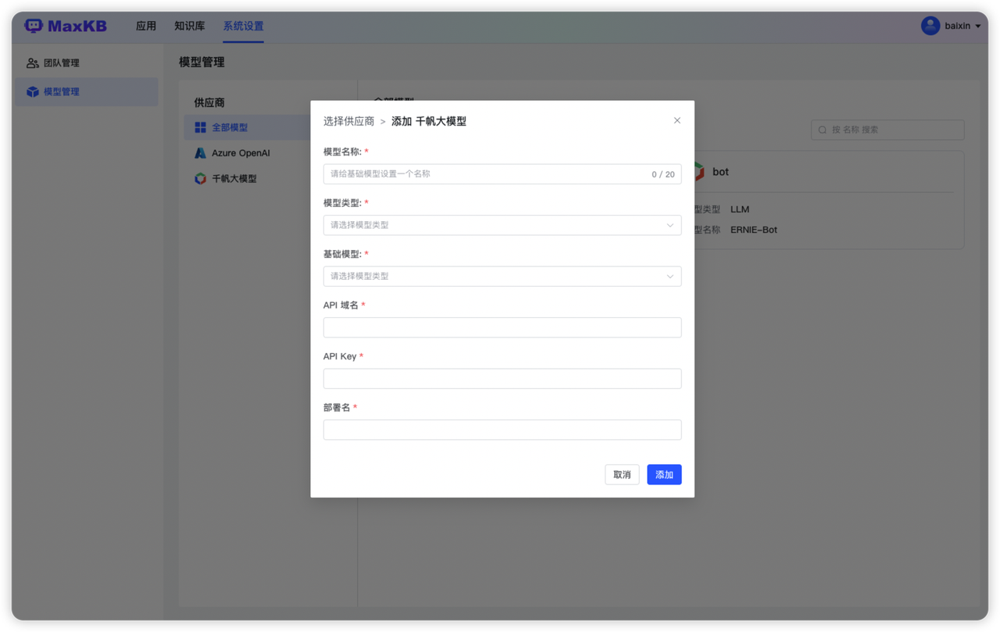

!!! Abstract ""
    模型名称： MaxKB 中自定义的模型名称。   
    模型类型： 大语言模型。    
    基础模型： 为供应商的 LLM 模型，支持自定义输入官方模型，选项中列了的一些常用的大语言模型。
            注意自定义基础模型名称需保证与供应商平台的模型名称一致才能校验通过。    
    API Key 和 Secret Key：千帆大模型中应用的API Key 和 Secret Key（需要先创建应用）   

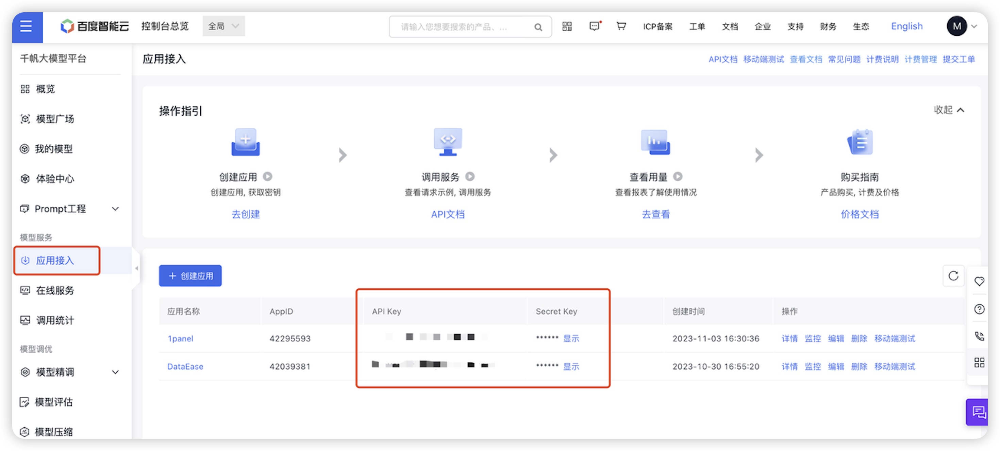

### 1.2 添加 Ollama 模型

!!! Abstract ""
    点击【添加模型】，选择供应商【 Ollama 】，直接进入下一步填写 Ollama 供应商的大模型表单。
    或者左侧供应商先选择【 Ollama 】，然后点击【添加模型】，则直接进入 Ollama 表单。    
    模型名称： MaxKB 中自定义的模型名称。   
    模型类型： 大语言模型。    
    基础模型： 为供应商的 LLM 模型，支持自定义输入，但需要与供应商的模型名称保持一致，系统会自动下载部署模型。   
    API 域名和 API Key: 为供应商的连接信息（Ollama 服务地址， 如：http://42.92.198.53:11434 ）。若没有 API Key 可以输入任意字符。     
    点击【添加】后 校验通过则添加成功，便可以在应用的 AI 模型列表选择该模型。
    
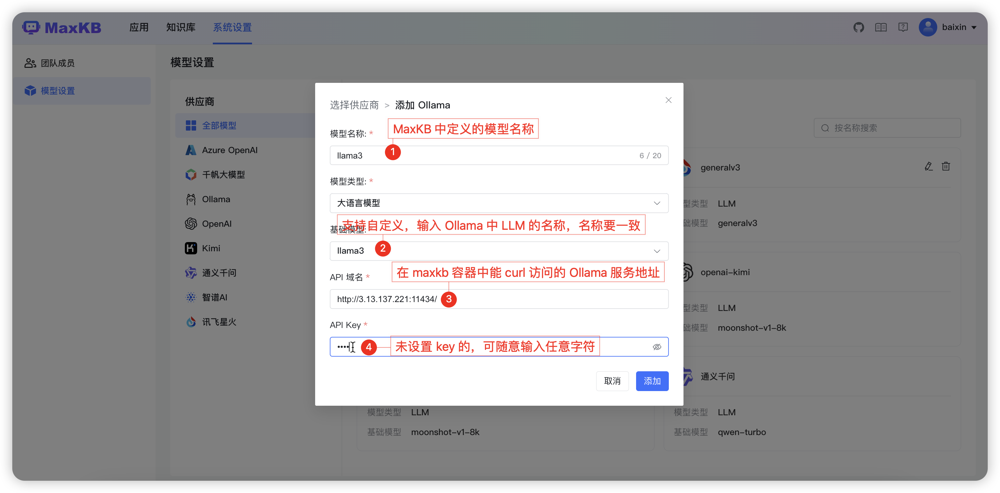

### 1.3 添加 Azure OpenAI 模型

!!! Abstract ""
    在模型管理中，点击供应商【 Azure OpenAI 】，直接进入下一步填写Azure OpenAI 的模型表单。    
    或者左侧供应商先选择【 Azure OpenAI 】，然后点击【添加模型】，则直接进入 Azure OpenAI 的模型表单。    
    模型名称： MaxKB 中自定义的模型名称。   
    模型类型： 大语言模型。   
    基础模型： 为供应商的 LLM 模型，支持自定义输入和下拉选项，当前可下拉选择的大语言模型如：gpt-3.5-turbo-0613、gpt-3.5-turbo-0301、gpt-3.5-turbo-16k-0613 等。    

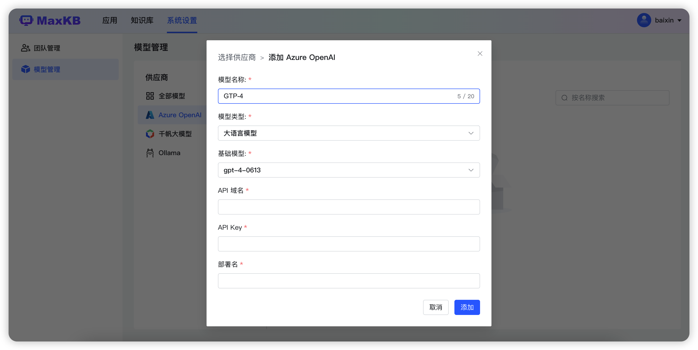

!!! Abstract ""
    API 域名、API Key、部署名称: 是Azure OpenAI 的模型部署中提供的，需要填写一致，参考下图：

### 1.4 添加 OpenAI 大模型

!!! Abstract ""
    在模型管理中，点击供应商【 OpenAI 】，直接进入下一步填写 OpenAI 的模型表单。    
    或者左侧供应商先选择【 OpenAI 】，然后点击【添加模型】，则直接进入 OpenAI 的模型表单。    
    模型名称： MaxKB 中自定义的模型名称。   
    模型类型： 大语言模型。   
    基础模型： 为供应商的 LLM 模型，支持自定义输入，下拉选项是 OpenAI 常用的一些大语言模型如：gpt-3.5-turbo-0613、gpt-3.5-turbo、gpt-4 等。    
    API 域名（国外）：https://api.openai.com/v1 。
    API 域名：国内服务器反向代理地址/v1。
    API Key：访问 OpenAI 的 Key。

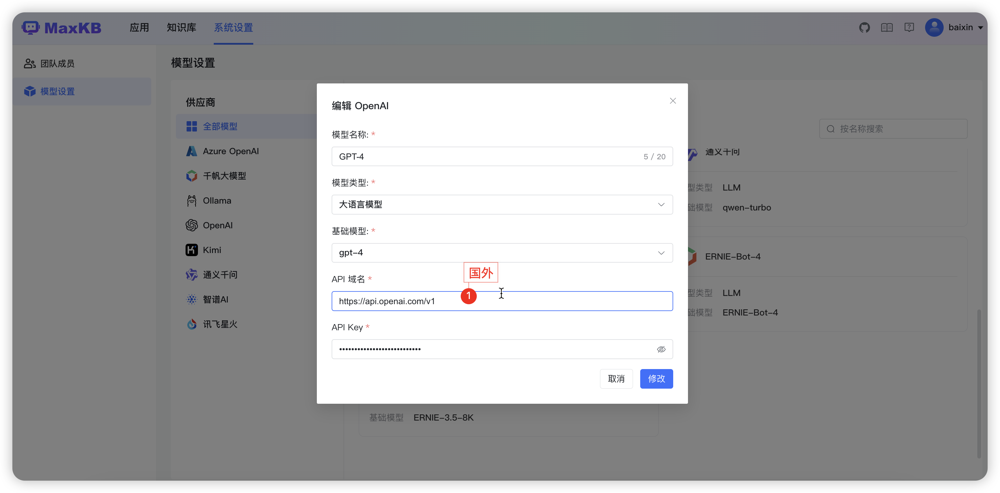

### 1.5 添加讯飞星火大模型

!!! Abstract ""
    在模型管理中，点击供应商【讯飞星火】，直接进入下一步填写讯飞星火的模型表单。    
    或者左侧供应商先选择【讯飞星火】，然后点击【添加模型】，则直接进入讯飞星火的模型表单。    
    模型名称： MaxKB 中自定义的模型名称。   
    模型类型： 大语言模型。   
    基础模型： 支持自定义输入，对应接口文档中domain，下拉选项是讯飞星火常用的一些大语言模型。    
    API 域名：每个基础模型对应的API域名不同，请根据所选基础模型输入对应的API域名，参考[讯飞星火官方文档](https://www.xfyun.cn/doc/spark/Web.html#_1-%E6%8E%A5%E5%8F%A3%E8%AF%B4%E6%98%8E)。

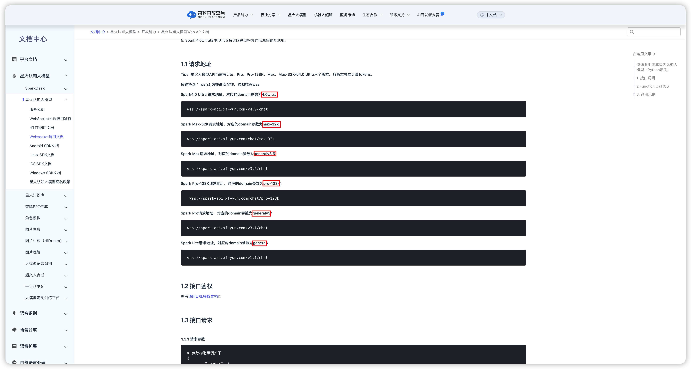{width="800px"}
!!! Abstract ""
    APP ID、API Key、Secret Key 需要现在讯飞星火开放平台创建应用，并该应该的剩余tokens>0，才能添加成功。
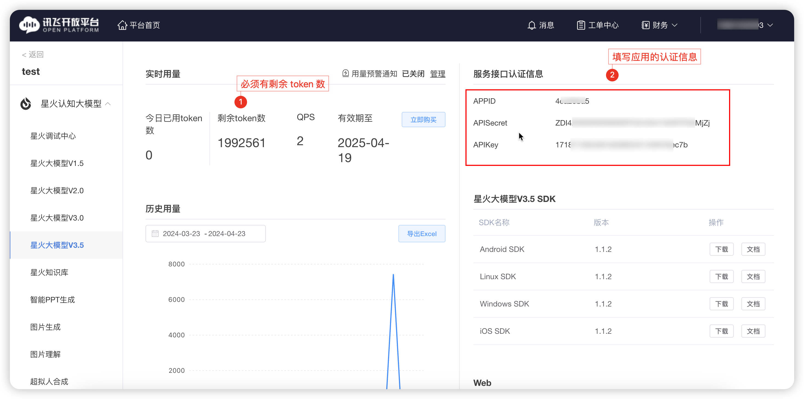
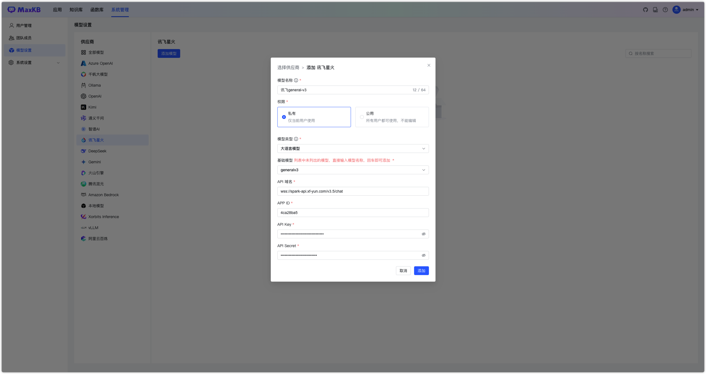

### 1.6 添加智谱AI大模型

!!! Abstract ""
    在模型管理中，点击供应商【智谱AI】，直接进入下一步填写智谱AI的模型表单。    
    或者左侧供应商先选择【智谱AI】，然后点击【添加模型】，则直接进入智谱AI的模型表单。    
    模型名称： MaxKB 中自定义的模型名称。   
    模型类型： 大语言模型。   
    基础模型： 为供应商的 LLM 模型，支持自定义输入，下拉选项是常用的一些大语言模型。    
    API Key： 需要现在智谱 AI 开放平台创建。

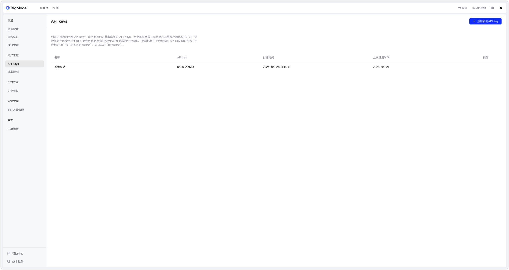
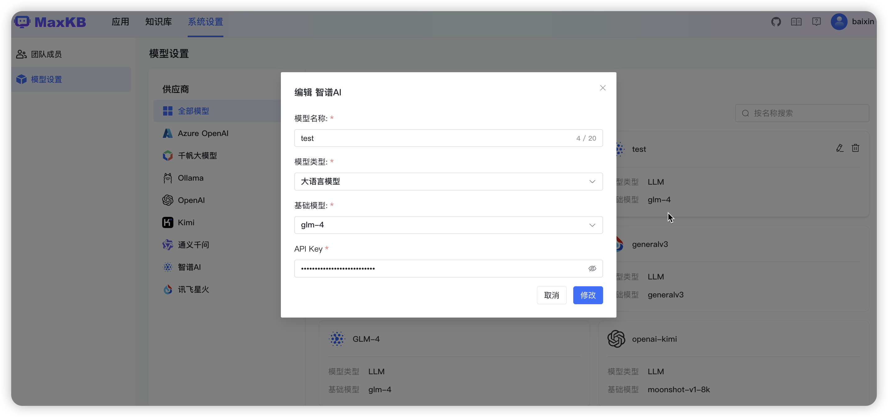

### 1.7 添加通义千问大模型

!!! Abstract ""
    在模型管理中，点击供应商【通义千问】，直接进入下一步填写通义千问的模型表单。    
    或者左侧供应商先选择【通义千问】，然后点击【添加模型】，则直接进入通义千问的模型表单。    
    模型名称： MaxKB 中自定义的模型名称。   
    模型类型： 大语言模型。   
    基础模型： 为供应商的 LLM 模型，支持自定义输入，下拉选项是常用的一些大语言模型。    
    API Key： 需要在阿里云->DashScope灵积模型服务->API Key管理中获取。

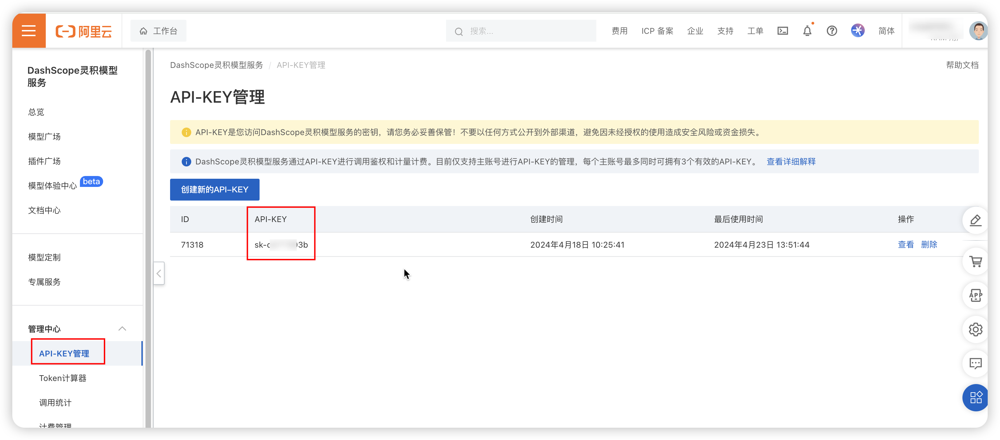
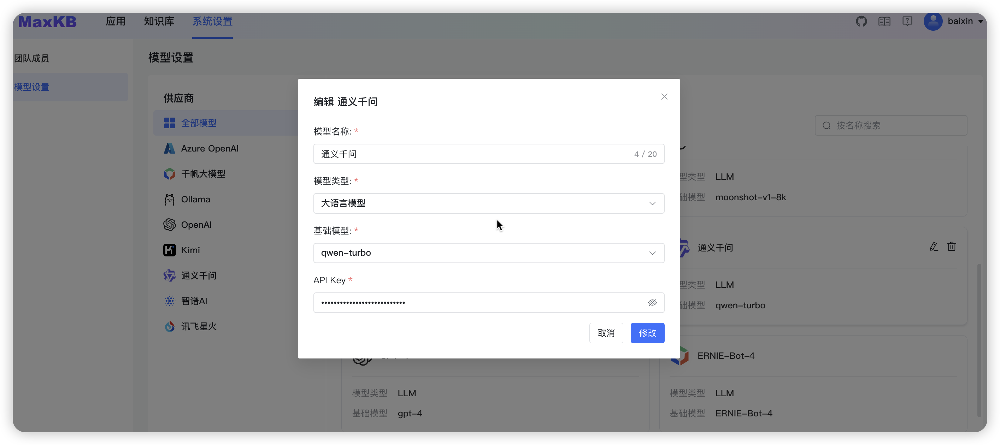

### 1.8 添加 Kimi 大模型

!!! Abstract ""
    在模型管理中，点击供应商【Kimi】，直接进入下一步填写Kimi的模型表单。    
    或者左侧供应商先选择【Kimi】，然后点击【添加模型】，则直接进入Kimi的模型表单。    
    模型名称： MaxKB 中自定义的模型名称。   
    模型类型： 大语言模型。   
    基础模型： 为供应商的 LLM 模型，支持自定义输入，下拉选项是常用的一些大语言模型。  
    API 域名： https://api.moonshot.cn/v1  
    API Key： 在Kimi 账户中心的 API Key 管理中获取 key。

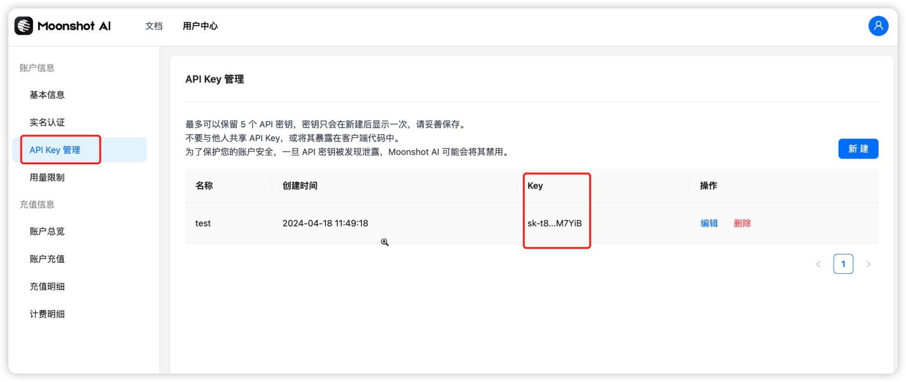
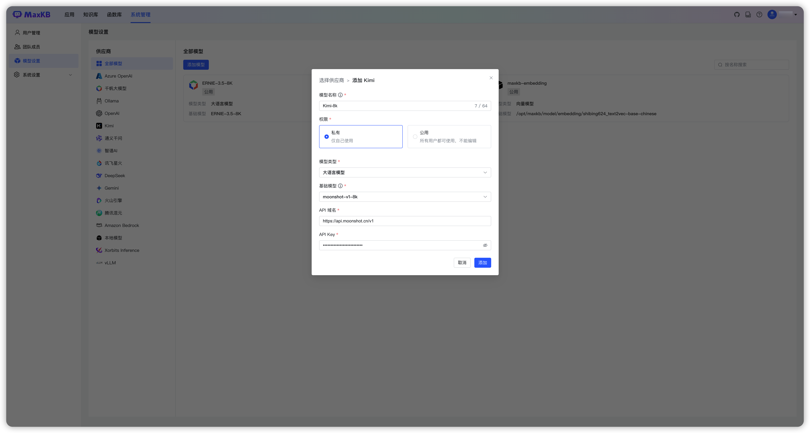

### 1.9 添加 DeepSeek 大模型

!!! Abstract ""
    在模型管理中，点击供应商【DeepSeek】，直接进入下一步填写 DeepSeek 的模型表单。    
    或者左侧供应商先选择【DeepSeek】，然后点击【添加模型】，则直接进入 DeepSeek 的模型表单。    
    模型名称： MaxKB 中自定义的模型名称。   
    模型类型： 大语言模型。   
    基础模型： 为供应商的 LLM 模型，支持自定义输入，下拉选项是常用的一些大语言模型。  
    API Key： 在 [DeepSeek官方](https://www.deepseek.com) 获取 API Key。

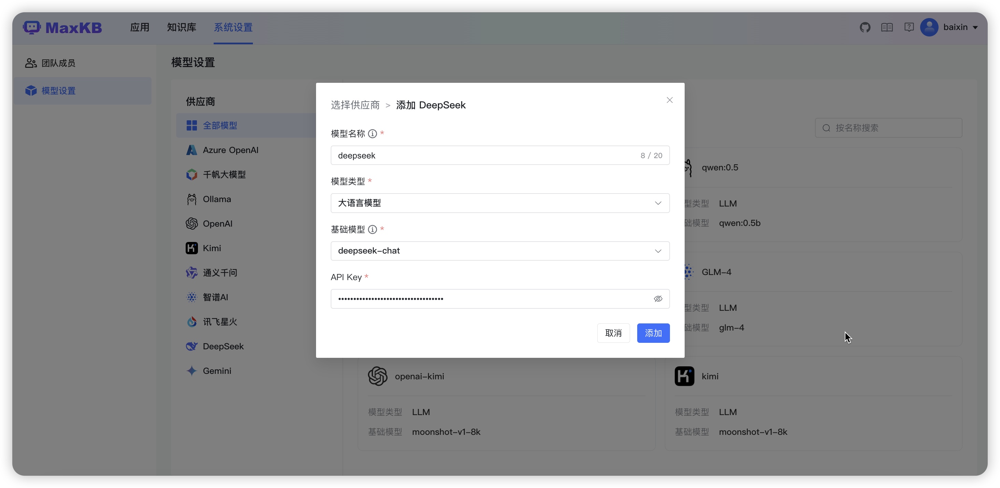

###  1.10 添加 Gemini 大模型

!!! Abstract ""
    在模型管理中，点击供应商【Gemini】，直接进入下一步填写 Gemini 的模型表单。    
    或者左侧供应商先选择【Gemini】，然后点击【添加模型】，则直接进入 Gemini 的模型表单。    
    模型名称： MaxKB 中自定义的模型名称。   
    模型类型： 大语言模型。   
    基础模型： 为供应商的 LLM 模型，支持自定义输入，下拉选项是常用的一些大语言模型。  
    API Key： 获取 API Key。

    注意：使用 Gemini API 需要确保程序所在服务器位于 [Gemini API所支持的地区](https://ai.google.dev/gemini-api/docs/available-regions?hl=zh-cn) ，否则无法调用API，并且无法进入Google AI Studio。

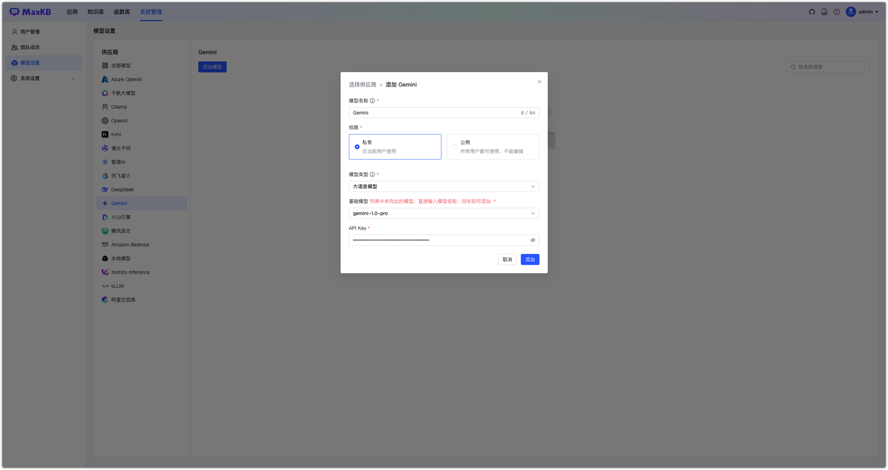

## 2 编辑模型

!!! Abstract ""
    点击模型右上角的编辑icon，打开编辑模型表单，可以对模型的属性进行修改。
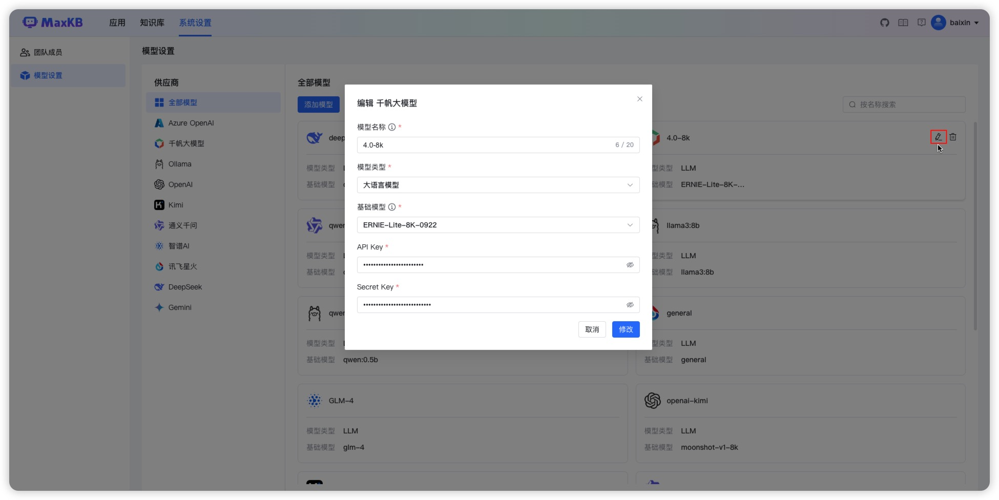
## 3 删除模型
!!! Abstract ""
    点击模型右上角的删除icon，这里仅会删除在MaxKB中模型的对接信息，不会物理删除供应商的模型。
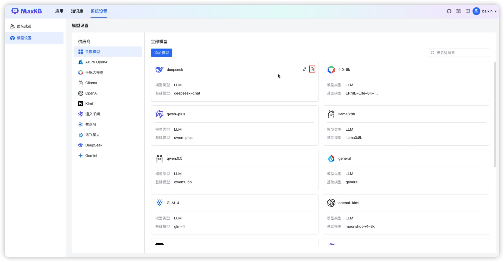