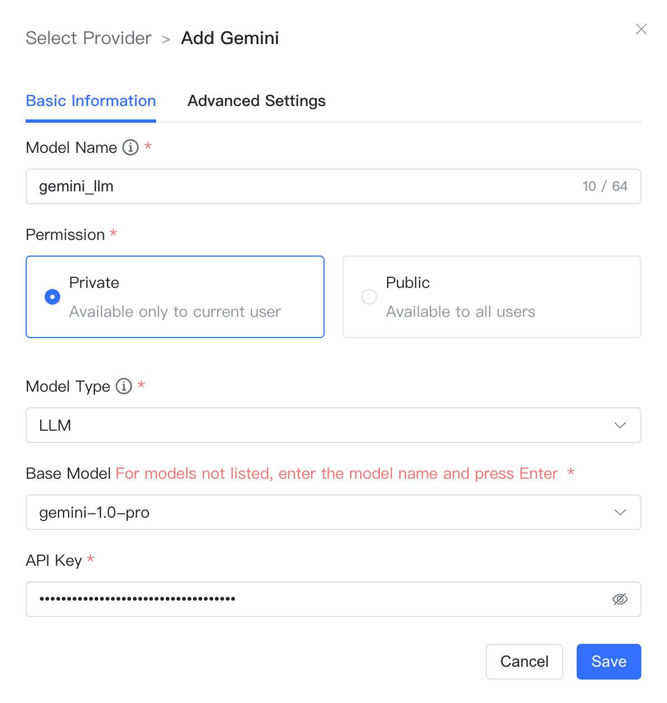
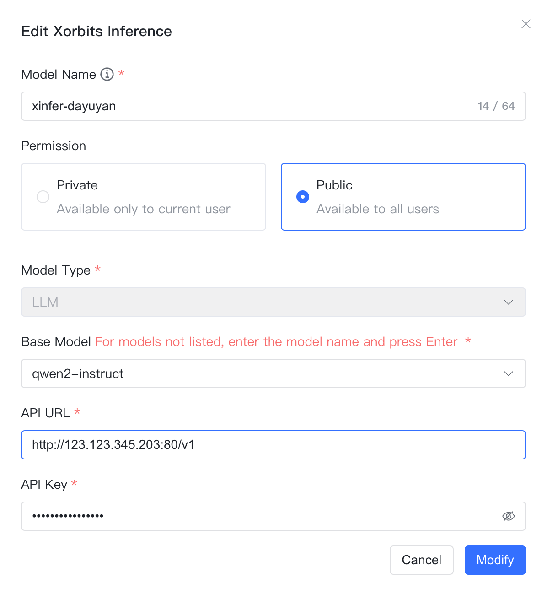
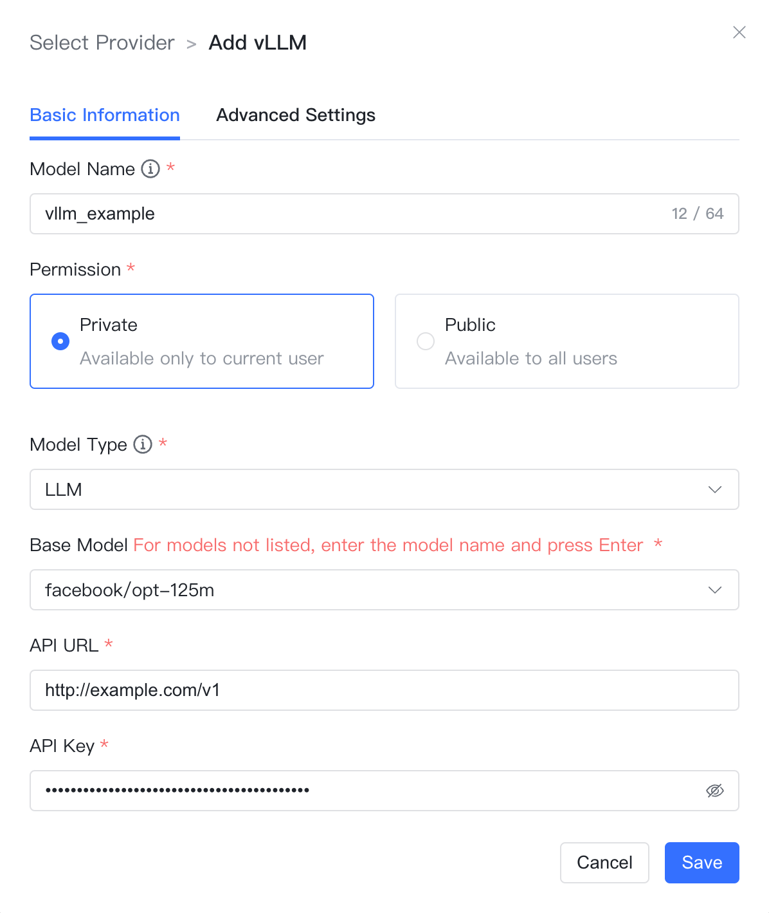
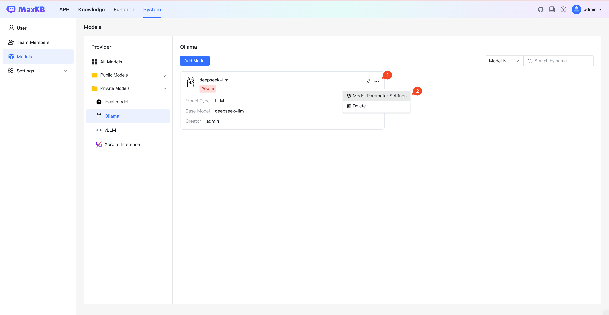
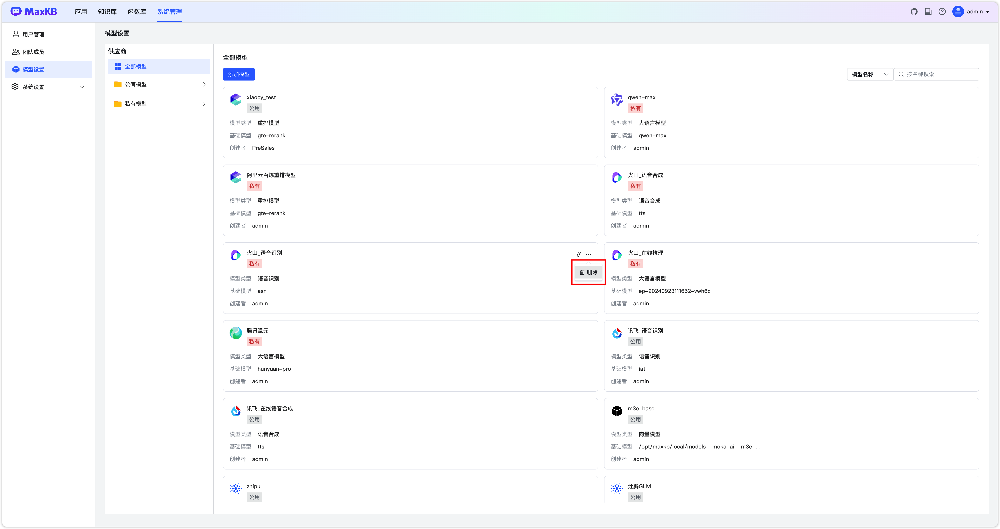

!!! Abstract ""
    模型管理用于对接供应商的大语言模型，支持对接主流的大模型，包括本地私有大模型（Llama 3 / Qwen 2 等）、国内公共大模型（通义千问 / 智谱 AI / 百度千帆 / Kimi / DeepSeek 等）和国外公共大模型（OpenAI / Azure OpenAI / Gemini 等），支持的种类包括大语言模型、向量模型、重排模型、语音识别模型、语音合成模型等。
    
    各供应商支持的类型详情见下表（按字母排序）：

    | 供应商           |  大语言模型  |  向量模型   |  重排模型   | 语音识别模型 | 语音合成模型 | 
    |-----------------|:----------:|:----------:|:----------:|:----------:|:----------:|
    |阿里云百炼         |            |  &#10004   | &#10004    |  &#10004   | &#10004   |
    |Amazon Bedrock   |  &#10004   |  &#10004   |            |            |           |
    |Azure OpenAI     |  &#10004   |            |            |            |           | 
    |DeepSeek         |  &#10004   |            |            |            |           | 
    |Gemini           |  &#10004   |            |            |            |           | 
    |kimi-月之暗面     |  &#10004   |             |           |            |           |
    |Ollama           |  &#10004   |  &#10004   |            |            |           | 
    |OpenAI           |  &#10004   |  &#10004   |            | &#10004    |  &#10004 |
    |通义千问          | &#10004    |            |            |            |           | 
    |腾讯混元          |  &#10004   |  &#10004   |            |            |           |
    |vLLM             |  &#10004   |            |            |            |           |
    |火山引擎          |  &#10004   |            |            |  &#10004   |  &#10004 |
    |本地模型          |            |  &#10004   | &#10004    |            |           |
    |千帆大模型         |  &#10004   |  &#10004  |            |            |           |
    |讯飞星火          |  &#10004   |  &#10004   |            | &#10004    |  &#10004  |
    |Xorbits Inference|  &#10004   |  &#10004   | &#10004    | &#10004   |   &#10004  | 
    |智谱 AI           |  &#10004  |            |            |            |           | 


## 1 添加模型

!!! Abstract ""
    登录 MaxKB 系统后，可以先对接模型，也可以在创建应用时再添加模型。添加模型时，可先点击【添加模型】，然后选择供应商，也可以左侧先选择供应商，然后点击【添加模型】。

### 1.1 添加千帆大模型

!!! Abstract ""
    添加千帆大模型之前，需要先在 [百度智能云千帆大模型平台](https://qianfan.cloud.baidu.com/) 中进行注册并登录。在控制台中的【模型服务-应用接入】中创建应用后，将自动生成 API Key和Secret Key 等信息。


!!! Abstract ""
    选择模型供应商为`千帆大模型`，并在模型添加对话框中输入如下必要信息：

    * 模型名称：MaxKB 中自定义的模型名称。   
    * 权限：分为私有和公用两种权限，私有模型仅当前用户可用，公用模型即系统内所有用户均可使用，但其它用户不能编辑和删除。    
    * 模型类型：大语言模型/向量模型。    
    * 基础模型：百度千帆支持的 LLM 模型名称，选项中显示了百度千帆支持的部分常用大语言模型名称，支持手动输入，但需要与千帆大平台支持的模型名称保持一致，否则无法通过校验。    
    * API Key 和 Secret Key：千帆大模型中应用的API Key 和 Secret Key。

!!! Abstract ""
    千帆大模型-大语言模型配置样例图示：


!!! Abstract ""
    千帆大模型-向量模型配置样例图示：


!!! Abstract ""


### 1.2 添加 Ollama 模型

!!! Abstract "" 
    **说明：** Ollama允许用户在本地计算机上运行和部署大型语言模型。在添加 Ollama 模型之前需要先自行安装部署 Ollama 并运行模型，详情见：[Ollama 离线部署LLM模型](../../faq/Offline_install_OllamaModel.md)。

!!! Abstract "" 
    模型供应商为`Ollama`，并在模型添加对话框中输入如下必要信息：

    * 模型名称：MaxKB 中自定义的模型名称。   
    * 权限：分为私有和公用两种权限，私有模型仅当前用户可用，公用模型即系统内所有用户均可使用，但其它用户不能编辑和删除。    
    * 模型类型：大语言模型/向量模型。    
    * 基础模型：Ollama 支持的不同类型模型的基础模型名称，选项中显示了 Ollama 支持的部分常用基础模型名称，支持手动输入，但需要与 Ollama 支持的模型名称保持一致，否则无法通过校验。如果本地没有此模型，系统将自动下载。 

!!! Abstract "" 
    大语言模型还需要输入 API 域名和API Key，向量模型需要输入API 域名。

    * API 域名：为 Ollama 服务地址连接信息，例如：http://42.92.198.53:11434 。     
    * API Key：若没有配置API Key，可以输入任意字符。

    点击【添加】，校验通过则添加成功，便可以在应用的 AI 模型列表选择该模型。

!!! Abstract ""
    ollama-大语言模型配置样例图示：


!!! Abstract ""
    ollama-向量模型配置样例图示：


### 1.3 添加 Azure OpenAI 模型

!!! Abstract "" 
    添加 Azure OpenAI 大模型之前，需要先在 [Azure AI Studio](https://ai.azure.com/) 中注册，并获取有关API 域名、API Key、部署详细信息等内容，参考下图：


!!! Abstract "" 
    选择模型供应商为`Azure OpenAI`，并在模型添加对话框中输入如下必要信息：

    * 模型名称：MaxKB 中自定义的模型名称。   
    * 权限：分为私有和公用两种权限，私有模型仅当前用户可用，公用模型即系统内所有用户均可使用，但其它用户不能编辑和删除。    
    * 模型类型：大语言模型。   
    * 基础模型：具体的基础模型由部署名决定，见上图。 
    * API 版本：模型版本
    * API 域名：Azure OpenAI 项目 API 服务 URL，见上图。
    * API Key：Azure OpenAI 项目 API 服务认证验证信息，见上图。
    * 部署名：Azure AI Studio 项目操场中模型的部署名称。


### 1.4 添加 OpenAI 大模型

!!! Abstract ""
    选择模型供应商为`OpenAI`，并在模型添加对话框中输入如下必要信息：

    * 模型名称： MaxKB 中自定义的模型名称。   
    * 权限：分为私有和公用两种权限，私有模型仅当前用户可用，公用模型即系统内所有用户均可使用，但其它用户不能编辑和删除。     
    * 模型类型： 大语言模型/向量模型/语音识别/语音合成。   
    * 基础模型： OpenAI 支持的 LLM 模型名称，选项中显示了 OpenAI 支持的部分常用大语言模型名称，支持手动输入，但需要与 OpenAI 支持的模型名称保持一致，否则无法通过校验。
    * API 域名：国外 Open API的域名是`https://api.openai.com/v1`，国内代理的API域名格式一般是`反向代理地址/v1`。
    * API Key：访问 OpenAI 的 Key。

!!! Abstract ""
    OpenAI-大语言模型配置样例图示：
{ width="500px" }

!!! Abstract ""
    OpenAI-向量模型配置样例图示：
{ width="500px" }


!!! Abstract ""
    OpenAI-语音识别模型配置样例图示：
{ width="500px" }


!!! Abstract ""
    OpenAI-语音合成配置样例图示：
{ width="500px" }

### 1.5 添加讯飞星火大模型

!!! Abstract "" 
    添加讯飞星火大模型之前，需要先在 [讯飞开放平台](https://www.xfyun.cn/) 中进行注册，并根据不同的模型类型创建不同应用，平台将自动生成APPID、API Secret、APIKey等信息。


!!! Abstract "" 
    选择模型供应商为`讯飞星火`，并在模型添加对话框中输入如下必要信息：

    * 模型名称：MaxKB 中自定义的模型名称。 
    * 权限：分为私有和公用两种权限，私有模型仅当前用户可用，公用模型即系统内所有用户均可使用，但其它用户不能编辑和删除。     
    * 模型类型：大语言模型/向量模型/语音识别/语音合成。   
    * 基础模型：对应接口文档中的 domain，下拉选项是讯飞星火不同模型类型下的常用基础模型名称，支持自定义输入。    
    * API 域名：每个基础模型对应的 API 域名不同，请根据所选基础模型输入对应的 API 域名，详情请参考[讯飞开放平台文档中心](https://www.xfyun.cn/doc/)，如下图所示。
    * APP ID：讯飞开放平台中创建应用的标识。
    * API Key：讯飞开放平台应用访问对应的 API Key。
    * API Secret：讯飞开放平台应用访问对应的的 API Secret。


!!! Abstract ""
    讯飞星火-大语言模型配置样例图示：

{ width="500px" }

!!! Abstract ""
    讯飞星火-向量模型配置样例图示：

{ width="500px" }

!!! Abstract ""
    讯飞星火-语音识别模型配置样例图示：

{ width="500px" }

!!! Abstract ""
    讯飞星火-语音合成模型配置样例图示：

{ width="500px" }


### 1.6 添加智谱AI大模型

!!! Abstract "" 
    添加讯智谱AI模型之前，需要先在 [智谱AI开放平台](https://open.bigmodel.cn/) 中进行注册并创建 API Key。


!!! Abstract ""
    选择模型供应商为`智谱AI`，并在模型添加对话框中输入如下必要信息：

    * 模型名称：MaxKB 中自定义的模型名称。   
    * 权限：分为私有和公用两种权限，私有模型仅当前用户可用，公用模型即系统内所有用户均可使用，但其它用户不能编辑和删除。     
    * 模型类型：大语言模型。   
    * 基础模型：智谱AI支持的 LLM 模型名称，下拉选项是常用的一些大语言模型名称，支持自定义输入。    
    * API Key：在智谱 AI 开放平台创建的 API Key。

{ width="500px" }

### 1.7 添加通义千问大模型

!!! Abstract ""
    添加通义千问模型之前，需要先在阿里云 DashScope 模型服务灵积创建 API-Key。


!!! Abstract ""
    选择模型供应商为`通义千问`，并在模型添加对话框中输入如下必要信息：

    * 模型名称：MaxKB 中自定义的模型名称。  
    * 权限：分为私有和公用两种权限，私有模型仅当前用户可用，公用模型即系统内所有用户均可使用，但其它用户不能编辑和删除。   
    * 模型类型：大语言模型。   
    * 基础模型：通义千问支持的 LLM 模型名称，下拉选项是常用的一些大语言模型名称，支持自定义输入。        
    * API Key：阿里云 DashScope灵积模型服务 API Key管理中创建和查看。

{ width="500px" }

### 1.8 添加 Kimi 大模型

!!! Abstract ""
    添加 kimi 模型之前，需要先在 [Moonshot AI 开放平台](https://platform.moonshot.cn/console/account) 中注册并创建 API Key。


!!! Abstract ""
    选择模型供应商为`Kimi`，并在模型添加对话框中输入如下必要信息：

    * 模型名称：MaxKB 中自定义的模型名称。   
    * 权限：分为私有和公用两种权限，私有模型仅当前用户可用，公用模型即系统内所有用户均可使用，但其它用户不能编辑和删除。
    * 模型类型：大语言模型。   
    * 基础模型：Kimi 支持的 LLM 模型名称，下拉选项是常用的一些大语言模型名称，支持自定义输入。   
    * API 域名：https://api.moonshot.cn/v1  
    * API Key：在 Kimi 账户中心的 API Key 管理中创建和查看。

{ width="500px" }

### 1.9 添加 DeepSeek 大模型

!!! Abstract ""
    添加 DeepSeek 大模型之前，需要先在 [DeepSeek 开放平台](https://platform.deepseek.com/) 创建 API Key。


!!! Abstract ""
    选择模型供应商为`DeepSeek`，并在模型添加对话框中输入如下必要信息：

    * 模型名称：MaxKB 中自定义的模型名称。  
    * 权限：分为私有和公用两种权限，私有模型仅当前用户可用，公用模型即系统内所有用户均可使用，但其它用户不能编辑和删除。      
    * 模型类型：大语言模型。   
    * 基础模型：DeepSeek 支持的 LLM 模型名称，下拉选项是常用的一些大语言模型名称，支持自定义输入。  
    * API Key：在 DeepSeek 开放平台创建并查看。

{ width="500px" }

###  1.10 添加 Gemini 大模型

!!! Abstract ""
    添加 Gemini 大模型之前，需要先在 [Google AI Studio](https://aistudio.google.com/) 创建 API Key。


!!! Abstract ""
    选择模型供应商为`Gemini`，并在模型添加对话框中输入如下必要信息：

    * 模型名称：MaxKB 中自定义的模型名称。    
    * 权限：分为私有和公用两种权限，私有模型仅当前用户可用，公用模型即系统内所有用户均可使用，但其它用户不能编辑和删除。     
    * 模型类型：大语言模型。   
    * 基础模型：Gemini 支持的 LLM 模型名称，下拉选项是常用的一些大语言模型名称，支持自定义输入。
    * API Key：获取 API Key。

    **注意：** 使用 Gemini API 需要确保程序所在服务器位于 [Gemini API 所支持的地区](https://ai.google.dev/gemini-api/docs/available-regions?hl=zh-cn) ，否则无法调用API，并且无法进入Google AI Studio。

{ width="500px" }

### 1.11 添加 Xorbits Inference 大模型

!!! Abstract ""
    选择模型供应商为`Xorbits Inference`，并在模型添加对话框中输入如下必要信息：

    * 模型名称：MaxKB 中自定义的模型名称。    
    * 权限：分为私有和公用两种权限，私有模型仅当前用户可用，公用模型即系统内所有用户均可使用，但其它用户不能编辑和删除。    
    * 模型类型：大语言模型/向量模型/语音识别/语音合成/重排模型。   
    * 基础模型：Xorbits-Inference 支持的 LLM 模型名称，下拉选项是常用的一些大语言模型名称，支持自定义输入。  

!!! Abstract "" 
    大语言模型和重排模型需要输入 API 域名和API Key，向量模型需要输入API 域名。

    * API 域名：Xorbits Inference 服务地址，例如：http://192.168.20.242:9997 。 
    * API Key：若没有 API Key，输入任意字符即可。

!!! Abstract ""
    Xorbits Inference-大语言模型配置样例图示：
{ width="500px" }

!!! Abstract ""
    Xorbits Inference-向量模型配置样例图示：
{ width="500px" }

!!! Abstract ""
    Xorbits Inference-语音识别模型配置样例图示：
{ width="500px" }

!!! Abstract ""
    Xorbits Inference-语音合成模型配置样例图示：
{ width="500px" }

!!! Abstract ""
    Xorbits Inference-重排模型配置样例图示：
{ width="500px" }

### 1.12 添加 vLLM 大模型

!!! Abstract ""
    选择模型供应商为`vLLM`，并在模型添加对话框中输入如下必要信息：

    * 模型名称：MaxKB 中自定义的模型名称。    
    * 权限：分为私有和公用两种权限，私有模型仅当前用户可用，公用模型即系统内所有用户均可使用，但其它用户不能编辑和删除。
    * 模型类型：大语言模型。   
    * 基础模型：vLLM 支持的 LLM 模型名称，下拉选项是常用的一些大语言模型名称，支持自定义输入。      
    * API 域名：vLLM 服务地址， 如：http://192.168.20.242:8000/v1 。 
    * API Key：若没有 API Key，输入任意字符即可。

{ width="500px" }

### 1.13 添加 Amazon Bedrock 大模型

!!! Abstract ""
    选择模型供应商为`Amazon Bedrock`，并在模型添加对话框中输入如下必要信息：

    * 模型名称：MaxKB 中自定义的模型名称。    
    * 权限：分为私有和公用两种权限，私有模型仅当前用户可用，公用模型即系统内所有用户均可使用，但其它用户不能编辑和删除。
    * 模型类型：大语言模型/向量大模型。   
    * 基础模型：Amazon Bedrock 支持的 LLM 模型名称，下拉选项是常用的一些大语言模型名称，支持自定义输入。     
    * Region Name：模型开通的区域。    
    * Access Key ID/Secret Access Key:  Access Key ID 和 Secret Access Key 是用于对 AWS 服务（包括 Amazon Bedrock）的编程访问进行身份验证的凭证。

!!! Abstract ""
    Amazon Bedrock-大语言模型配置样例图示：

{ width="500px" }

!!! Abstract ""
    Amazon Bedrock-向量模型配置样例图示：

{ width="500px" }

### 1.14 添加腾讯混元大模型

!!! Abstract ""
    添加腾讯混元大模型之前，需要先在腾讯云开通腾讯混元服务并新建秘钥。


!!! Abstract ""
    选择模型供应商为`腾讯混元`，并在模型添加对话框中输入如下必要信息：

    * 模型名称：MaxKB 中自定义的模型名称。    
    * 权限：分为私有和公用两种权限，私有模型仅当前用户可用，公用模型即系统内所有用户均可使用，但其它用户不能编辑和删除。    
    * 模型类型：大语言模型/向量模型。   
    * 基础模型：腾讯混元支持的 LLM 模型名称，下拉选项是常用的一些大语言模型名称，支持自定义输入。         
    * APPID：【腾讯云-控制台-访问管理-API密钥管理】中获取。 
    * SecretId：【腾讯云-控制台-访问管理-API密钥管理】中获取。
    * SecretKey：【腾讯云-控制台-访问管理-API密钥管理】新建密钥时下载的SecretKey。 

!!! Abstract ""
    腾讯混元-大语言模型配置样例图示：

{ width="500px" }

!!! Abstract ""
    腾讯混元-向量模型配置样例图示：
{ width="500px" }


### 1.15 添加豆包大模型

!!! Abstract ""
    选择模型供应商为`火山引擎`，并在模型添加对话框中输入如下必要信息：

    * 模型名称：MaxKB 中自定义的模型名称。    
    * 权限：分为私有和公用两种权限，私有模型仅当前用户可用，公用模型即系统内所有用户均可使用，但其它用户不能编辑和删除。   
    * 模型类型：大语言模型/语音识别/语音合成。

!!! Abstract ""
    豆包大语言模型其它接入参数说明：

    * 基础模型：在线推理的接入点ID。        
    * API 域名：https://ark.cn-beijing.volces.com/api/v3
    * API Key：接入点-> API调用 -> 通过API Key授权 -> 选择 API Key 复制获取，如下图


!!! Abstract ""
    豆包-大语言模型配置样例图示：
{ width="500px" }


!!! Abstract "" 
    语音识别和语音合成需要输入App ID、Access Token、Cluster ID。

    * App 域名：语音识别模型 API 域名为`wss://openspeech.bytedance.com/api/v2/asr`，语音合成模型 API 域名为`wss://openspeech.bytedance.com/api/v1/tts/ws_binary`
    * App ID：在火山引擎中创建的应用ID。 
    * Access Token：在火山引擎应用对应的认证信息。 
    * Cluster ID：在火山引擎应用对应的服务信息.


!!! Abstract ""
    豆包-语音识别模型配置样例图示：
{ width="500px" }

!!! Abstract ""
    豆包-语音合成模型配置样例图示：
{ width="500px" }


### 1.16 阿里云百炼大模型

!!! Abstract ""
    选择模型供应商为`阿里云百炼`，并在模型添加对话框中输入如下必要信息：

    * 模型名称：MaxKB 中自定义的模型名称。    
    * 权限：分为私有和公用两种权限，私有模型仅当前用户可用，公用模型即系统内所有用户均可使用，但其它用户不能编辑和删除。   
    * 模型类型：向量模型/语音识别/语音合成/重排模型。   
    * 基础模型：阿里云百炼支持的重排模型模型名称，下拉选项是常用的一些重排模型名称，支持自定义输入。
    * API Key：阿里云百炼重排模型对应的 API Key。


!!! Abstract ""
    阿里云百炼-向量模型配置样例图示：

{ width="500px" }

!!! Abstract ""
    阿里云百炼-语音识别模型配置样例图示：
{ width="500px" }

!!! Abstract ""
    阿里云百炼-语音合成模型配置样例图示：
{ width="500px" }

!!! Abstract ""
    阿里云百炼-重排模型配置样例图示：
{ width="500px" }

### 1.17 本地模型

!!! Abstract ""
    **前提条件：** 将模型下载到服务器，并且挂在到 MaxKB 容器中,以向量模型为例详细说明如下。

    （1）将向量模型下载到本地服务器。
    ```
    # 推荐模型下载网址
    https://huggingface.co/models?other=text-embedding
    # 下载后存放在/opt/maxkb/model/local_embedding目录下
    ```
    （2）使用-v 将宿主机模型路径挂载到 MaxKB 容器内部。
    ```
    -v /opt/maxkb/model/local_embedding:/opt/maxkb/model/local_embedding
    # 说明： v 模型所在目录:MaxKB容器内目录
    ```

!!! Abstract ""
    在模型管理中，点击供应商【本地模型】，直接进入下一步填写本地模型的表单。  

    * 模型名称：MaxKB 中自定义的模型名称。    
    * 权限：分为私有和公用两种权限，私有模型仅当前用户可用，公用模型即系统内所有用户均可使用，但其它用户不能编辑和删除。   
    * 模型类型：向量模型/重排模型。   
    * 基础模型：模型在 MaxKB 容器下的绝对路径。     
    * 模型目录：模型的目录（基础模型为名称时，该目录生效，基础模型若有绝对路径，则该参数不生效，建议与基础模型填写一致）。 

!!! Abstract ""
    本地模型-向量模型配置样例图示：
{ width="500px" }

!!! Abstract ""
    本地模型-重排模型配置样例图示：
{ width="500px" }


## 2 模型参数设置

!!! Abstract ""
    点击模型右上角更多菜单，点击【模型参数设置】，可以根据各平台提供的其它参数进行配置。



## 3 编辑模型

!!! Abstract ""
    点击模型右上角的编辑icon，打开编辑模型表单，可以对模型的属性进行修改。


## 4 删除模型

!!! Abstract ""
    点击模型右上角的删除icon，即删除 MaxKB 与该模型的对接信息，但不会物理删除此模型。
