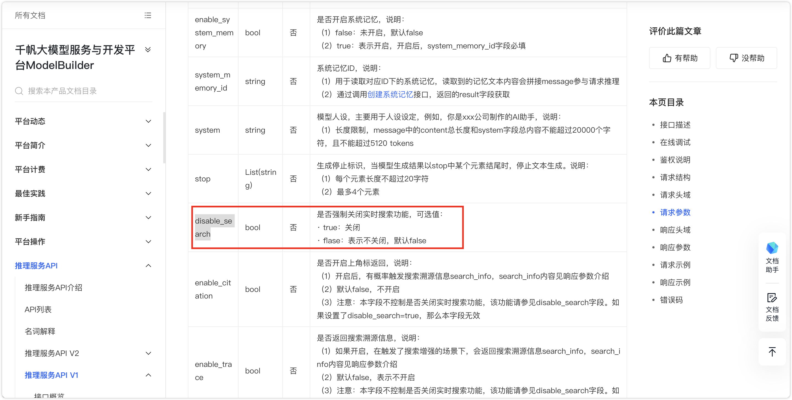
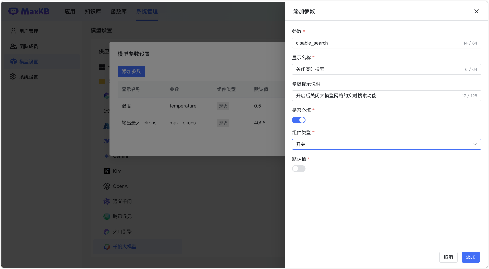
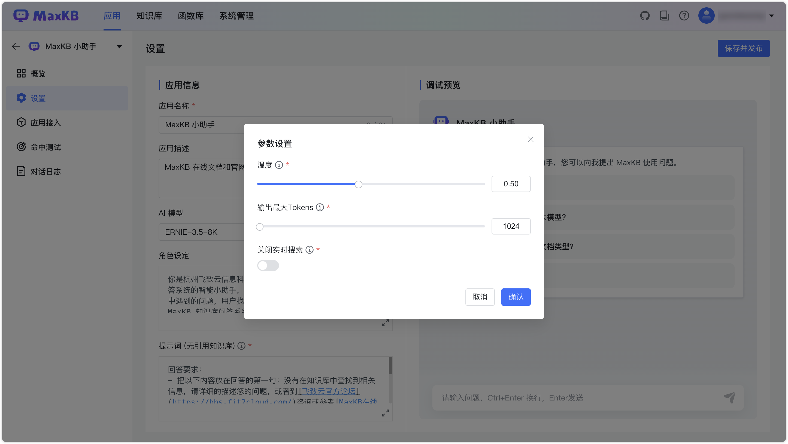

!!! Abstract ""
    点击模型右上角更多菜单，点击【模型参数设置】，可以根据各平台提供的其它参数进行配置。

!!! Abstract ""
    以模型联网搜索参数为例，首先需要先在对应模型平台官方 API 文档找到模型的参数信息，例如百度千帆大模型的 ERNIE-4.0-8K， 联网参数为：disable_search，打开 ERNIE-4.0-8K的模型参数设置，添加关闭实时搜索参数。
    **注意：** 不同模型该参数会有差异，请根据官方文档进行配置相关参数。

!!! Abstract ""
    然后在应用的AI模型参数设置中，设置实时搜索功能参数。

