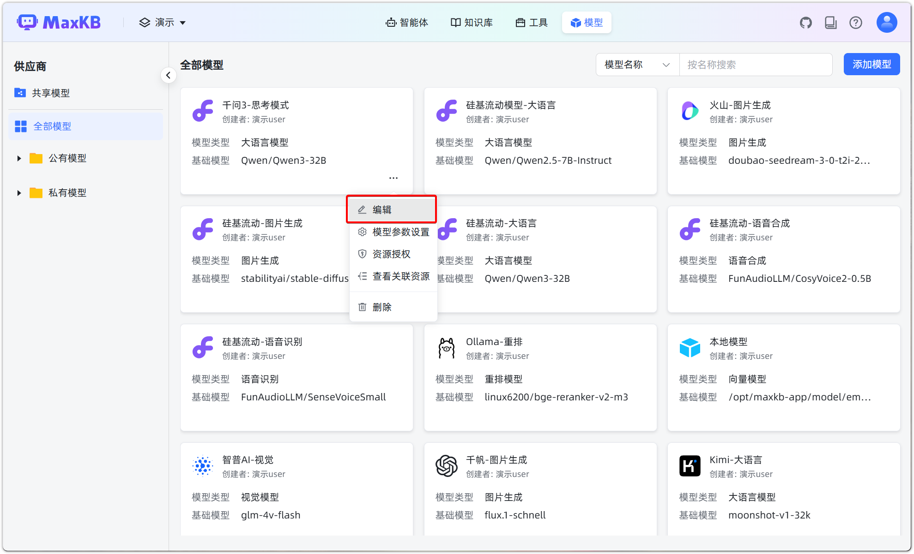
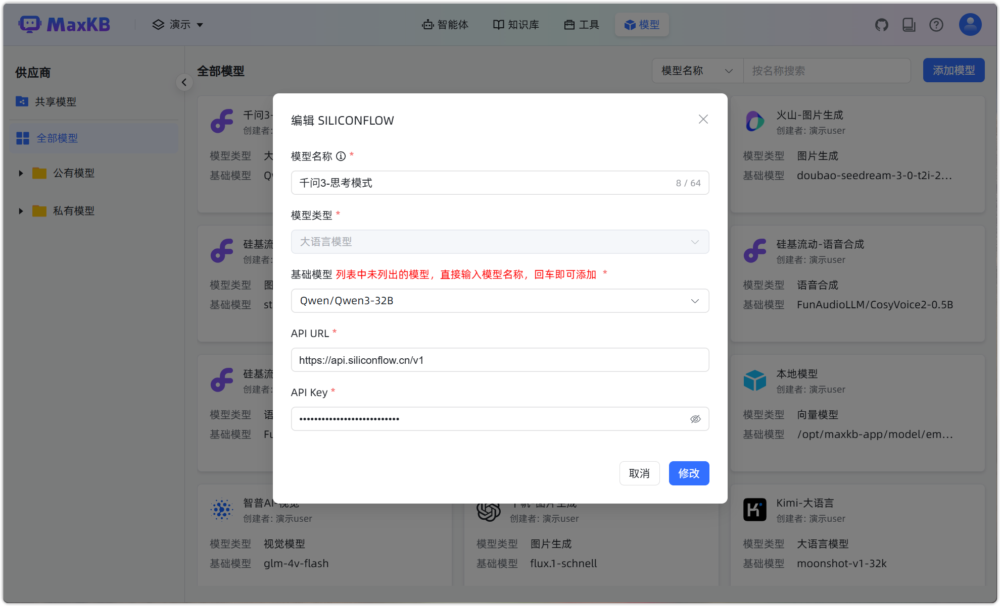
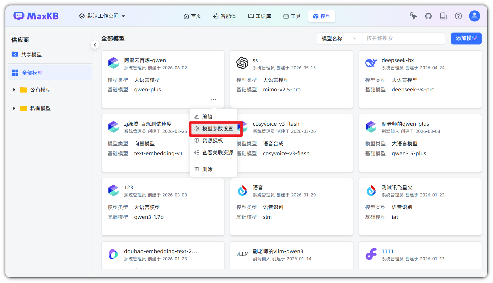
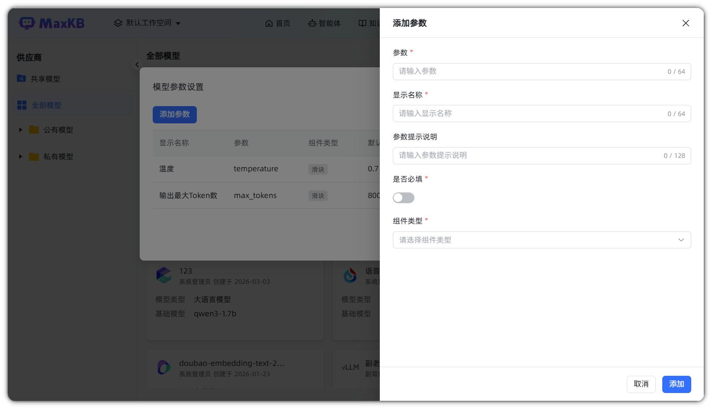
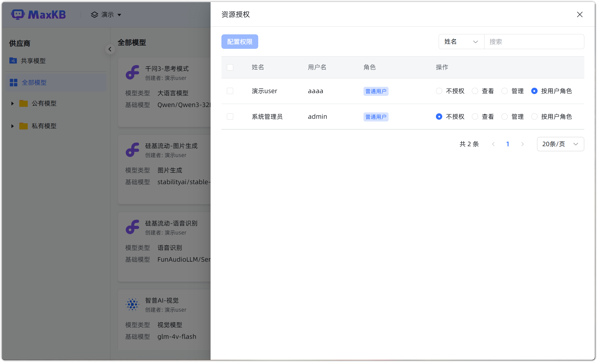
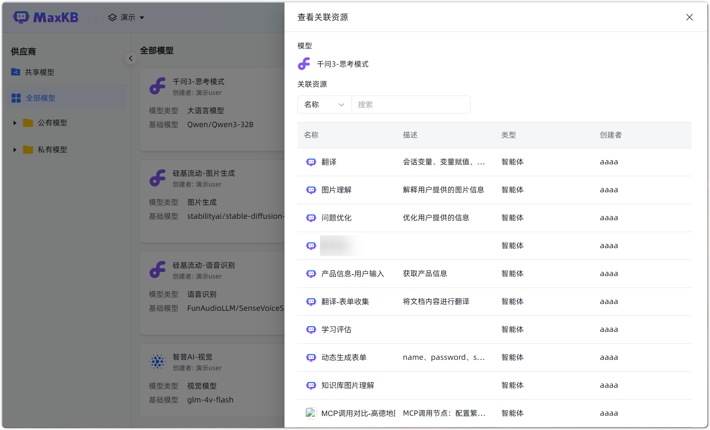

# 模型操作

## 1 编辑
!!! Abstract ""
    点击模型右下角更多菜单，点击【编辑】，可以修改已创建的模型配置信息。

## 2 模型参数设置
!!! Abstract ""
    点击模型右下角更多菜单，点击【模型参数设置】，可以查看模型参数配置，也可根据各平台提供的其它参数进行配置。

## 3 资源授权
!!! Abstract ""
    点击模型右下角更多菜单，点击【资源授权】，可以将该模型授权给相应的用户。

## 4 查看关联资源
!!! Abstract ""
    点击模型右下角更多菜单，点击【查看关联资源】，可查看该模型关联资源依赖和被依赖情况，支持根据名称、创建者和类型进行搜索。

    - 依赖：查看当前资源所依赖的其他资源（智能体、模型、知识库、工具）；
    - 被依赖：查看当前资源被其他资源（智能体、模型、知识库、工具）依赖。

