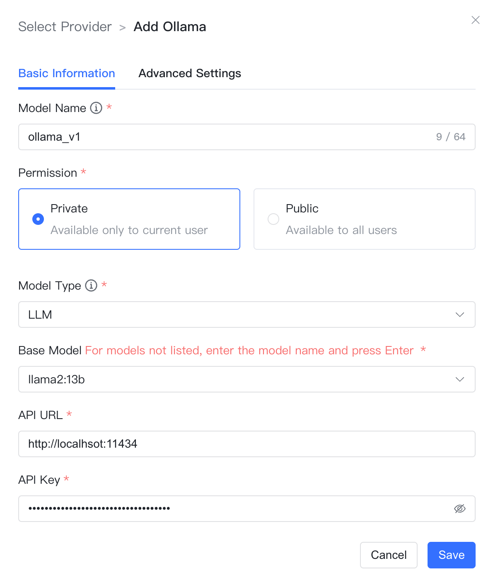
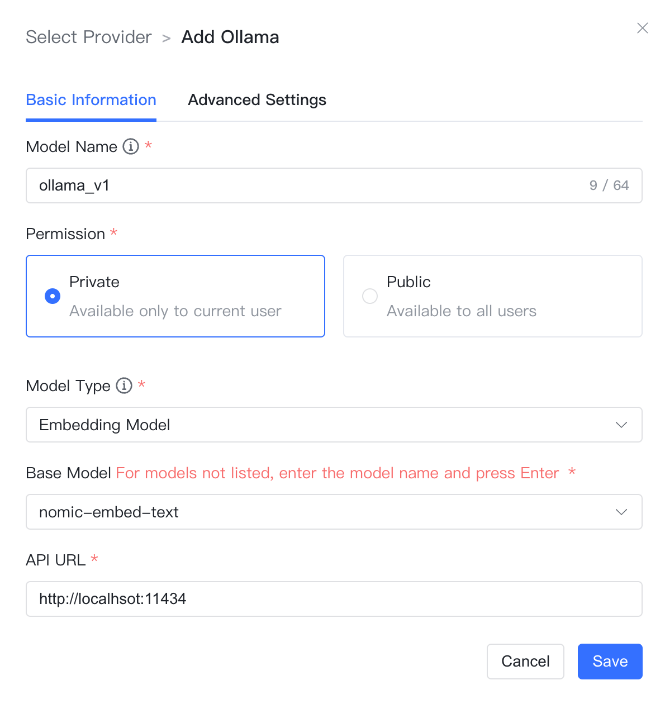

## 1 Adding a Model

!!! Abstract ""
    **Note:** Ollama allows users to run and deploy large language models on their local computers. Before adding an Ollama model, you need to install and deploy Ollama and run the model. For more details, see: [Ollama Offline Deployment of LLM Models](../../faq/Offline_install_OllamaModel.md).

!!! Abstract ""
    Select the model provider as `Ollama` and enter the following necessary information in the model addition dialog:

    * Model Name: Custom model name in MaxKB.
    * Permission: Divided into private and public permissions. Private models are only available to the current user, while public models can be used by all users within the system, but other users cannot edit or delete them.
    * Model Type: Large language model/Vector model/Image understanding.
    * Base Model: The name of the base model under different types, with a drop-down option for some commonly used base model names. It supports custom input, but must be consistent with the model names supported by Ollama; otherwise, it will not pass validation. If the model is not available locally, the system will automatically download it.

!!! Abstract ""
    Large language models also require the input of an API domain and API Key, while vector models require the API domain.

    * API Domain: Connection information for the Ollama service address, e.g., http://42.92.198.53:11434.
    * API Key: If an API Key is not configured, you can enter any character.

    Click [Add], and if the validation passes, the model is successfully added. You will then be able to select this model in the AI model list of the application.

## 2 Configuration Example

!!! Abstract ""
    Example of configuration for ollama - Large Language Model:

!!! Abstract ""
    Example of configuration for ollama - Vector Model:

!!! Abstract ""
    Example of configuration for ollama - Image Understanding:

