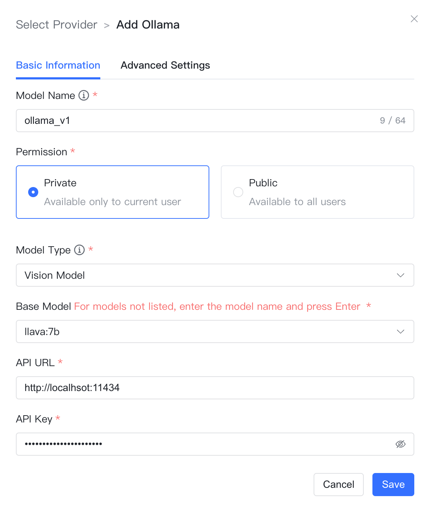

## 1 添加模型

!!! Abstract "" 
    **说明：** Ollama允许用户在本地计算机上运行和部署大型语言模型。在添加 Ollama 模型之前需要先自行安装部署 Ollama 并运行模型，详情见：[Ollama 离线部署LLM模型](../../faq/Offline_install_OllamaModel.md)。

!!! Abstract "" 
    模型供应商为`Ollama`，并在模型添加对话框中输入如下必要信息：

    * 模型名称：MaxKB 中自定义的模型名称。   
    * 权限：分为私有和公用两种权限，私有模型仅当前用户可用，公用模型即系统内所有用户均可使用，但其它用户不能编辑和删除。    
    * 模型类型：大语言模型/向量模型/图片理解。    
    * 基础模型：不同类型模型下的基础模型名称，下拉选项是常用的一些基础模型名称，支持自定义输入，但需要与 Ollama 支持的模型名称保持一致，否则无法通过校验。如果本地没有此模型，系统将自动下载。 

!!! Abstract "" 
    大语言模型还需要输入 API 域名和API Key，向量模型需要输入API 域名。

    * API 域名：为 Ollama 服务地址连接信息，例如：http://42.92.198.53:11434 。     
    * API Key：若没有配置API Key，可以输入任意字符。

    点击【添加】，校验通过则添加成功，便可以在应用的 AI 模型列表选择该模型。

## 2 配置样例

!!! Abstract ""
    ollama-大语言模型配置样例图示：

!!! Abstract ""
    ollama-向量模型配置样例图示：

!!! Abstract ""
    ollama-图片理解配置样例图示：

