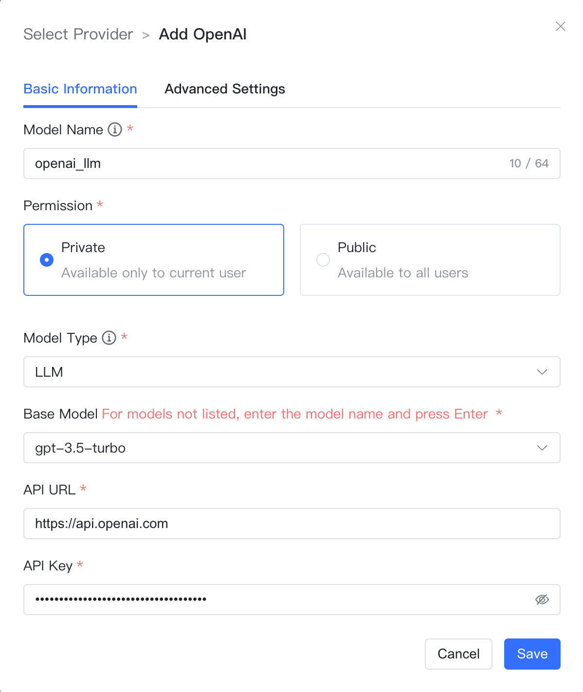
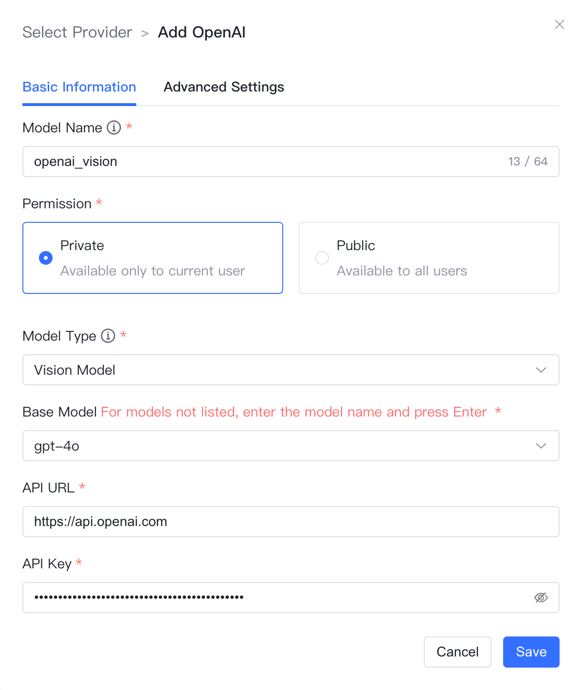

## 1 添加模型

!!! Abstract ""
    选择模型供应商为`OpenAI`，并在模型添加对话框中输入如下必要信息：

    * 模型名称： MaxKB 中自定义的模型名称。   
    * 权限：分为私有和公用两种权限，私有模型仅当前用户可用，公用模型即系统内所有用户均可使用，但其它用户不能编辑和删除。     
    * 模型类型： 大语言模型/向量模型/语音识别/语音合成/视觉模型/图片生成。   
    * 基础模型： 不同类型模型下的基础模型名称，下拉选项是常用的一些基础模型名称，支持自定义输入，但需要与 OpenAI 支持的模型名称保持一致，否则无法通过校验。
    * API 域名：国外 Open API的域名是`https://api.openai.com/v1`，国内代理的API域名格式一般是`反向代理地址/v1`。
    * API Key：访问 OpenAI 的 Key。

## 2 配置样例

!!! Abstract ""
    OpenAI-大语言模型配置样例图示：
{ width="500px" }

!!! Abstract ""
    OpenAI-向量模型配置样例图示：
{ width="500px" }

!!! Abstract ""
    OpenAI-语音识别模型配置样例图示：
{ width="500px" }

!!! Abstract ""
    OpenAI-语音合成配置样例图示：
{ width="500px" }

!!! Abstract ""
    OpenAI-视觉模型配置样例图示：
{ width="500px" }

!!! Abstract ""
    OpenAI-图片生成模型配置样例图示：
{ width="500px" }