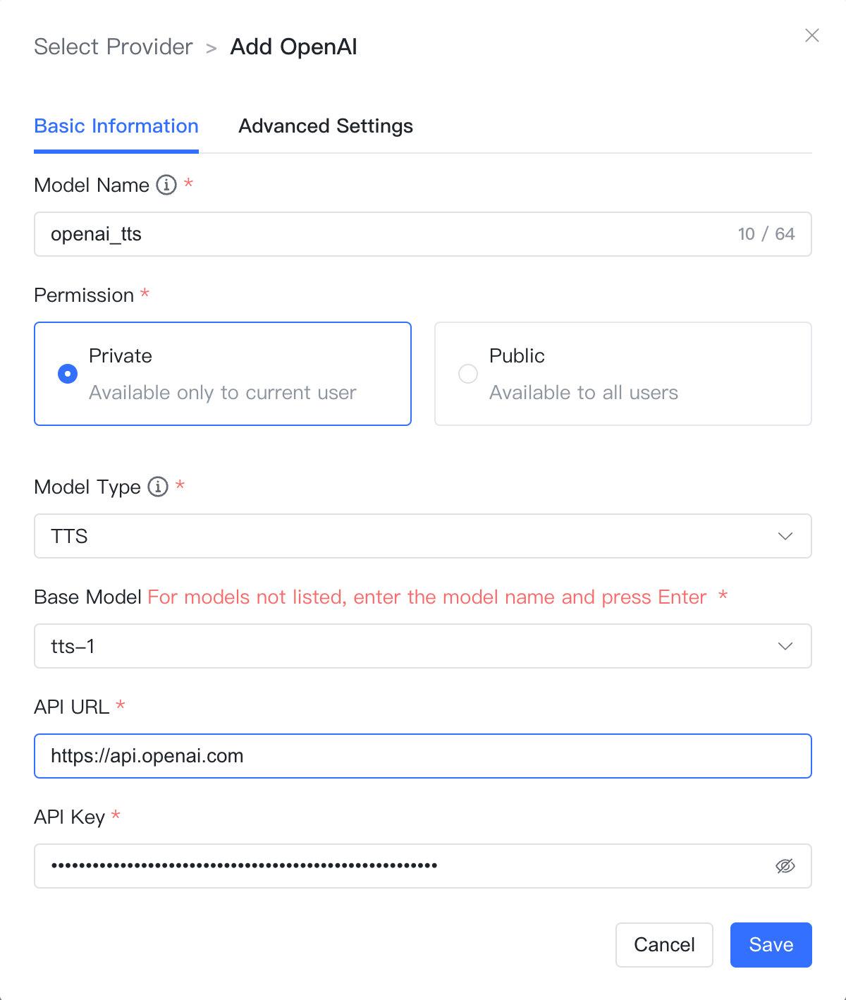

## 1 Adding a Model

!!! Abstract ""
    Select the model provider as `OpenAI` and enter the following necessary information in the model addition dialog:

    * Model Name: Custom model name in MaxKB.
    * Permission: Divided into private and public permissions. Private models are only available to the current user, while public models can be used by all users within the system, but other users cannot edit or delete them.
    * Model Type: Large language model/Vector model/Speech recognition/Speech synthesis.
    * Base Model: The name of the base model under different types, with a drop-down option for some commonly used base model names. It supports custom input but must be consistent with the model names supported by OpenAI; otherwise, it will not pass validation.
    * API Domain: The domain name for the overseas Open API is `https://api.openai.com/v1`. The format for the API domain in China is typically `reverse proxy address/v1`.
    * API Key: The Key to access OpenAI.

## 2 Configuration Example

!!! Abstract ""
    Example of OpenAI - Large Language Model configuration:
{ width="500px" }

!!! Abstract ""
    Example of OpenAI - Vector Model configuration:
{ width="500px" }

!!! Abstract ""
    Example of OpenAI - Speech Recognition Model configuration:
{ width="500px" }

!!! Abstract ""
    Example of OpenAI - Speech Synthesis configuration:
{ width="500px" }

!!! Abstract ""
    Example of OpenAI - Image Understanding configuration:
{ width="500px" }
