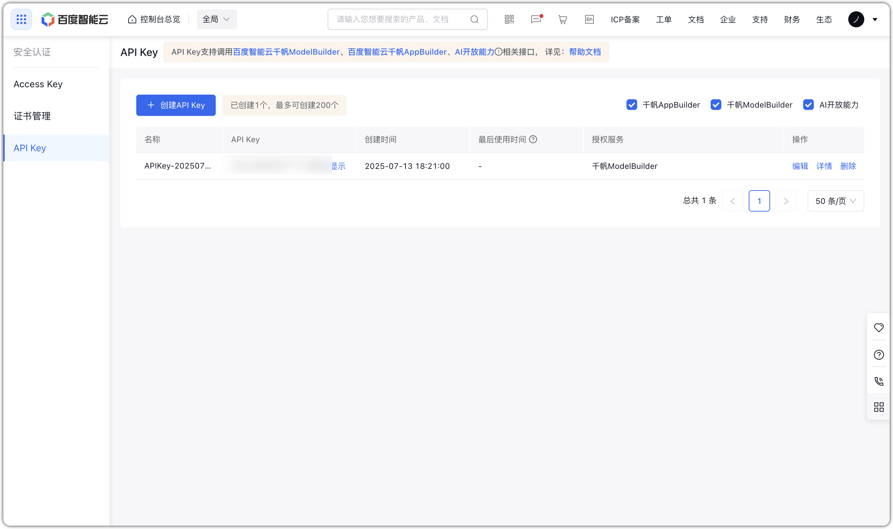
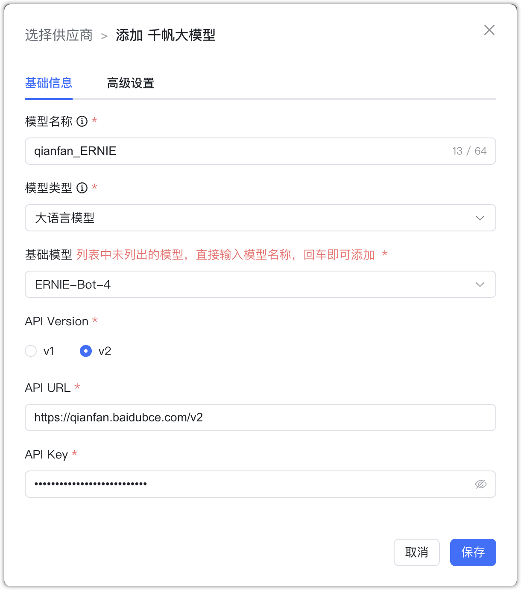
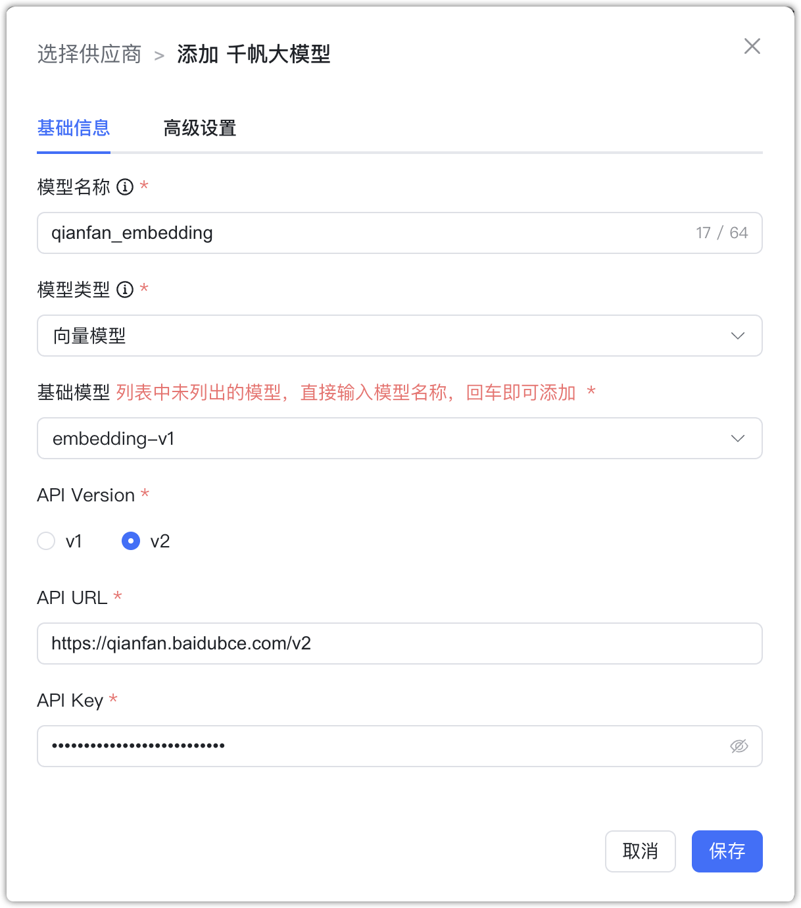

## 1 添加模型

!!! Abstract ""
    添加千帆大模型之前，需要先在 [百度智能云千帆大模型平台](https://qianfan.cloud.baidu.com/) 中进行注册并登录。在控制台中的【安全认证】中创建 API Key 和 Secret Key 等信息。
    
    **说明：** 千帆 ModelBuilder 已经推出兼容 OpenAI 规范的 v2版本推理接口，v1 版本推理接口即将下线。MaxKB 对 v1和 v2 版本接口进行了兼容处理，在创建模型时，可以指定 API 接口版本。使用 v1 版本时，需要输入 API Key 和 Secret Key参数，而 v2 版本版本输入参数为 API URL 和 API Key。

    选择模型供应商为`千帆大模型`，并在模型添加对话框中输入如下必要信息：

    * 模型名称：MaxKB 中自定义的模型名称。
    * 模型类型：大语言模型/向量模型。    
    * 基础模型：百度千帆支持的 LLM 模型名称，选项中显示了百度千帆支持的部分常用大语言模型名称，支持手动输入，但需要与千帆大平台支持的模型名称保持一致，否则无法通过校验。  
    * API Version: API 接口版本，v1/v2。
    * API URL: API Version 为 v2时的输入参数，请输入`https://qianfan.baidubce.com/v2`。
    * API Key 和 Secret Key： API Version 为 v1 时的输入参数， 即千帆大模型中应用的 API Key和Secret Key。

## 2 配置样例

!!! Abstract ""
    千帆大模型 v2-大语言模型配置样例图示：

{ width="500px" }

!!! Abstract ""
    千帆大模型 v2-向量模型配置样例图示：
{ width="500px" }

