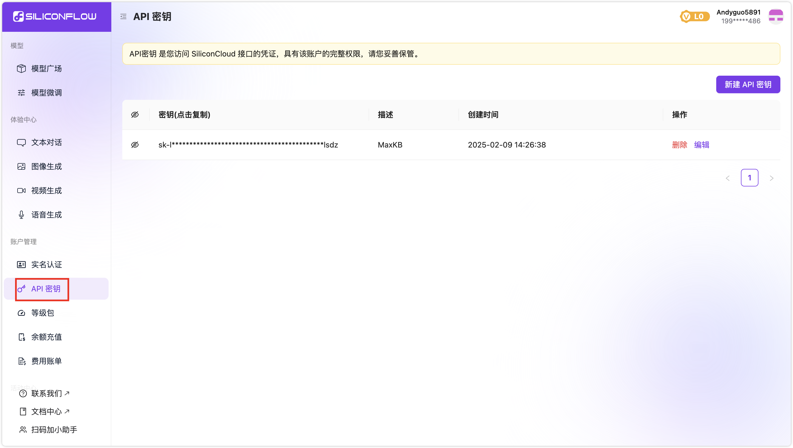
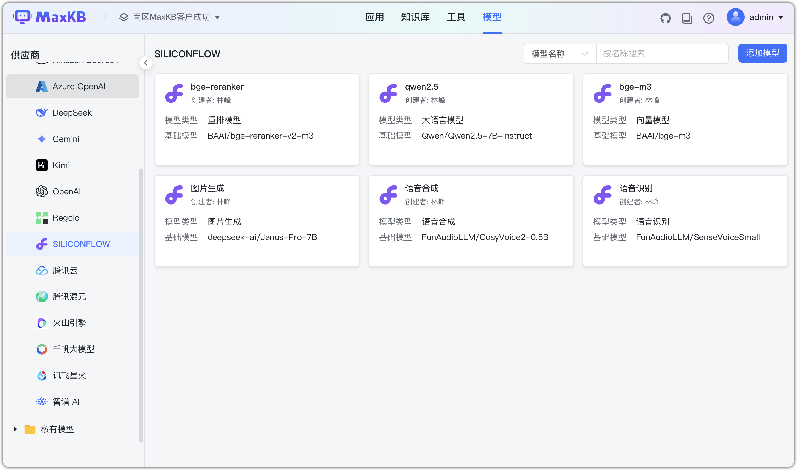
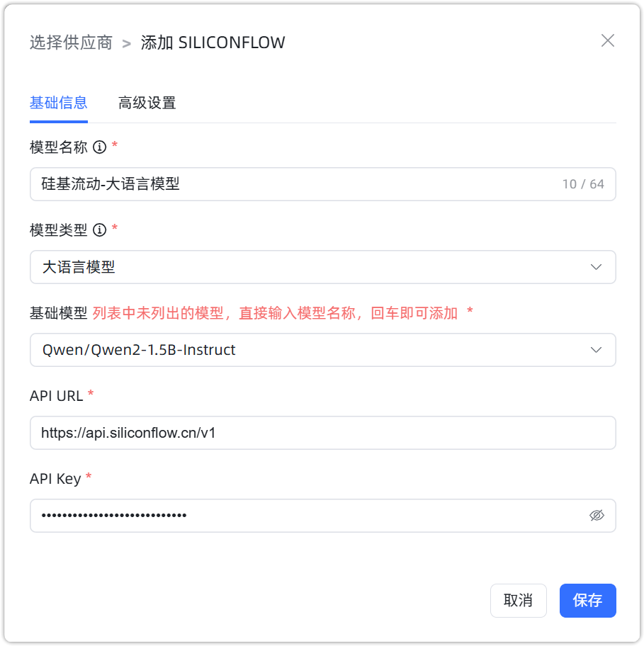
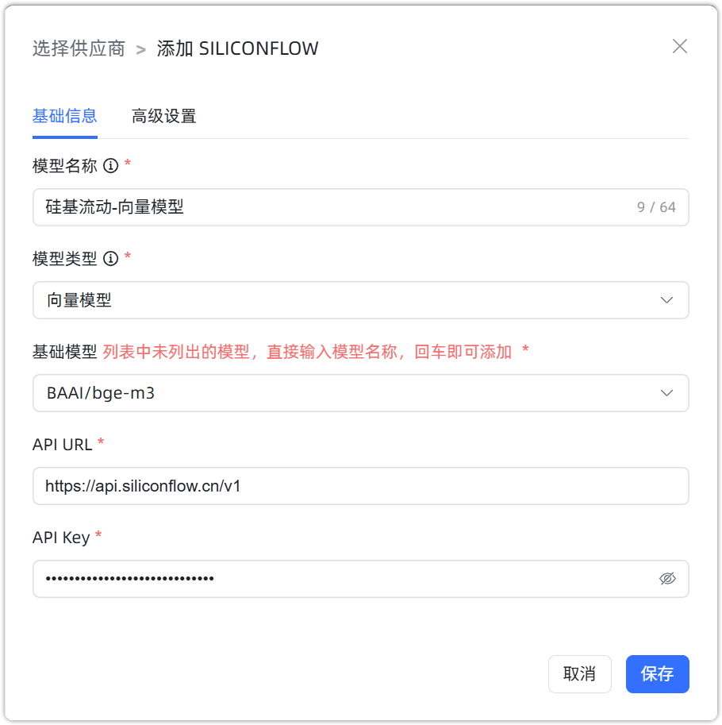
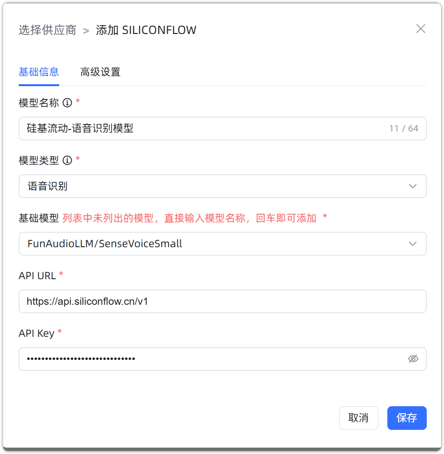
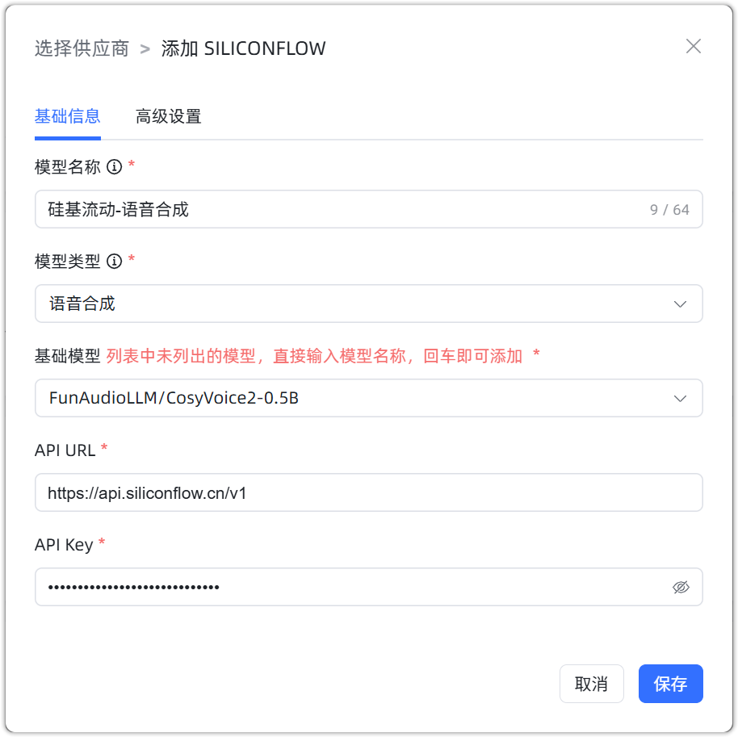
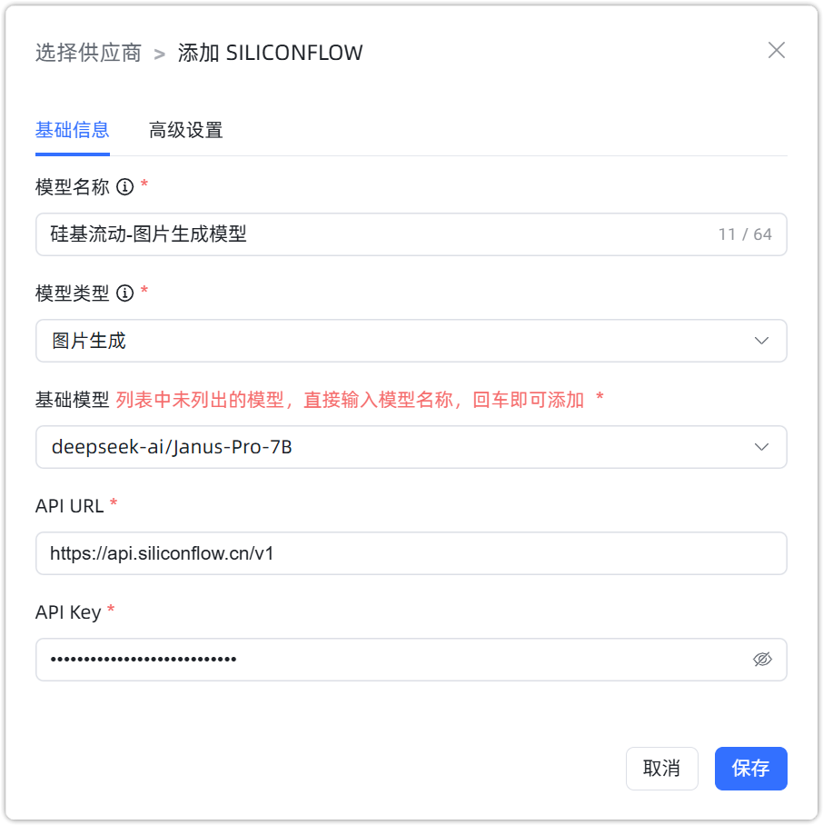
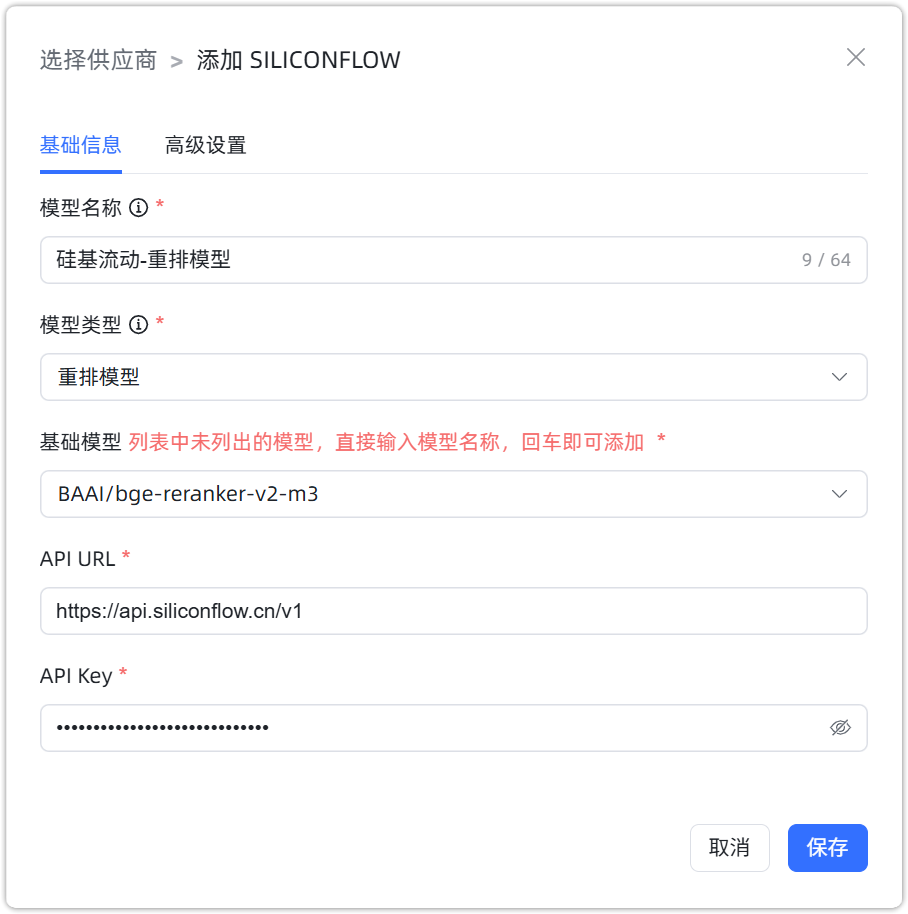

## 1 添加模型

!!! Abstract ""
    添加 SILICONFLOW 模型之前，需要先在 [SILICONFLOW](https://siliconflow.cn/) 中进行注册并登录。在控制台中的【账户管理-API密钥】中新建 API 密钥。

    选择模型供应商为`SILICONFLOW`，并在模型添加对话框中输入如下必要信息：

    * 模型名称：MaxKB 中自定义的模型名称。    
    * 模型类型：大语言模型/向量模型/语音识别/语音合成/图片生成/重排模型。    
    * 基础模型：SILICONFLOW 支持的各类模型的基础模型名称，选项中显示了 SILICONFLOW 支持的部分常用大语言模型名称，支持手动输入，但需要与 SILICONFLOW 支持的模型名称保持一致，否则无法通过校验。    
    * API URL：https://api.siliconflow.cn/v1
    * API Key：创建的密钥 Key。

## 2 配置样例

!!! Abstract ""
    SILICONFLOW-大语言模型配置样例图示如下：

{ width="500px" }

!!! Abstract ""
    SILICONFLOW-向量模型配置样例图示如下：
{ width="500px" }

!!! Abstract ""
    SILICONFLOW-语音识别配置样例图示如下：
{ width="500px" }

!!! Abstract ""
    SILICONFLOW-语音合成配置样例图示如下：
{ width="500px" }

!!! Abstract ""
    SILICONFLOW-图片生成配置样例图示如下：
{ width="500px" }

!!! Abstract ""
    SILICONFLOW-重排模型配置样例图示如下：
{ width="500px" }
