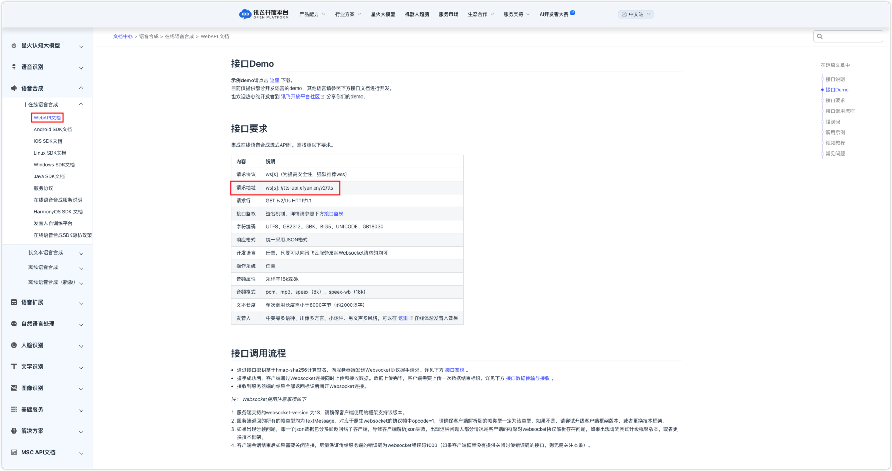

## 1 添加模型

!!! Abstract "" 
    添加讯飞星火大模型之前，需要先在 [讯飞开放平台](https://www.xfyun.cn/) 中进行注册，并根据不同的模型类型创建不同应用，平台将自动生成APPID、API Secret、APIKey等信息。

!!! Abstract "" 
    选择模型供应商为`讯飞星火`，并在模型添加对话框中输入如下必要信息：

    * 模型名称：MaxKB 中自定义的模型名称。 
    * 权限：分为私有和公用两种权限，私有模型仅当前用户可用，公用模型即系统内所有用户均可使用，但其它用户不能编辑和删除。     
    * 模型类型：大语言模型/向量模型/语音识别/语音合成。   
    * 基础模型：对应接口文档中的 domain，下拉选项是讯飞星火不同模型类型下的常用基础模型名称，支持自定义输入。    
    * API 域名：每个基础模型对应的 API 域名不同，请根据所选基础模型输入对应的 API 域名，详情请参考[讯飞开放平台文档中心](https://www.xfyun.cn/doc/)，如下图所示。
    * APP ID：讯飞开放平台中创建应用的标识。
    * API Key：讯飞开放平台应用访问对应的 API Key。
    * API Secret：讯飞开放平台应用访问对应的的 API Secret。

## 2 配置样例

!!! Abstract ""
    讯飞星火-大语言模型配置样例图示：

{ width="500px" }

!!! Abstract ""
    讯飞星火-向量模型配置样例图示：

{ width="500px" }

!!! Abstract ""
    讯飞星火-语音识别模型配置样例图示：

{ width="500px" }

!!! Abstract ""
    讯飞星火-语音合成模型配置样例图示：

{ width="500px" }