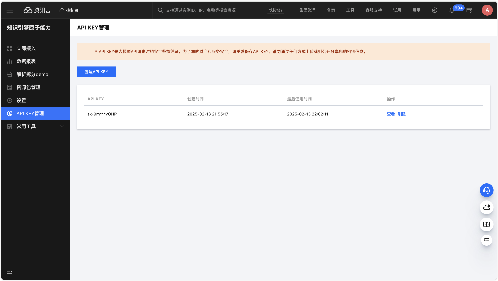
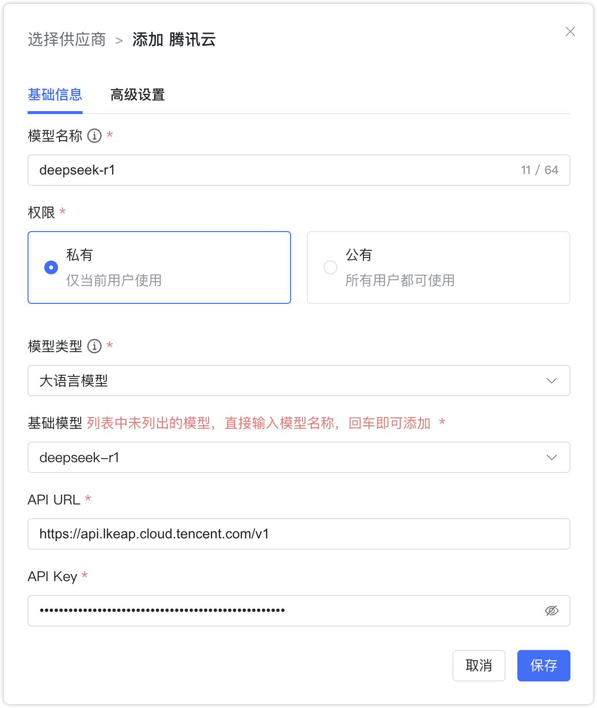

## 1 添加模型

!!! Abstract ""
    添加腾讯知识引擎原子能力之前，需要先在腾讯云开通知识引擎原子能力服务并新建API Key。

!!! Abstract ""
    选择模型供应商为`腾讯云`，并在模型添加对话框中输入如下必要信息：

    * 模型名称：MaxKB 中自定义的模型名称。    
    * 权限：分为私有和公用两种权限，私有模型仅当前用户可用，公用模型即系统内所有用户均可使用，但其它用户不能编辑和删除。    
    * 模型类型：大语言模型。   
    * 基础模型：不同类型模型下的基础模型名称，下拉选项是常用的一些基础模型名称，支持自定义输入。
    * API URL：https://api.lkeap.cloud.tencent.com/v1/chat/completions。
    * API Key：在控制台新建的OpenAI API KEY。 

## 2 配置样例

!!! Abstract ""
    腾讯云知识引擎原子能力-大语言模型配置样例图示如下：
{ width="500px" }