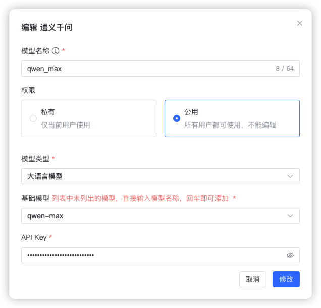
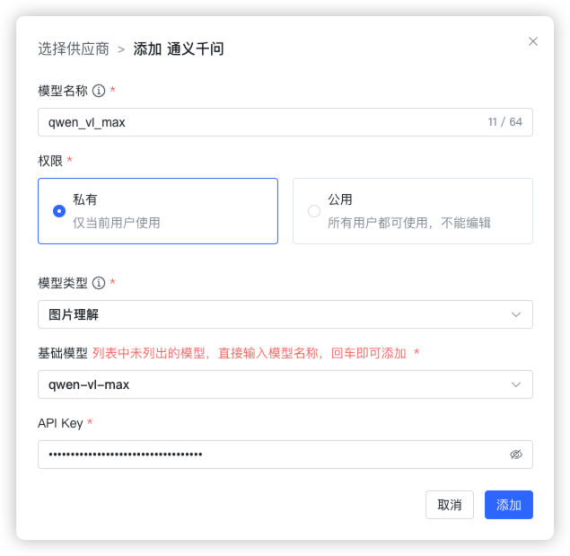
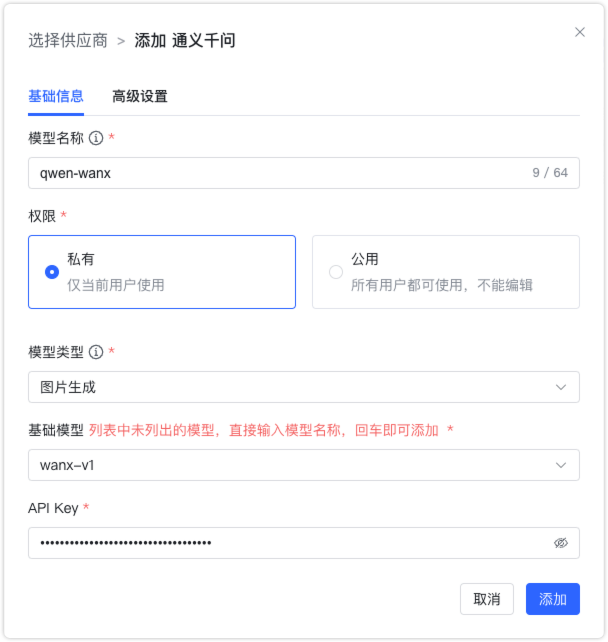
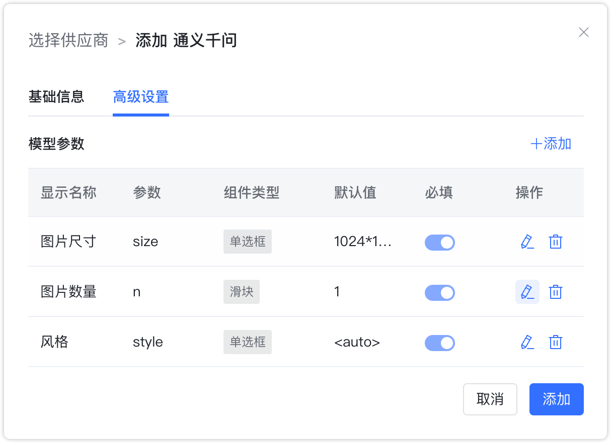

## 1 添加模型

!!! Abstract ""
    添加通义千问模型之前，需要先在阿里云 DashScope 模型服务灵积的控制台中创建 API-Key。

!!! Abstract ""
    选择模型供应商为`通义千问`，并在模型添加对话框中输入如下必要信息：

    * 模型名称：MaxKB 中自定义的模型名称。  
    * 权限：分为私有和公用两种权限，私有模型仅当前用户可用，公用模型即系统内所有用户均可使用，但其它用户不能编辑和删除。   
    * 模型类型：大语言模型/视觉模型/图片生成。   
    * 基础模型：不同类型模型下支持的基础模型名称，下拉选项是常用的一些基础模型名称，支持自定义输入。        
    * API Key：阿里云 DashScope灵积模型服务 API Key管理中创建和查看。

## 2 配置样例

!!! Abstract ""
    通义千问-大语言模型配置样例图示如下：
{ width="500px" }

!!! Abstract ""
    通义千问-视觉模型模型配置样例图示如下：
{ width="500px" }

!!! Abstract ""
    通义千问-图片生成模型默认图像尺寸为 1024 * 1024，图片数量 1 张，风格为 <auto>，即由模型随机输出图像风格，配置样例图示如下：
{ width="500px" } 

{ width="500px" }
