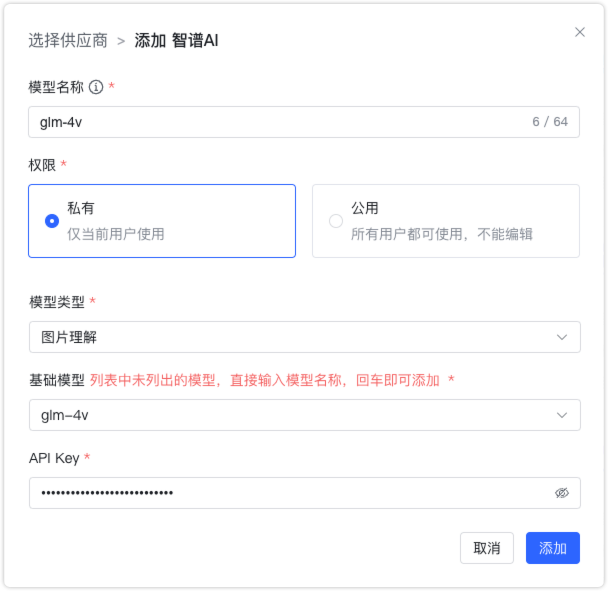
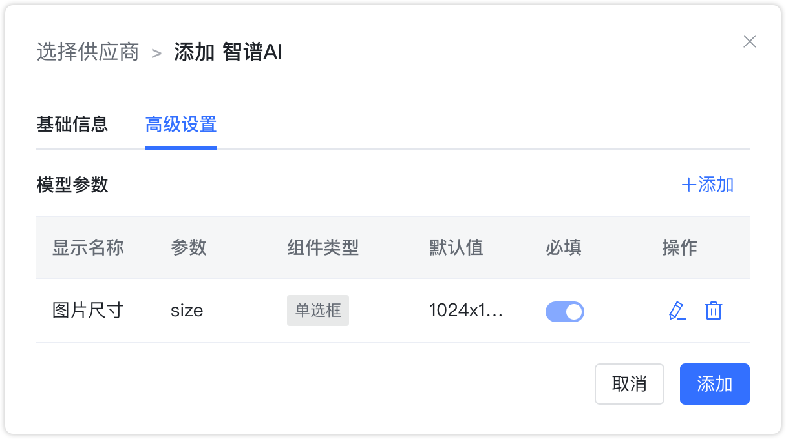

## 1 添加模型

!!! Abstract "" 
    添加讯智谱AI模型之前，需要先在 [智谱AI开放平台](https://open.bigmodel.cn/) 中进行注册并创建 API Key。

!!! Abstract ""
    选择模型供应商为`智谱AI`，并在模型添加对话框中输入如下必要信息：

    * 模型名称：MaxKB 中自定义的模型名称。   
    * 权限：分为私有和公用两种权限，私有模型仅当前用户可用，公用模型即系统内所有用户均可使用，但其它用户不能编辑和删除。     
    * 模型类型：大语言模型/图片理解/图片生成。   
    * 基础模型：不同类型模型下的基础模型名称，下拉选项是常用的一些基础模型名称，支持自定义输入。    
    * API Key：在智谱 AI 开放平台创建的 API Key。

## 2 配置样例

!!! Abstract ""
    智谱AI-大语言模型配置样例图示如下：

{ width="500px" }

!!! Abstract ""
    智谱AI-图片理解模型配置样例图示如下：

{ width="500px" }

!!! Abstract ""
    智谱AI-图片生成模型配置样例图示如下：

{ width="500px" }

{ width="500px" }