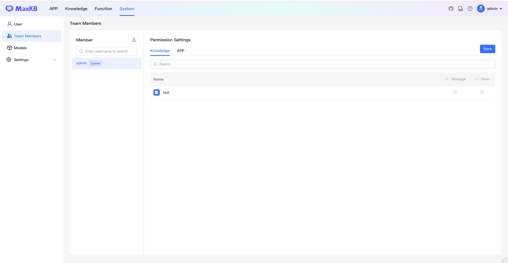
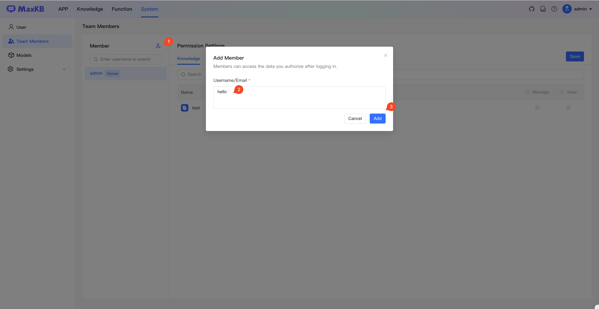
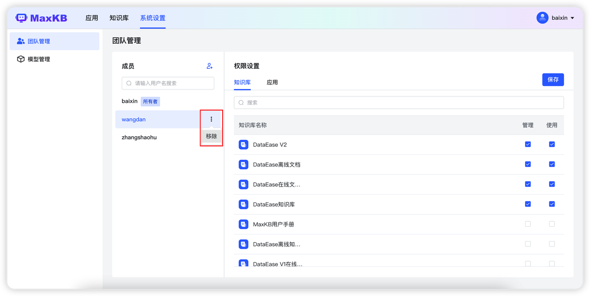

# 团队管理

!!! Abstract ""
    在 MaxKB 中，支持团队协同维护知识库和应用。内置所有者和成员两种角色，当前登录用户为所有者角色，添加成员用户都为成员角色。     
    在团队管理钟支持添加和移除成员。    
    **友情提示：社区版限制 1 个团队成员。**      

## 1 添加成员

!!! Abstract ""
    点击【添加成员】，需要输入成员的用户名或邮箱进行添加。   
    **注意：** 仅能添加成员必须是已存在 MaxKB 的用户。  

## 2 权限设置

!!! Abstract ""
    支持为成员分配当前用户创建应用和知识库资源的权限。    
    若分配使用权限，当成员登录 MaxKB 后仅能查看相应资源。    
    若分配管理权限，当成员登录 MaxKB 后可以管理操作相应资源。 
    点击【保存】后，权限生效。

## 3 移除成员

!!! Abstract ""
    如果把成员移除，点击【…】-【移除】即可，成员移除后会回收资源权限。

