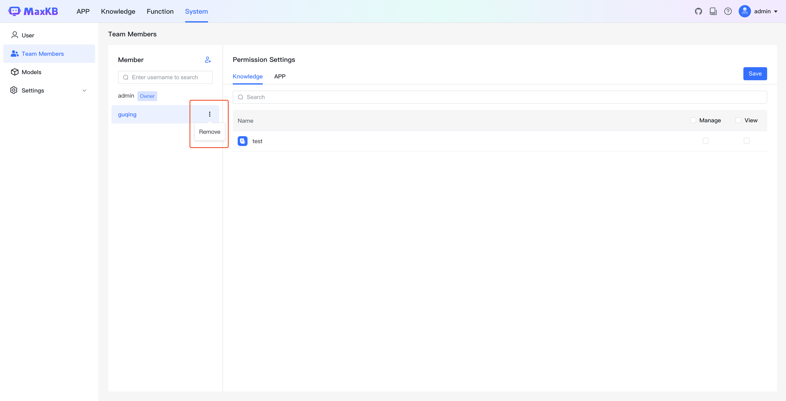

# 团队管理

!!! Abstract ""
    在 MaxKB 中，支持团队协同维护知识库和应用。内置所有者和成员两种角色，知识库/应用创建者即为所有者角色，添加的成员用户都是成员角色。所有者可以添加和移除成员。    
    **友情提示：社区版限制 1 个团队成员。**      

## 1 添加成员

!!! Abstract ""
    点击【添加成员】，需要输入完整的成员用户名或邮箱后进行添加。   
    **注意：** 待添加的成员必须是已存在的用户。  

## 2 权限设置

!!! Abstract ""
    添加成员后，可以对成员分配知识库和应用的的权限。 

    * 管理权限，当成员登录 MaxKB 后可以管理操作相应资源。 
    * 使用权限，当成员登录 MaxKB 后仅能查看相应资源。    
    
    点击【保存】后，权限设置生效。

## 3 移除成员

!!! Abstract ""
    在成员列表中点击【…】->【移除】即可删除该成员，成员移除后将失去所有权限。

