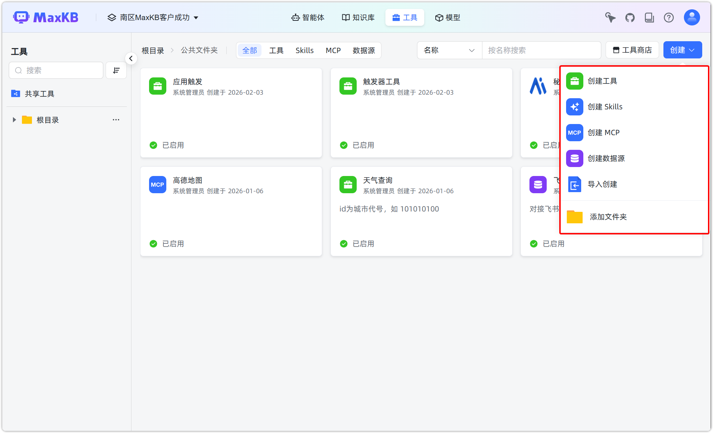
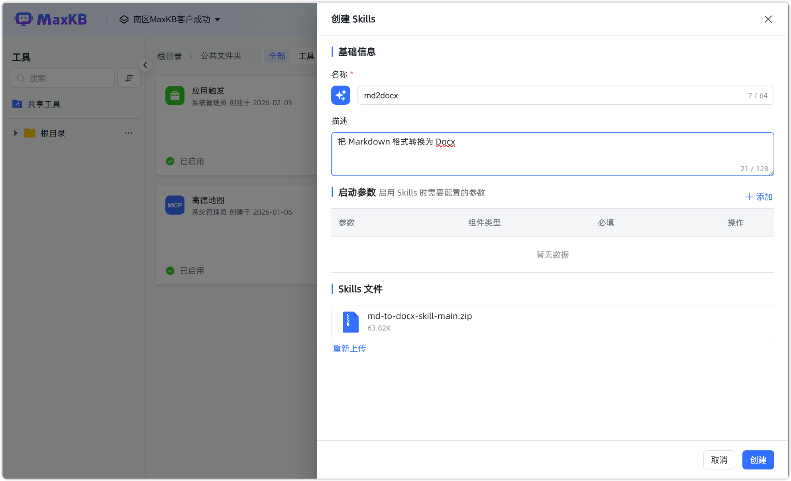
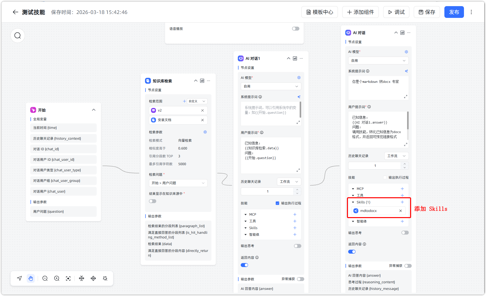
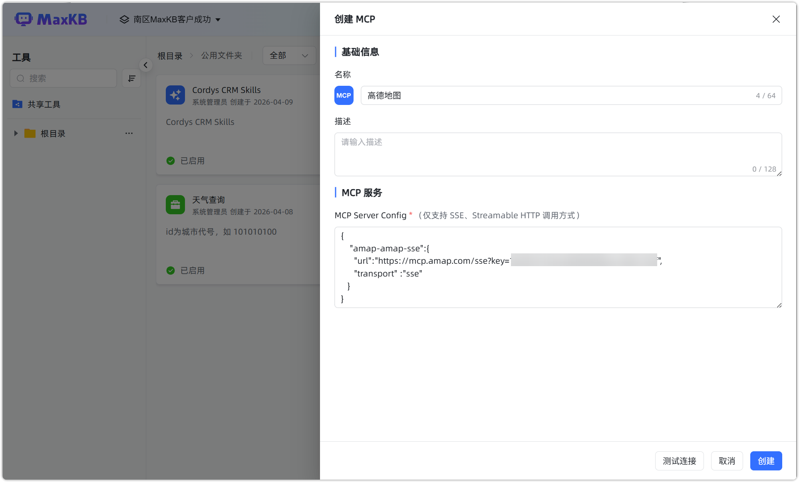
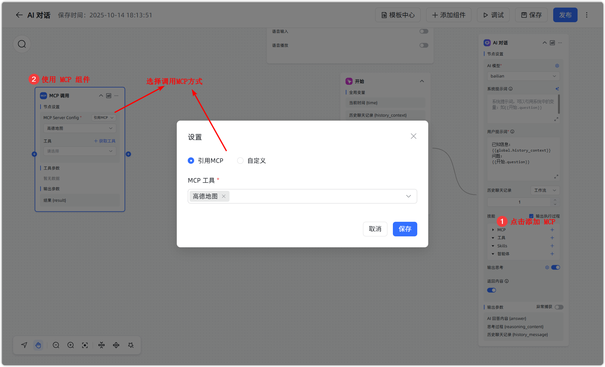
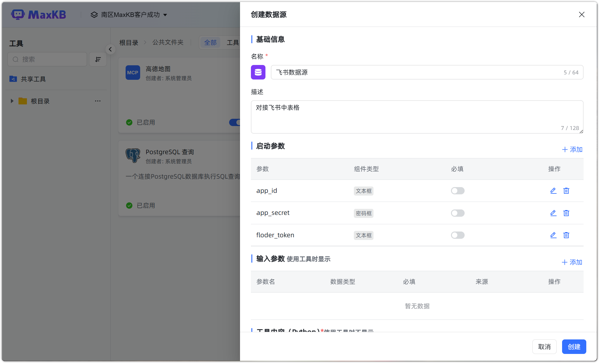
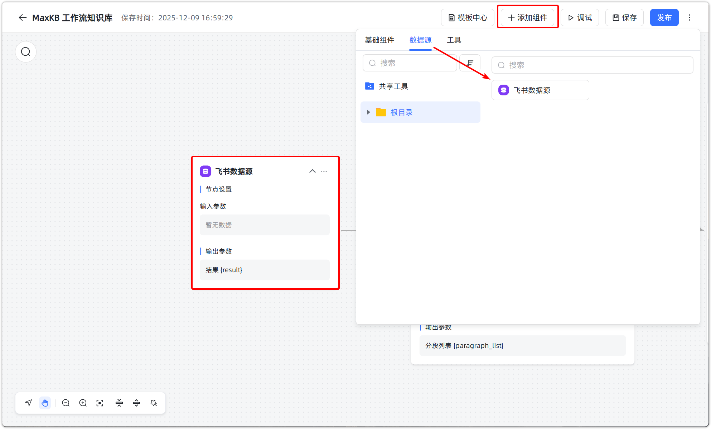
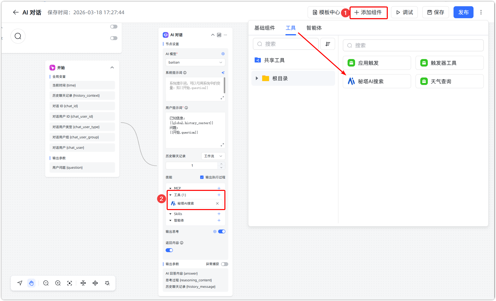

# 工具

## 1 功能概述

!!! Abstract ""
    MaxKB 支持用户根据自身的业务需求，通过各种工具获取和查询数据、逻辑判断、信息提取或其它场景的操作并在智能体编排时进行调用，以满足各种复杂的业务需求。 

    - 共享工具：系统管理员在【共享资源】中创建共享工具后，可以授权给指定工作空间。
    - 全部工具：用户可以创建工具，其他用户[**资源授权**](../../user_manual/X-Pack/authorization_resources.md)后可以查看、使用和维护。
    
    工具通过文件夹进行管理，根目录下可建立最多三级的子文件夹。每一级文件夹内均可创建相应的工具。文件夹支持资源授权，普通用户仅可查看被授权的文件夹，授权文件夹时支持授权文件夹下已有的子资源。

     **注意**：共享资源为企业版 X-Pack 功能。


!!! Abstract ""
    工具的创建支持创建工具、创建 Skills、创建 MCP、创建数据源、导入创建以及从工具商店中添加。



## 2 自定义工具

### 2.1 依赖安装

!!! Abstract ""
    如果工具实现需要安装第三方依赖包，可在 MaxKB 容器中使用 pip 命令进行安装。

    ```
    # 进入 MaxKB 容器中
    docker exec -it maxkb bash

    # pip安装第三方依赖，如 pymysql，执行下面命令
    pip install pymysql 
    ```

### 2.2 工具创建

!!! Abstract ""
    点击【创建工具】，打开创建工具页面。

    - 工具名称：工具的 logo 与工具名称，便于识别。工具 logo 在保存后可自定义上传。     
    - 描述：工具详细说明以及使用注意事项，会显示在高级智能体的组件列表中。
    - 启动参数：启用参数即工具运行的必要参数，例如 API Key 等。将启动参数与输入参数分离，在工作流中仅关注输入参数，同时也避免关键信息的泄露。
    - 输入参数：工具的输入参数，参数的数据类别包括：string、int、float、array，可自定义赋值，也可引用参数。 
    - 函数内容：自定义编写 Python 工具代码，可以引用输入变量。  
    - 输出参数：Python 代码执行返回的结果。


!!! Abstract ""
    Python 代码编写完成后，点击【调试】进行代码功能的验证。调试完成后，点击【创建】，即完成工具的创建。已创建成功的工具，默认状态为【已禁用】。


!!! Abstract ""
    已启用的工具，可以在【高级智能体】中，点击【添加组件】->【工具】中，以添加组件的方式调用工具；也可通过【AI 对话】组件的【工具】进行调用。


## 3 创建 Skills
!!! Abstract ""
    **注意：由于环境限制和安全考虑， Skills 仅支持由 Python 触发的 Skills。**

!!! Abstract ""
    点击【创建 Skills】，打开创建 Skills页面。

    - 名称： Skills 的名称，便于识别。    
    - 描述： Skills 详细说明以及使用注意事项，会显示在高级智能体的组件列表中。
    - 启动参数：启用参数即 Skills 运行的必要参数，例如 API Key 等。将启动参数与输入参数分离，在工作流中仅关注输入参数，同时也避免关键信息的泄露。
    -  Skills 文件：拖拽或选择 Skills 的 ZIP 文件，大小不超过 100 MB。



!!! Abstract ""
    已创建成功的 Skills ，默认状态为【已禁用】。开启该 Skills 后，可以在【高级智能体】->【AI 对话】的 Skills 中进行引用。



## 3 创建 MCP

!!! Abstract ""
    点击【创建 MCP】，打开创建 MCP 页面。

    - MCP 名称：MCP 的名称与 Logo，便于识别。MCP 的 Logo 在保存后可自定义上传。   
    - 描述： MCP 详细说明以及使用注意事项。
    - MCP Server Config：使用 JSON 格式填写 MCP Server 配置参数。通过 SSE/Streamable HTTP 协议调用 MCP 服务中的工具。



!!! Abstract ""
    已创建成功的 MCP，默认状态为【已禁用】。开启 MCP 后，可以在【AI 对话】的 MCP 中进行引用，也可以在【高级智能体】中，点击【添加组件】->【MCP 调用】中，以添加组件的方式调用 MCP。



## 4 创建数据源

!!! Abstract ""
    点击【创建数据源】，打开创建数据源页面。

    - 名称：数据源的 logo 与数据源名称，便于识别。数据源 logo 在保存后可自定义上传。     
    - 描述：数据源详细说明以及使用注意事项，会显示在工作流知识库的组件列表中。
    - 启动参数：启用参数即数据源运行的必要参数，例如 Token、Secret 等。将启动参数与输入参数分离，在工作流中仅关注输入参数，同时也避免关键信息的泄露。
    - 输入参数：数据源的输入参数，参数的数据类别包括：string、int、float、array，可自定义赋值，也可引用参数。 
    - 函数内容：自定义编写 Python 数据源代码，可以引用输入变量。  
    - 输出参数：Python 代码执行返回的结果。



!!! Abstract ""
    已创建成功的数据源，默认状态为【已禁用】。启用数据源工具后，可以在【工作流知识库】中，点击【添加组件】->【数据源】中，添加数据源进行知识库创建。



## 5 工具商店

!!! Abstract ""
    工具商店是 MaxKB 系统中的一个功能模块，帮助用户扩展系统的功能。

    工具商店中的工具主要分为联网搜索、数据库查询、接口工具、内容处理、消息推送、翻译工具和数据源七大类。


!!! Abstract ""
    用户可直接在商店中选择所需的工具，无需手动开发或进行复杂集成，可以显著提升工具的调用效率。

    为了丰富工具商店资源，推动产品生态持续发展，MaxKB 诚挚邀请广大社区用户参与工具贡献，共享技术成果：

    * 贡献路径：开发者可以按照官方提供的工具开发规范开发适用于 MaxKB 的工具（例如 API 对接类、本地功能类具等）；
    * 提交方式：完成开发后，将工具代码提交至 [GitHub 官方工具仓库](https://github.com/1Panel-dev/MaxKB-toolstore)，项目团队将按流程审核，通过后即可上架至 MaxKB 工具商店，供全体社区用户使用；
    * 共建开发生态：社区贡献的工具不仅能帮助更多用户解决实际问题，也将促进 MaxKB 工具生态的多样化发展，形成“用户需求-工具开发-生态完善” 的正向循环。

!!! Abstract ""
    工具添加后，在配置启动参数（例如数据库连接信息、API Key 等）并启用后，便可在高级智能体中调用。





## 6 工具操作

### 6.1 复制工具

!!! Abstract ""
    点击工具面板的【复制】，打开复制工具对话框，对原工具内容进行编辑修改后点击【创建】即可快速创建一个新工具。


### 6.2 资源授权
!!! Abstract ""
    点击工具面板的【资源授权】，可以将该工具授权给相应的用户。


### 6.3 触发器
!!! Abstract ""
    点击工具面板的【触发器】，可以为该工具添加定时或事件触发的触发器。


!!! Abstract ""
    创建触发器：点击【添加】，进行创建触发器。

    - 触发器名称：触发器的名称，便于识别不同触发器及其触发条件。
    - 描述：触发器详细说明以及使用注意事项。
    - 类型：
        - 定时触发：可按照每月、每周、每日或间隔时间执行任务，支持 Cron 表达式。
        - 事件触发：即 Webhook 触发器，创建事件触发器时，系统会自动生成 URL 和 Bearer Token，支持调用方发送 HTTP 请求（Header 带 Token）并携带请求参数，触发相应的工具。
    - 任务执行：触发器执行的任务，需输入相应参数内容。


### 6.4 查看关联资源
!!! Abstract ""
    点击工具面板的【查看关联资源】，可查看该模型关联资源情况，支持根据名称、创建者和类型进行搜索。


### 6.5 查看执行记录
!!! Abstract ""
    点击工具面板的【查看执行记录】，可以查看工具的执行记录。可通过筛选触发来源、类型和状态查看相应的执行记录和执行详情。


### 6.6 转移到
!!! Abstract ""
    点击工具面板的【转移到】，可以将工具移动到同一工作空间下工具的其他文件夹中。


### 6.7 工具导出/导入
    
!!! Abstract ""
    工具支持导出和导入，导出的文件后缀为 `.tool`。


    
!!! Abstract ""
    点击【导入创建】，选择后缀名为 `.tool` 的文件并打开。


!!! Abstract ""
    工具将自动导入，导入的工具默认状态为【已禁用】，可以点击工具，进入编辑工具查看和修改工具。


### 6.8 删除工具

!!! Abstract ""
    点击工具面板的【删除】按钮，即可对工具进行删除。


!!! Abstract ""

    **注意： 工具删除后，不可恢复。** 如果智能体引用了该工具，在编排页面将显示【该工具不可用】的提示信息。 


