# 工具

## 1 功能概述

!!! Abstract ""
    MaxKB 支持用户根据自身的业务需求，通过内置工具或自定工具对获取和查询数据，逻辑判断、信息提取或其它场景的操作。  
    工具创建完成后，在应用编排时以添加组件的方式调用这些工具，从而更好地满足各种复杂的业务需求。 

    - 共享工具：系统管理员在【共享资源】中创建共享工具后，可以授权给指定工作空间。
    - 全部工具：用户可以创建工具，其他用户[**资源授权**](../../user_manual/X-Pack/authorization_resources.md)后可以查看、使用和维护。
    
     **注意**：共享资源为企业版 X-Pack 功能。

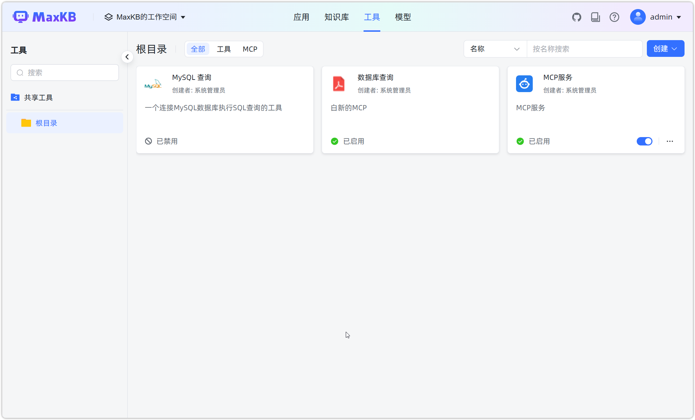


## 2 工具商店

!!! Abstract ""
    工具商店是 MaxKB 系统中的一个功能模块，帮助用户扩展系统的功能。  
    工具商店中的工具主要分为以下几类：

    - 联网搜索：提供网络搜索功能，如 Google Search、博查搜索、LangSearch 等，帮助用户快速从互联网获取信息。
    - 数据库查询：支持连接不同类型的数据库并执行查询，如 MySQL 查询、PostgreSQL 查询等，方便用户管理和分析数据。

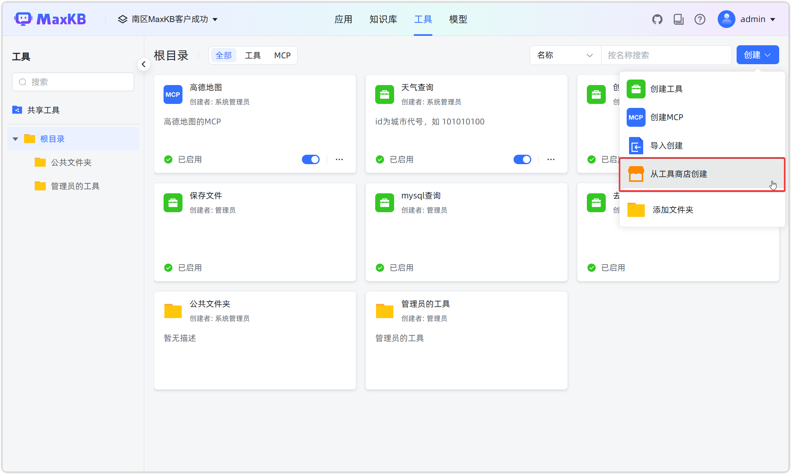


!!! Abstract ""
    内置工具添加后，需要配置启动参数，例如数据库连接信息、API Key 等，并启用后才可以在高级编排应用中使用。

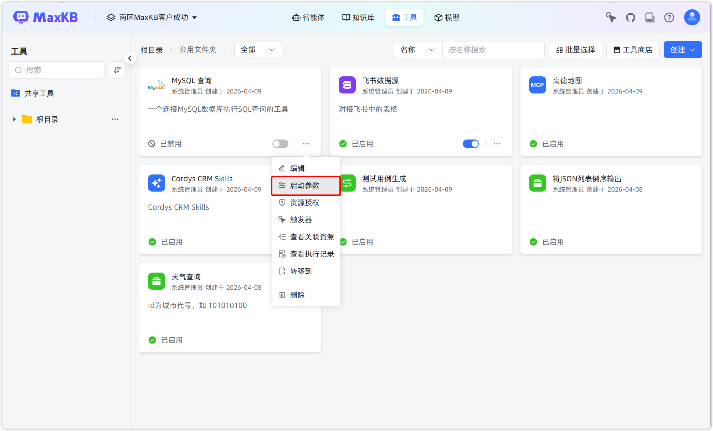

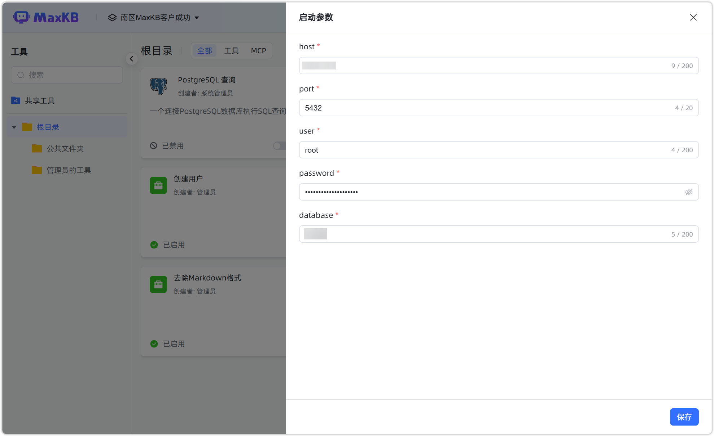

## 2 自定义工具

### 2.1 依赖安装

!!! Abstract ""
    如果工具实现需要安装第三方依赖包，可在 MaxKB 容器中使用 pip 命令进行安装。

    ```
    # 进入 MaxKB 容器中
    docker exec -it maxkb bash

    # pip安装第三方依赖，如 pymysql，执行下面命令
    pip install pymysql 
    ```

### 2.2 工具创建

!!! Abstract ""
    点击【创建工具】，打开创建工具对话框。

    - 工具名称：工具的 logo 以工具数名称，便于识别。工具 logo 在保存后可自定义上传。     
    - 描述：工具详细说明以及使用注意事项，会显示在高级编排应用的组件列表中。
    - 启动参数：启用参数即工具运行的必要参数，例如 API Key 等。将启动参数与输入参数分离，在工作流中仅关注输入参数，同时也避免关键信息的泄露。
    - 输入参数：工具的输入参数，参数的数据类别包括：string、int、float、array，可自定义赋值，也可引用参数。 
    - 函数内容：自定义编写 Python 工具代码，可以引用输入变量。  
    - 输出参数：Python 代码执行返回的结果。


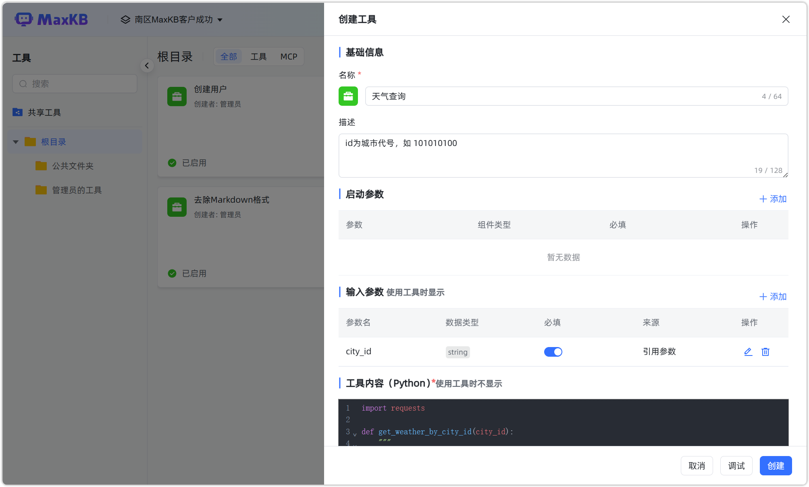{width="600px"}

!!! Abstract ""
    Python 代码编写完成后，点击【调试】进行代码功能的验证。调试完成后，点击【创建】，即完成工具数的创建。  

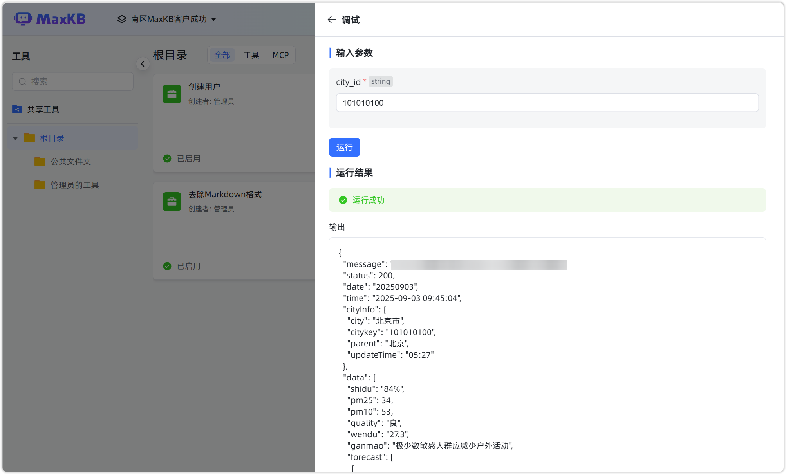

!!! Abstract ""
    创建成功的工具，可以在【高级编排应用】的设置中，点击【添加组件】->【工具】中，以添加组件的方式调用这些工具。

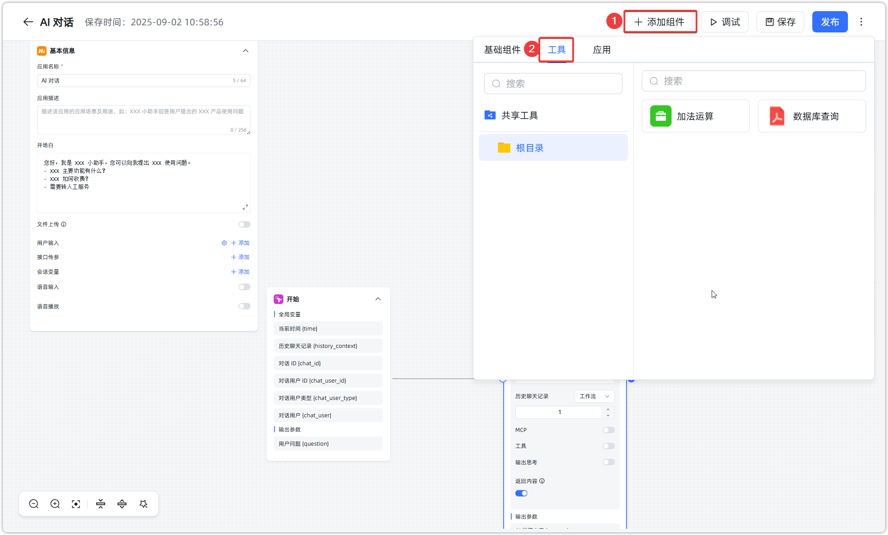

## 3 函数导出/导入
    
!!! Abstract ""
    工具支持导出和导入，对应的文件后缀为 `.tool`。

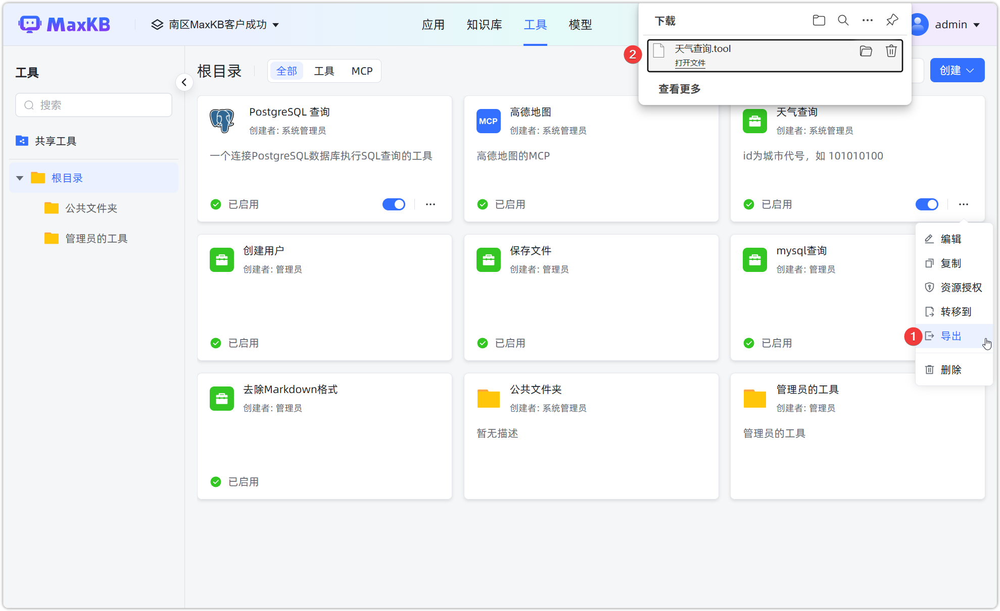
    

## 4 复制工具

!!! Abstract ""
    点击工具面板的【复制】按钮，打开复制工具对话框，对原工具内容进行编辑修改后点击【创建】即可快速创建一个新工具。

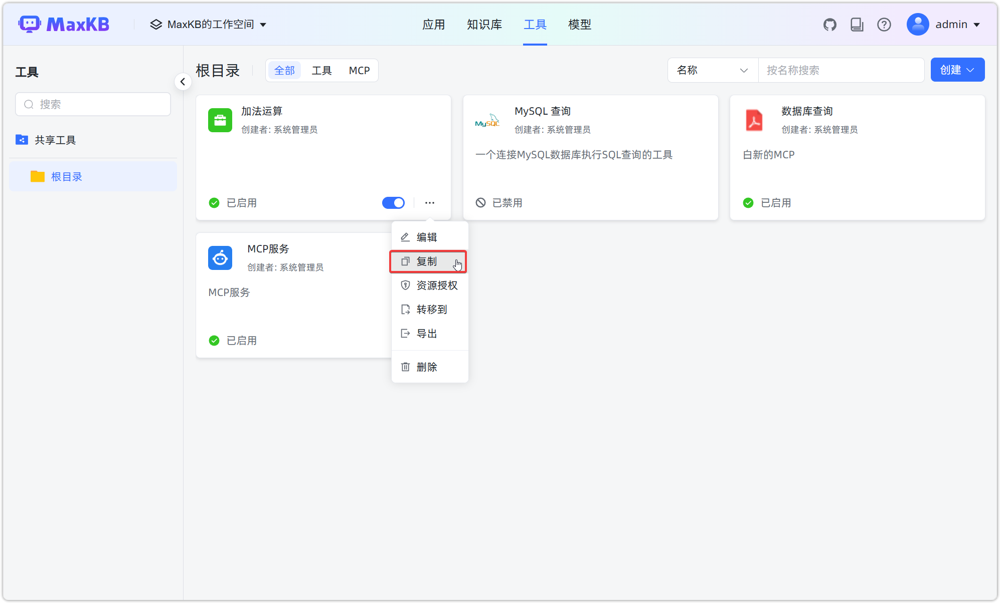

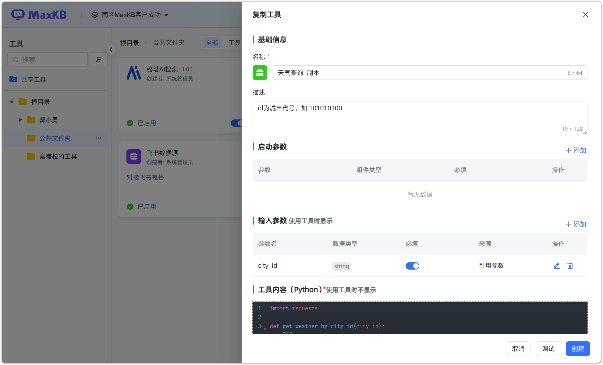

## 5 删除工具

!!! Abstract ""
    点击工具面板的【删除】按钮，即可对工具进行删除。

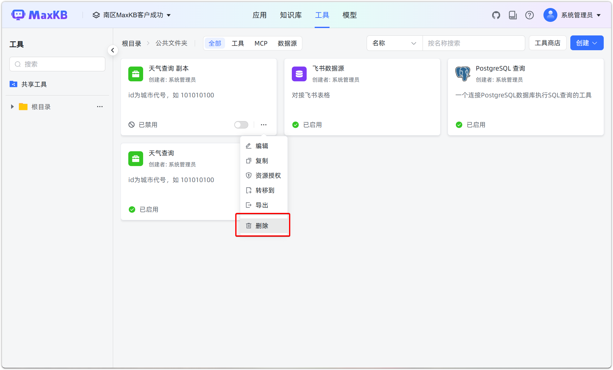

!!! Abstract ""

    **注意：** 工具删除后，如果应用引用了该工具，那么在编排页面将显示`该工具不可用`的提示信息，并且在问答时也会报错。 

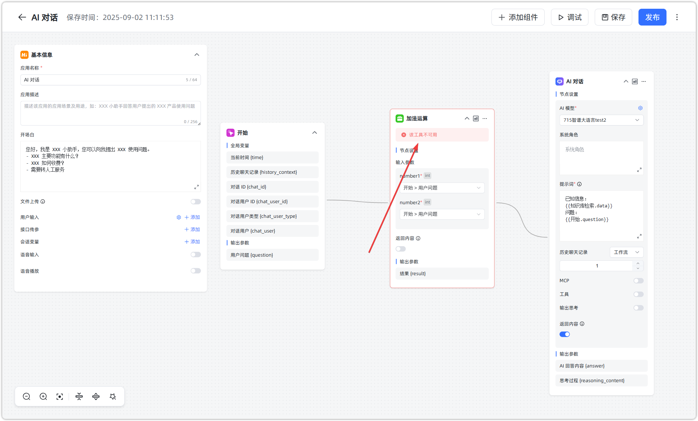
