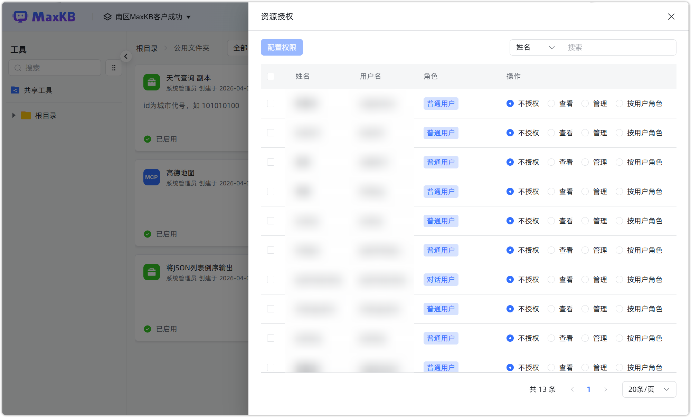
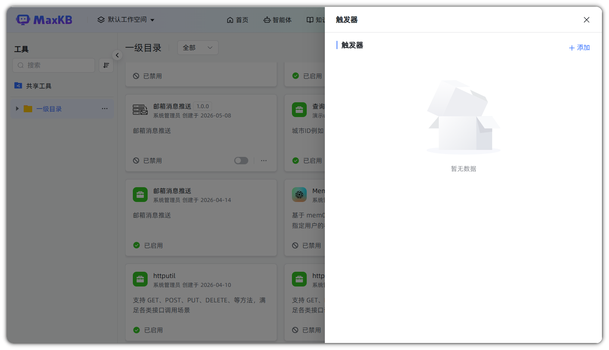
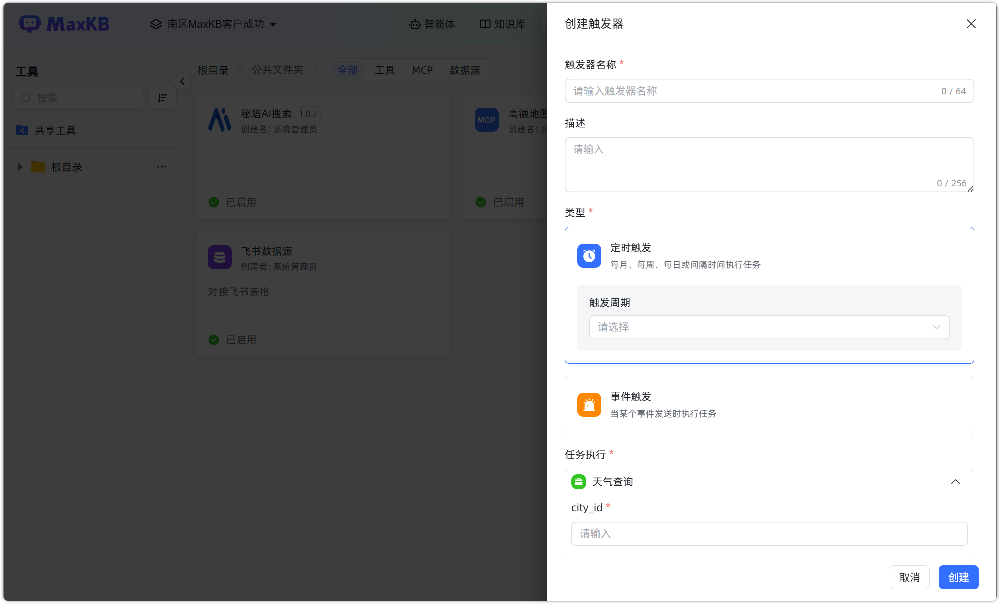
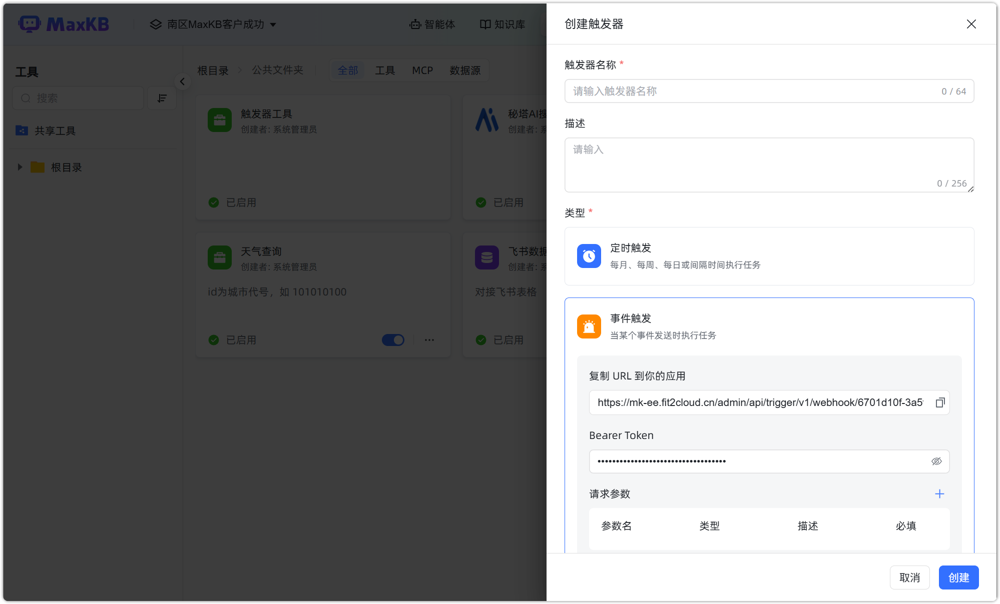
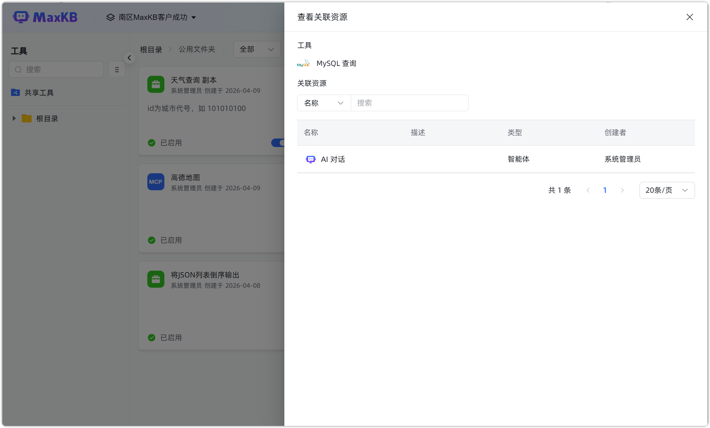
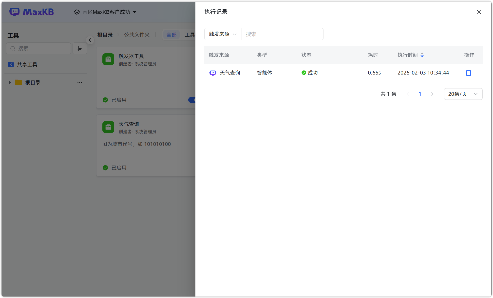
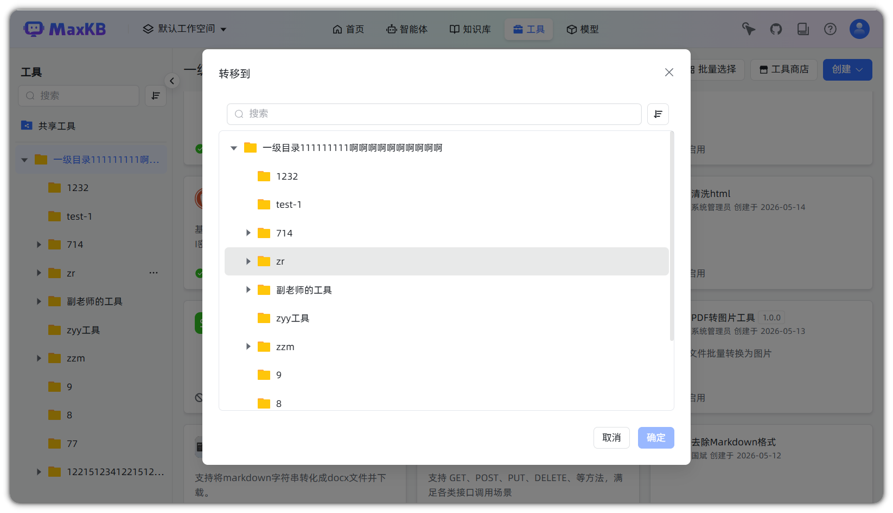
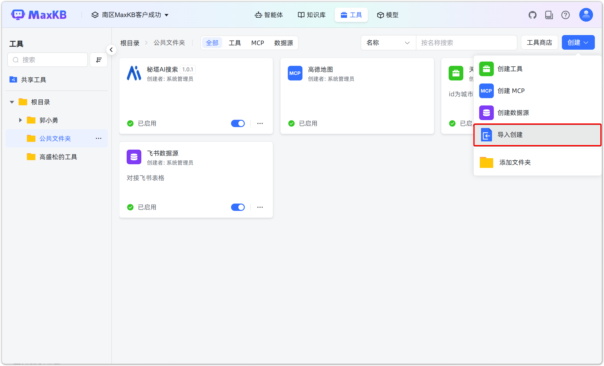
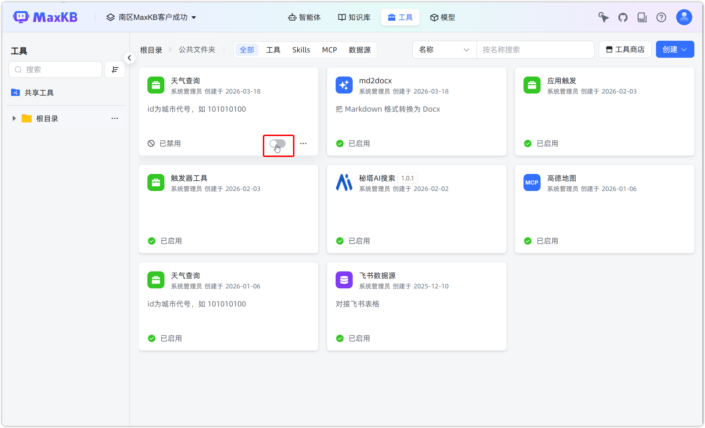
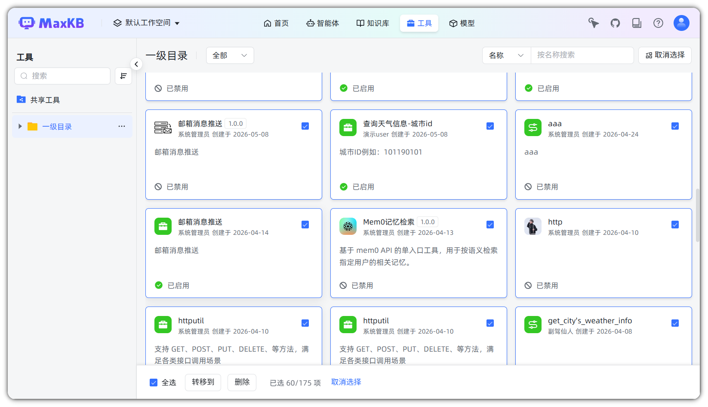

#  工具操作

## 1 复制工具

!!! Abstract ""
    点击工具面板的【复制】，打开复制工具对话框，对原工具内容进行编辑修改后点击【创建】即可快速创建一个新工具。

## 2 资源授权
!!! Abstract ""
    点击工具面板的【资源授权】，可以将该工具授权给相应的用户。

## 3 触发器
!!! Abstract ""
    点击工具面板的【触发器】，可以为该工具添加定时或事件触发的触发器。

!!! Abstract ""
    创建触发器：点击【添加】，进行创建触发器。

    - 触发器名称：触发器的名称，便于识别不同触发器及其触发条件。
    - 描述：触发器详细说明以及使用注意事项。
    - 类型：
        - 定时触发：可按照每月、每周、每日或间隔时间执行任务，支持 Cron 表达式。
        - 事件触发：即 Webhook 触发器，创建事件触发器时，系统会自动生成 URL 和 Bearer Token，支持调用方发送 HTTP 请求（Header 带 Token）并携带请求参数，触发相应的工具。
    - 任务执行：触发器执行的任务，需输入相应参数内容。

## 4 查看关联资源
!!! Abstract ""
    点击工具面板的【查看关联资源】，可查看该模型关联资源情况，支持根据名称、创建者和类型进行搜索。

## 5 查看执行记录
!!! Abstract ""
    点击工具面板的【查看执行记录】，可以查看工具的执行记录。可通过筛选触发来源、类型和状态查看相应的执行记录和执行详情。

## 6 转移到
!!! Abstract ""
    点击工具面板的【转移到】，可以将工具移动到同一工作空间下工具的其他文件夹中。

## 7 工具导出/导入

!!! Abstract ""
    工具支持导出和导入，导出的文件后缀为 `.tool`。

!!! Abstract ""
    点击【导入创建】，选择后缀名为 `.tool` 的文件并打开。

!!! Abstract ""
    工具将自动导入，导入的工具默认状态为【已禁用】，可以点击工具，进入编辑工具查看和修改工具。

## 8 删除工具

!!! Abstract ""
    点击工具面板的【删除】按钮，即可对工具进行删除。

!!! Abstract ""

    **注意： 工具删除后，不可恢复。** 如果智能体引用了该工具，在编排页面将显示【该工具不可用】的提示信息。 

## 9 批量选择

!!! Abstract ""
点击批量选择，可以批量选择工具进行移动或删除操作。

