# 触发器

## 1 触发器概述

!!! Abstract ""
    MaxKB 支持用户根据自身的业务需求，通过配置定时、事件等触发条件，实现智能体自动化触发执行，以满足各种复杂的业务需求。

    - 定时触发：可按照每月、每周、每日或间隔时间执行任务。
    - 事件触发：即 Webhook 触发器，创建事件触发器时，系统会自动生成 URL 和 Bearer Token，支持调用方发送 HTTP 请求（Header 带 Token）并携带请求参数，触发相应的工具。

    社区版 admin 账号、专业版/企业版的工作空间管理员角色可对工作空间内的所有触发器进行全生命周期配置与管控。

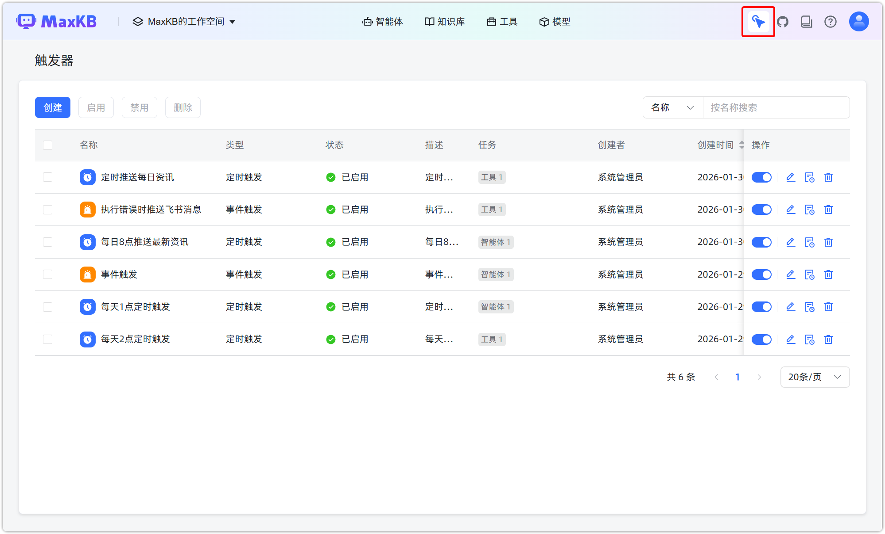

## 2 创建触发器

### 2.1 定时触发器
!!! Abstract ""
    在触发器页面，点击【创建】，填写触发器名称和描述。
    
    选择触发器类型为 **定时触发**，选择触发周期，可按每日、每周、每月或间隔事件执行任务。

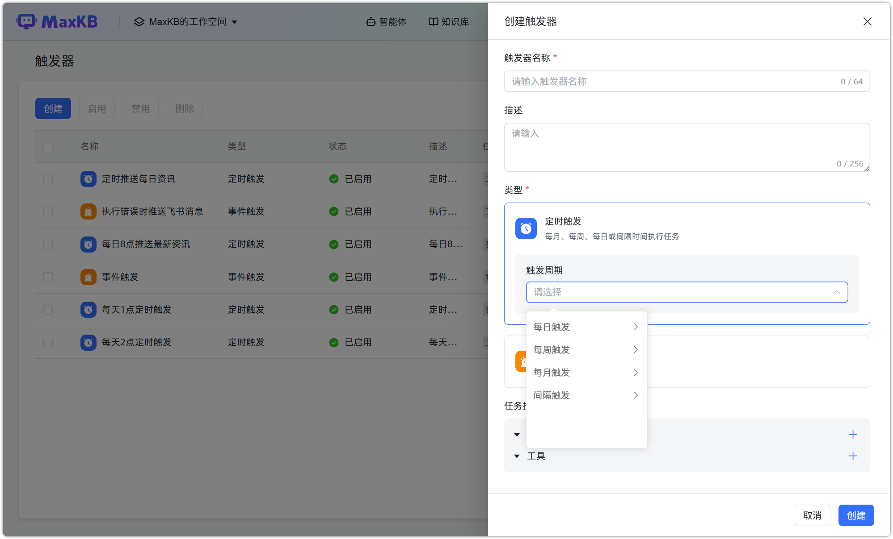

!!! Abstract ""
    选择该定时触发器执行任务的智能体或工具，并填写智能体或工具的输入参数，以确保触发器能正常执行任务。

    创建后的触发器默认为禁用状态，需要手动启动触发器。

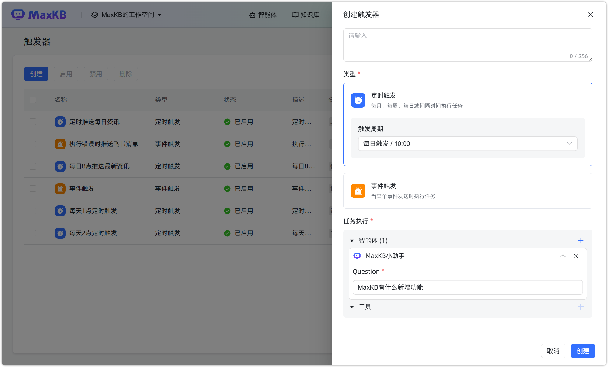

### 2.2 事件触发器
!!! Abstract ""
    在触发器页面，点击【创建】，填写触发器名称和描述。

    选择触发器类型为 **事件触发**，复制相应的 URL 和 Bearer Token，调用方可发送 HTTP 请求（Header 带 Token）并携带请求参数，触发相应的智能体或工具。

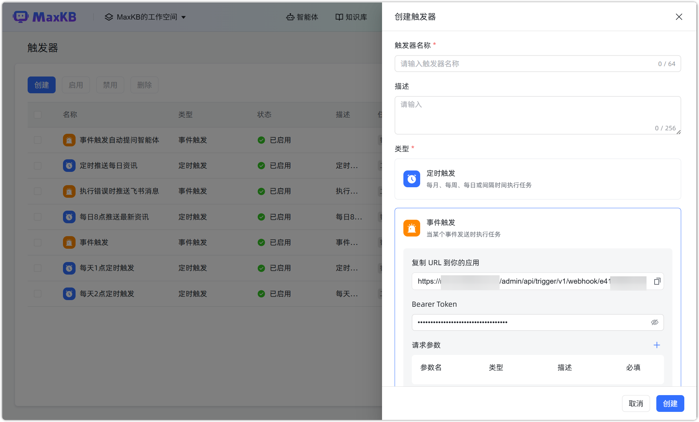

!!! Abstract ""
    选择该定时触发器执行任务的智能体或工具，并填写智能体或工具的输入参数，以确保触发器能正常执行任务。

    创建后的触发器默认为禁用状态，需要手动启动触发器。

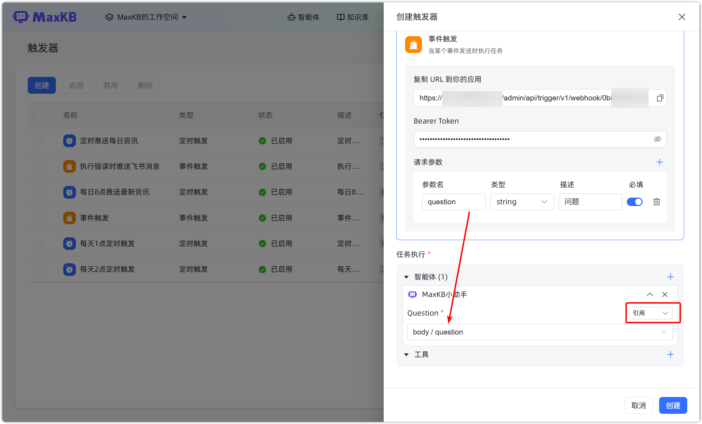

## 3 启用/禁用触发器
!!! Abstract ""
    触发器页面，可以单独启用/禁用某个触发器，也可批量启用/禁用触发器。

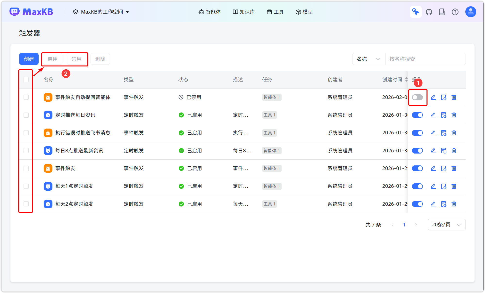

## 4 编辑触发器
!!! Abstract ""
    在触发器页面，点击【编辑】按钮，可修改触发器的内容。

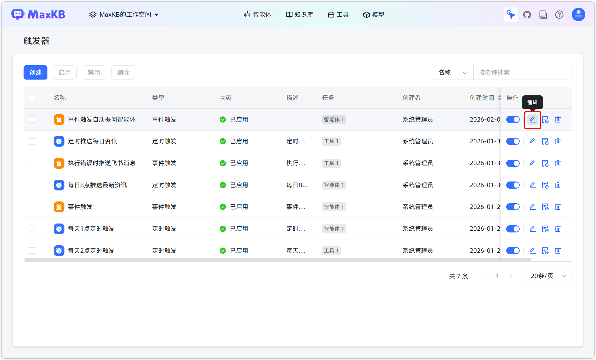
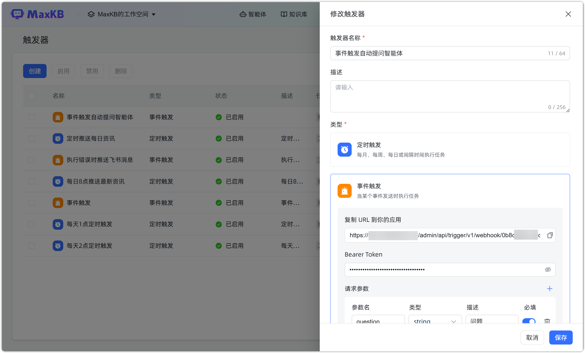

## 5 执行记录
!!! Abstract ""
    在触发器页面，点击【执行记录】按钮，可查看该触发器的执行记录。

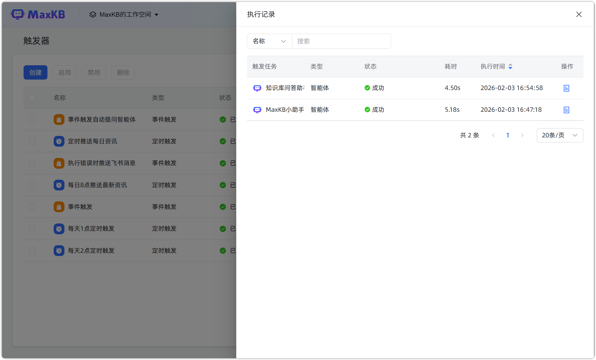

!!! Abstract ""
    点击【执行详情】，可查看具体执行的智能体的工作流或工具的输入输出。

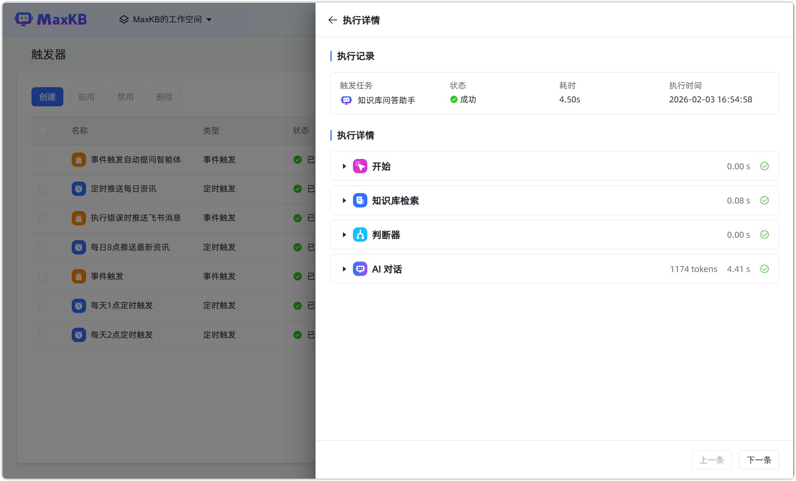

## 6 删除触发器
!!! Abstract ""
    触发器页面，可以单独删除某个触发器，也可批量删除触发器。

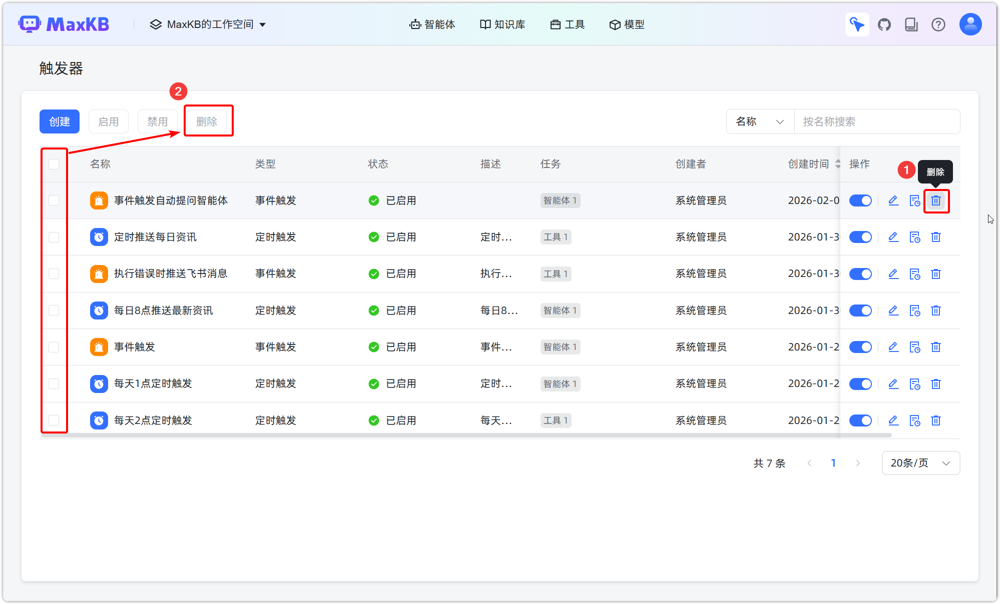