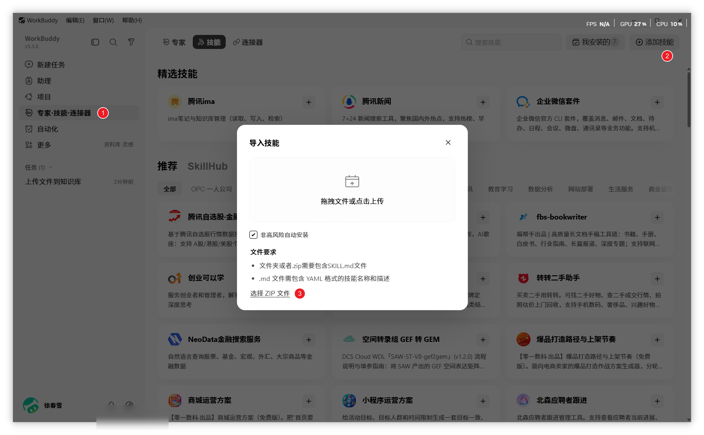
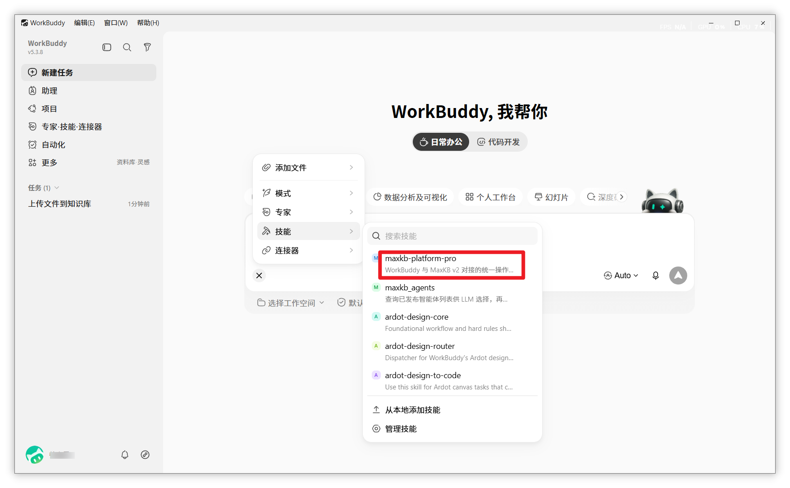
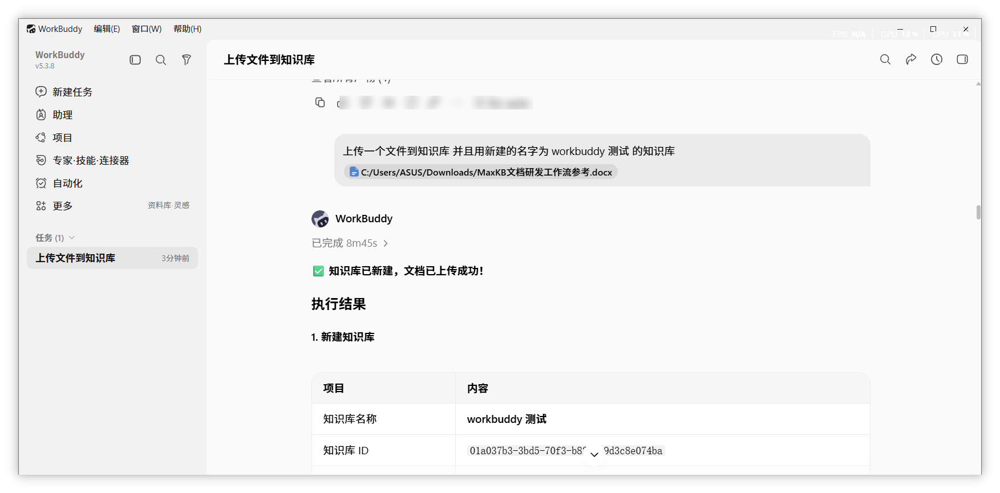
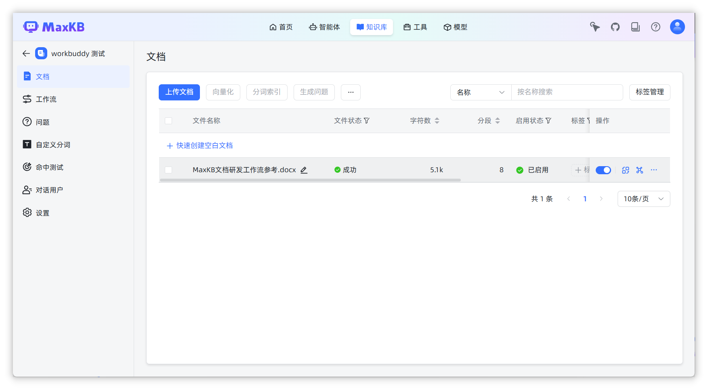
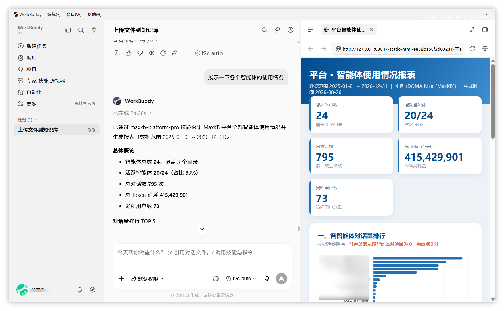
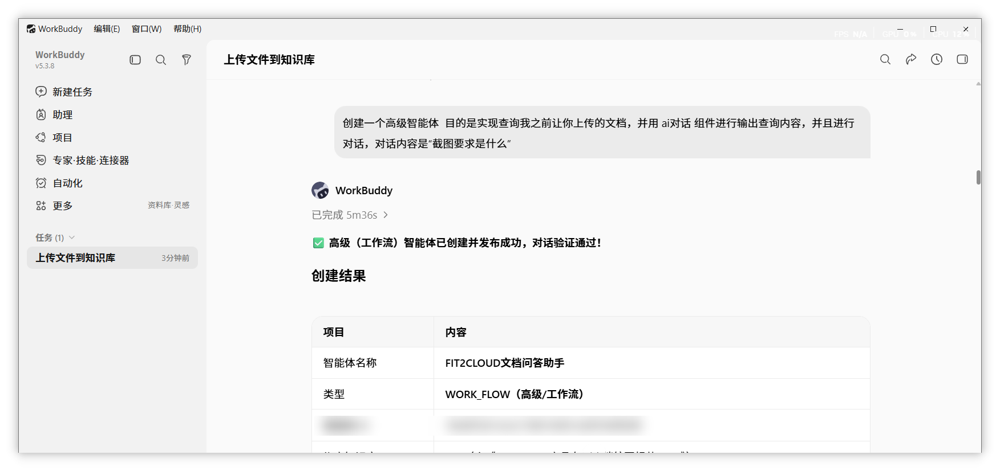
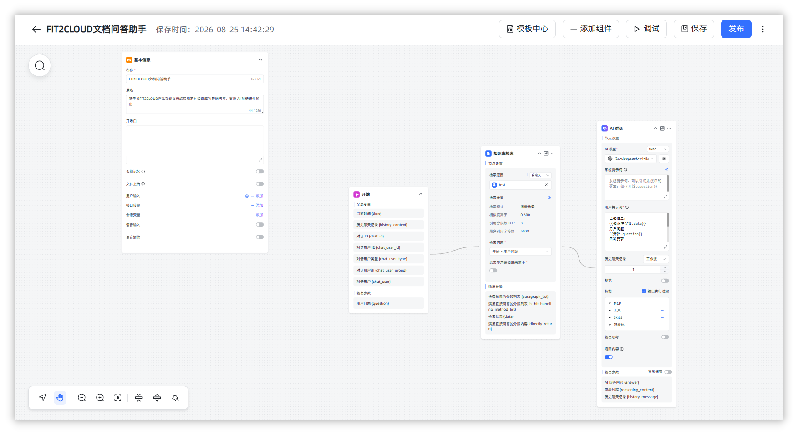
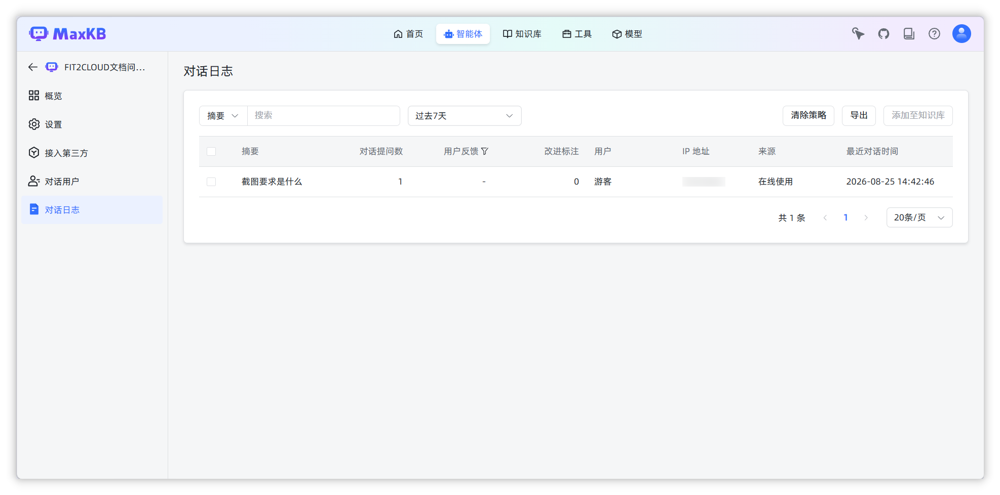

# WorkBuddy + MaxKB 技能使用指南

## 一、介绍
!!! Abstract ""

    WorkBuddy 是 AI 智能体开发平台，通过「MaxKB 技能」（maxkb-platform-pro），可将 MaxKB 平台的常见操作收敛为自然语言指令。用户在 WorkBuddy 对话框中以一句话描述需求，技能自动识别意图并调用 MaxKB 接口完成操作，无需记忆命令或 API 细节。

    本技能将 MaxKB 常见运维操作收敛为四大能力：

    | 能力 | 说明 |
    |------|------|
    | ① 知识库导入 | 将文档写入 MaxKB 知识库（支持 DOCX 智能分段） |
    | ② 创建智能体 | 创建普通（SIMPLE）或工作流（WORK_FLOW）智能体 |
    | ③ 智能查询 / 执行 | 调用智能体对话、执行任务（如群消息通知） |
    | ④ 智能出报表 | 采集统计数据并生成 Excel / HTML 可视化看板 |

!!! warning "适用范围提示"

    本技能依赖 MaxKB 平台 API，**仅适用于 MaxKB 商业版部署，不适用 MaxKB 社区版**。

    MaxKB 社区版未开放知识库 API，仅开放三类智能体相关 API：

    - ① 获取智能体会话 ID；
    - ② 查询智能体详情；
    - ③ 与智能体对话（发送消息并获取回答）。

    社区版不支持创建智能体、知识库导入、后台统计等能力，因此大部分指令无法在社区版上正常使用。

## 二、安装 Skill

### 2.1 前置条件

!!! Abstract ""

    安装并执行本指南任一项操作前，应确认下列条件均已满足：

    - WorkBuddy 客户端已安装并成功登录；
    - 本机可正常访问内网 MaxKB 地址；
    - 操作人员持有 MaxKB 平台账号（用于在后台核对结果）。
    - MaxKB 连接信息（地址与 API Key）通常由管理员预先配置到技能中。如未配置，首次使用时 WorkBuddy 会提示提供。

### 2.2 下载与安装

!!! Abstract ""

    本技能以 ZIP 安装包形式提供：[maxkb-platform-pro-skills](https://maxkb-apps-1323865188.cos.ap-shanghai.myqcloud.com/maxkb-platform-pro.zip)

    下载完成后，在 WorkBuddy 中按以下步骤安装：

    1. 打开 WorkBuddy，点击左侧「专家 · 技能 · 连接器」入口；
    2. 在顶部标签中切换到「技能」页签；
    3. 点击右上角「导入技能」按钮；
    4. 在弹出的对话框中，将技能 ZIP 文件拖入（或点击「选择 ZIP 文件」按钮选择文件）；
    5. 等待安装完成，在「我安装的」列表中确认技能已出现。

    **预期结果**：「我安装的」技能列表中可见 maxkb-platform-pro，技能描述显示「WorkBuddy 与 MaxKB v2 对接的统一操作入口」。

## 三、使用 Skill

### 3.1 调用方式

!!! Abstract ""

    安装完成后，在对话窗口中通过 + 技能即可调用。

## 四、典型场景

!!! Abstract ""

    以下列出 4 个典型场景，作为指令编写参考。实际操作时按需求调整指令即可，以下为示例而非固定模板。

### 4.1 把文件上传到知识库

**指令示例：**

> 上传一个文件到知识库，用新建的名字为 workbuddy 测试 的知识库 @MaxKB文档研发工作流参考.docx

    执行效果：自动新建知识库 → 上传文档 → 智能分段 → 写入知识库。

### 4.2 生成使用报表

    执行效果：从 MaxKB 后台采集统计 → 生成 HTML 看板 + Excel 明细 → 在 WorkBuddy 中呈现。

### 4.3 创建智能体

    执行效果：创建 WORK_FLOW 工作流智能体 → 绑定知识库 → 发布上线。

### 4.4 向智能体提问

    执行效果：智能体检索知识库 → AI 生成回答 → 回答标注引用来源。

## 五、总结

!!! Abstract ""

    本技能将 MaxKB 平台的常见运维操作收敛为自然语言指令，用户无需记忆命令或 API 细节，只需在 WorkBuddy 对话框中描述需求即可。以下是常用指令速查表：

    | 需求 | 推荐指令（示例） |
    |------|----------------|
    | 上传文档到知识库 | `@maxkb-platform-pro 上传 XX.docx 到 XX 知识库` |
    | 新建知识库 | `@maxkb-platform-pro 新建一个名称为 XX 的知识库` |
    | 执行某智能体任务 | `@maxkb-platform-pro 执行 XX 智能体` |
    | 生成使用报表 | `@maxkb-platform-pro 展示 XX 类智能体的使用报表` |
    | 创建可查文档的智能体 | `@maxkb-platform-pro 创建一个高级智能体，用于查询 XX 文档` |
    | 向智能体提问 | `@maxkb-platform-pro XX 要求是什么` |

    在指令中应使用自然、明确的语言描述「要做什么」（含目标对象与期望结果），由 WorkBuddy 将其转化为对 MaxKB 的具体操作。指令越明确，执行结果越准确。

